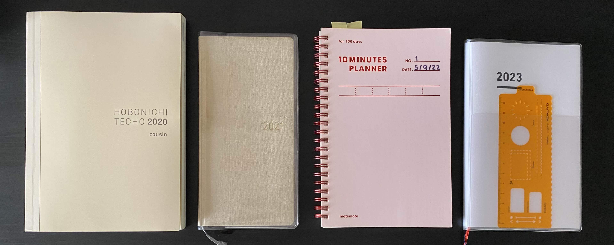

+++
title = "Planners and Productivity Apps: Try Emacs"
date = "2023-11-10"
description = "Finally finding Emacs."
tags = [
    "emacs",
]
+++

Hello there! I've tried many different productivity apps and planners, and I've noticed that Emacs and other text editors aren't really talked about in the (social media) productivity space. Here's where I'm coming from and what my planning "system" looks like.

## The Hunt for the Perfect Productivity App

For much of my school years, I've hopped from many different productivity apps and planners. If you've checked out the productivity scene in social media, you've probably heard of Notion and Obsidian. I've also used Todoist, Habitica, ClickUp, and Structured. Some analog planners I've tried include the Hobonichi Techo, the Kokuyo Jibun Techo DAYs, the MOTEMOTE 10 Minutes planner, and the Traveler's Notebook. I've even given my shot at bullet journaling. But I was always hopping: I've never stuck with one planner for one year. I was always missing something that I missed in a different planner or app, or it was too time-consuming to consistently set up.

### Why Not Analog Planners?

I really wanted to use a physical planner. I love stationery and the feeling of writing things out, but it quickly became too cumbersome to do when I had to plan for bigger assignments and projects as I had to rewrite the same things on multiple pages. For me, the ability to reschedule things on the fly is important. I concluded that an analog planner would not work as my main driver.

### What About Productivity Software?

I knew some kind of digital solution would work best for me, especially since I'm always on a computer. But there were some common themes that I noticed.

Most apps are online-first and won't load when you're offline. I wanted an offline-first solution so that I wouldn't have to worry about having a stable internet connection. My planner stores and keeps track of my life, so I needed something reliable.

Many apps had different features that I missed when using one over the other. For example, I loved Notion's databases and I was content with dating assignments that way, but I had a lot of trouble setting up a habit tracker and I needed a more capable calendar view. Habitica's way of gamifying habits worked well for me, but it wasn't suitable as a complete planner. Of course, I could use multiple apps at the same time to satisfy my needs, but I was in search of something that would have all of those features.

Many helpful features are locked behind a subscription-based paywall, which is a huge turn-off.

## What I Needed

I needed a digital planner that could:
* Show a history view so that I could undo changes
* Schedule tasks over a span of days
* Mark deadlines for tasks
* Show how many days left a task had if it were schedule over a span of days
* Warn me about deadlines
* Some kind of tagging system for tasks so that I could organize them by type
* Function as a habit tracker: tasks have to be repeatable
* Populate a calendar view
* Be available offline
* Have a clear privacy policy (I'd prefer that no data be collected)

## A Happy Intersection

Emacs is where everything is and my Traveler's Notebook gives me a visual overview of what's to come.

### Emacs

[GNU Emacs](https://www.gnu.org/software/emacs/) is a highly customizable free text editor. Coming from a non-technical background, there was a large learning curve to overcome. Admittedly, I still don't know what exactly I'm doing, but if you're in the same boat, I found these YouTube channels very helpful:

* [DistroTube](https://www.youtube.com/@DistroTube/videos)
* [Jake B](https://www.youtube.com/@JakeBox0/videos)
* [System Crafters](https://www.youtube.com/@SystemCrafters/videos)

For planning, the core packages I use are [`org-mode`](https://orgmode.org/) and [`org-super-agenda`](https://github.com/alphapapa/org-super-agenda). For that "history view," I use [Git](https://git-scm.com/) for version control. It fulfills every one of the listed requirements except for populating a calendar view. There is a calendar framework package called [calfw](https://github.com/kiwanami/emacs-calfw), but I haven't gotten it to work to my liking yet.

### Traveler's Notebook: Free Monthly Insert

For a calendar view, I use a [Free Monthly Diary Insert](https://shop.travelerscompanyusa.com/products/travelers-notebook-refill-free-diary-monthly) for the [Traveler's Notebook](https://shop.travelerscompanyusa.com/products/travelers-notebook-brown). I write down events and deadlines in my calendar with an erasable pen in case I need to reschedule things.