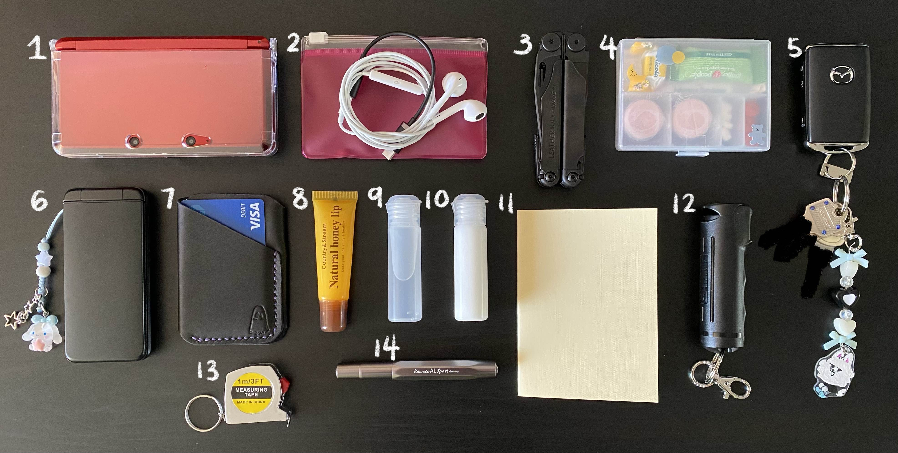

+++
title = "My Everyday Carry (EDC)"
date = "2024-12-23"
tags = []
+++

Sometimes my wallet, phone, and keys are not enough. I get dry hands during the winter and my lips are always chapped. I've had the "let me get back to you on that when I get to check my Google Calendar" situation more than once, so a calendar planner is a must when I don't have my iPhone with me.

Here's the list:
1. Nintendo 3DS
2. Apple EarPods (Lightning) + Motorola USB-C to 3.5 mm Audio Jack Adapter
3. Leatherman Wave+
4. Pill case (bandaids, cough drop, ginger chew, glucose tablets, Zyrtec, Advil)
5. Keys (the car is not mine)
6. Kyocera 902KC
7. Wallet (from [@tinyghostcrew](https://www.instagram.com/tinyghostcrew/))
8. Country & Stream Natural Honey Lip
9. Hand sanitizer
10. Lotion
11. Traveler's Company 006 Free Diary Monthly Insert (Passport)
12. Pepper gel
13. 1 meter measuring tape
14. Kaweco AL Sport (M) in anthracite

Depending on what I'm doing, sometimes I'll also bring:
- iPhone 11 (128 GB)
- Coin/cash purse
- Klean Kanteen 12 oz Classic Kid's Water Bottle
- Moleskine Cahier Journal
- Leatherman Skeletool KB
- Sony Walkman NW-E394 (8 GB)
- Kindle (2019)

I find the small water bottle convenient for me to carry around. I clip it to a snap hook that hangs off of my [Aer City Sling 2](https://aersf.com/products/city-sling-2?country=US) so that my hands are free.