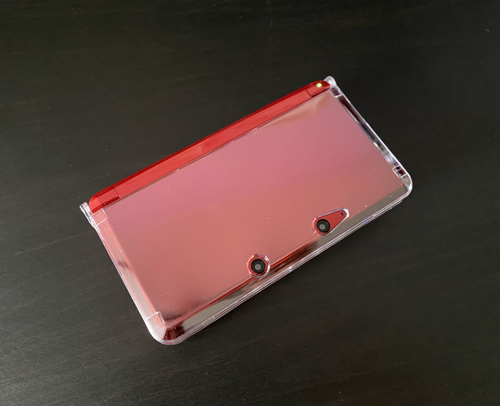
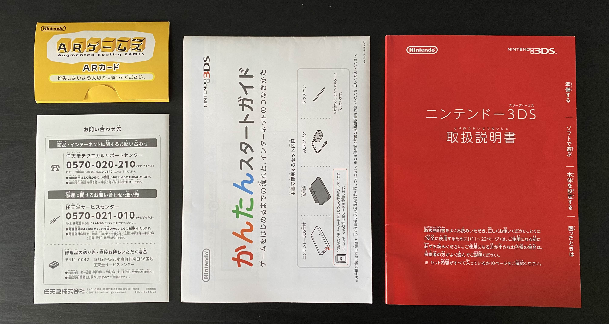
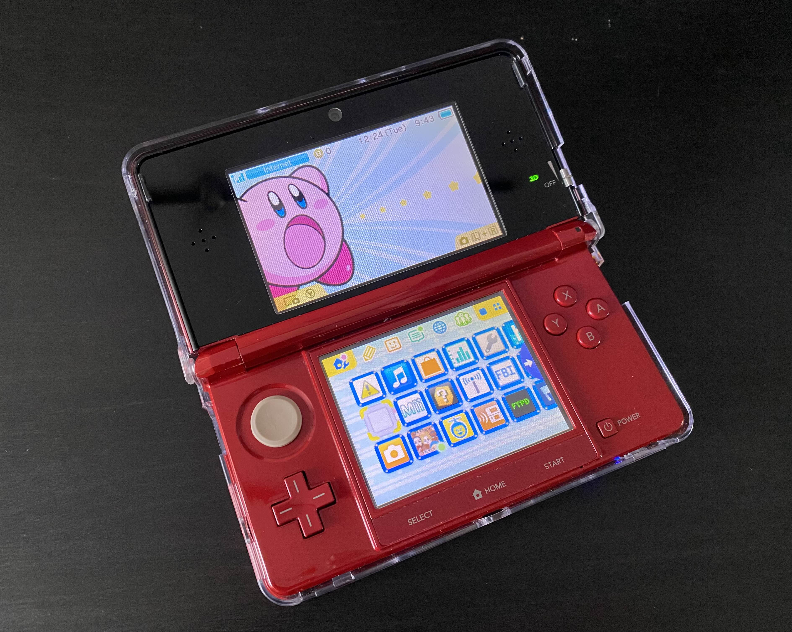
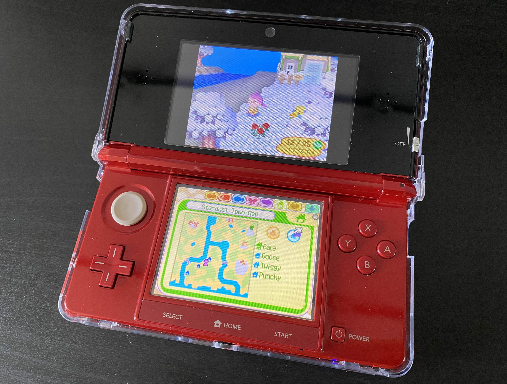

+++
title = "Modding My Region-Locked Nintendo 3DS"
date = "2024-12-26"
tags = [ "videogames", ]
+++

I recently bought a region-locked (JP) Nintendo 3DS (in flare red) for $90 off of Ebay with the intent of modding it! I've been trying to ween myself off of carrying my iPhone around with me, so I figured that extra time can be spent playing a game. I'd rather experience a story than watch slop on social media. I've wanted a 2DS/3DS for a long time—about 6 years now. And thanks to my barista money, I'll be able to drown in the incredible library of games the 3DS has.

The color reminds me a lot of [Mazda's soul red](https://www.mazdausa.com/discover/soul-red-crystal-paint)! Everything came as pictured on the listing: it came with the charger, the charging dock, and the manual. The warranty card, the AR cards, and the quick start pamphlet were also included.

The screens have slight yellowing on them, which I expected from how old this console is. After cleaning the console and peeling off the old screen protectors, I replaced them with new ones, a clear case, and popped in a 32 GB SD card.

Thankfully, there are plenty of resources on modding the 3DS. I followed the [3DS Hacks Guide](https://3ds.hacks.guide/key-information.html) all the way through. Because my console was region-locked, I then followed the [Region Changing Guide](https://3ds.hacks.guide/region-changing.html). While copying a 1 GB file from the SD card to my PC, I kept getting an error "splicing file," but it worked when I copied it via the terminal to my home directory over using the GUI.

To install a custom theme, I followed [this guide](https://wiki.hacks.guide/wiki/3DS:Custom_themes#tabber-tabpanel-FBI_QR_code-0). I installed a Kirby theme here.

To add my friends, I installed [Pretendo](https://pretendo.network/docs/install/3ds). I created a Nintendo Network ID (NNID) on the Nintendo server first. Then, I made an account on Pretendo with a different username on their website. I then switched to the Pretendo server on my 3DS and linked my account to the Pretendo Network ID I just registered for. I also installed [NetPass](https://gitlab.com/3ds-netpass/netpass/-/releases/v0.6.1).

To play some DS games, so I installed TWiLight Menu++ through the Universal Updater. But when I tried opening it, I got an error message with the error code `0xo8804478`. Thanks to this [Reddit post](https://www.reddit.com/r/3dshomebrew/comments/1apoiq3/twilight_menu_error/), I found that since my 3DS was region-changed, I would have to run [this fix](https://github.com/MechanicalDragon0687/TWLFix-CFW/releases). On the last step, I ran into a network error when performing a system update. This occurred because I was on the Pretendo server, not the Nintendo server. Switching over to the Nintendo server on Nimbus fixed the issue.

I then installed NDSForwarder following [these instructions on the DS-Homebrew Wiki](https://wiki.ds-homebrew.com/ds-index/forwarders) so that I could access my DS games from the home screen.

Here's *Animal Crossing: Wild World*! I can't wait to see everyone's dialogues. I hear the older games have a lot more personality.

Special thanks to my friend Bear ([@mokumas](https://www.instagram.com/mokumas?igsh=ZW5veWN6N3M4a3Nk)), who helped me mod my 3DS. :D