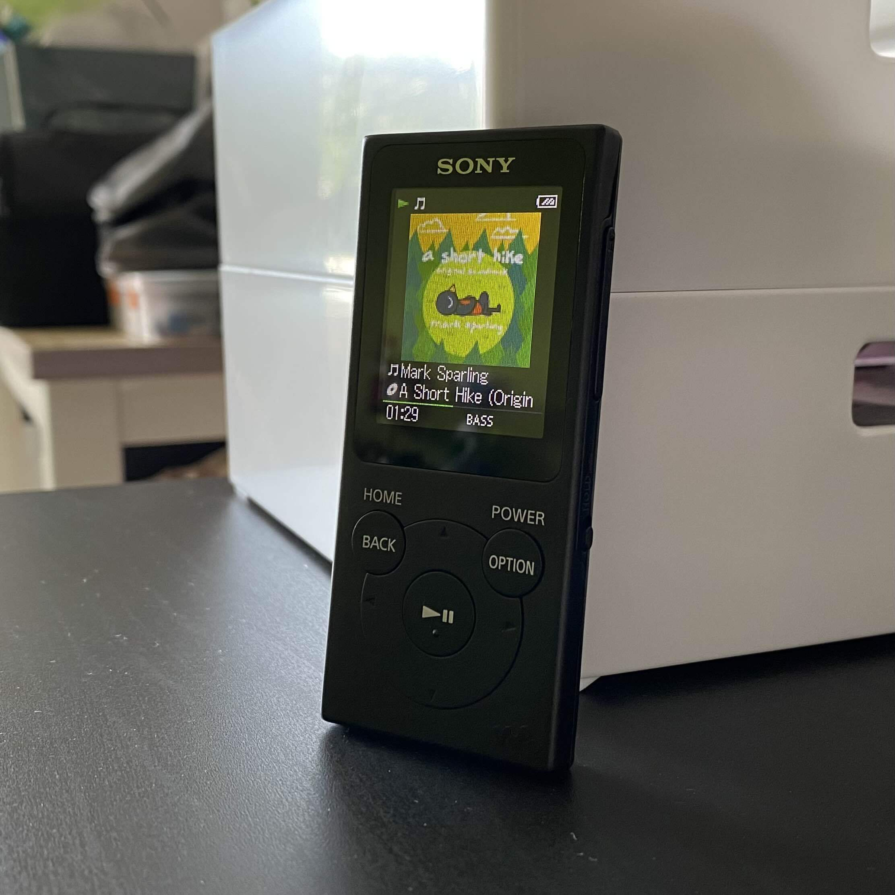

+++
title = "My MP3 Player"
date = "2024-08-01"
tags = []
+++

I bought an MP3 player awhile back. It's a black [Sony Walkman NW-E394](https://electronics.sony.com/audio/walkman-digital-recorders/walkman-mp3-players/p/nwe394-b). I got the 8 GB model, which is quite small in comparison to the iPod I'm considering buying. It comes with 3.5mm jack earbuds. They don't really fit in my ears. Since I'm afraid to casually bring it outside, I crocheted a little pouch for it. I love how small and incredibly light it is in comparison to my phone. Quite literally the best part about it is that I can wash dishes with ease because there isn't a brick (i.e. my phone) weighing down my pajama pants.



Also, the listening experience is just *miles* better than playing music from my phone. I discovered bass boost, and I never knew that audio can sound *this good*! I also found that using wired headphones or earbuds always gave me a superior experience over wireless ones. I actually like using Apple's wired EarPods and [Koss x Retrospekt P/21 Retro Orange On-Ear Headphones](https://retrospekt.com/products/koss-p-21-retro-foam-on-ear-headphones).

What's also really neat is that there's this `HOLD` button on the side of the music player, which "locks" the screen and disables button input. This is very useful when putting the player in my backpack so that I don't have to worry about unintentional clicking.

I haven't consciously tested the battery life of the music player, but so far, I don't run into frustrations with it dying on me.

## Transferring Music Files on Linux

Since my daily driver is a Linux system, I have to mention how this music player meshes with my workflow, right? :D

After plugging the music player into my computer with a micro-USB to USB-A cable, transferring music was done by dragging and dropping music into the `MUSIC` directory. For the song information to be appropriately read, its metadata should be edited using software such as [EasyTAG](https://wiki.gnome.org/Apps/EasyTAG).

Here's what the file tree on the music player looks like:

```tree
.
├── DCIM
├── default-capability.xml
├── DevIcon.fil
├── DevLogo.fil
├── MUSIC
│   ├── 2Pac
│   │   ├── Me Against the World
│   │   │   ├── Can U Get Away.m4a
│   │   │   ├── Dear Mama.m4a
│   │   │   └── Death Around The Corner.m4a
│   ├── Playlist.m3u8
├── PICTURE
└── System Volume Information
    ├── IndexerVolumeGuid
    └── WPSettings.dat
```

I like to organize my music by artist first and then create directories for their albums and singles.

To create playlists, I use [Clementine](https://www.clementine-player.org/) to generate the `.m3u8` file that can be read by the music player. If we take a look at `Playlist.m3u8`, its contents look like this:

```
#EXTM3U
#EXTINF:120,2Pac - Dear Mama
2Pac\Me Against the World\Dear Mama.m4a
#EXTINF:124,2Pac - Death Around The Corner
2Pac\Me Against the World\Death Around The Corner.m4a
```

When you **initially** generate the playlist using Clementine on Linux, your file will look like this:

```
#EXTM3U
#EXTINF:120,2Pac - Dear Mama
2Pac/Me Against the World/Dear Mama.m4a
#EXTINF:124,2Pac - Death Around The Corner
2Pac/Me Against the World/Death Around The Corner.m4a
```

The music player wouldn't be able to read the playlist because it navigates file directories with backslashes (`\`), not forward slashes (`/`) as done in Linux. I used [VSCodium](https://vscodium.com/) (or any text editing software will do) to replace the `/` with `\` using `C-f` (`CTRL + f`).

### Removing a Song? Delete the Dot Directory.

Sometimes I had to re-transfer a song because I messed up the metadata. I found that even if I deleted the music file, the old one would still show up on the music player. When viewing *all* of the files on the music player, there's a "trash" dot directory that I had to delete for the music file to really disappear.
