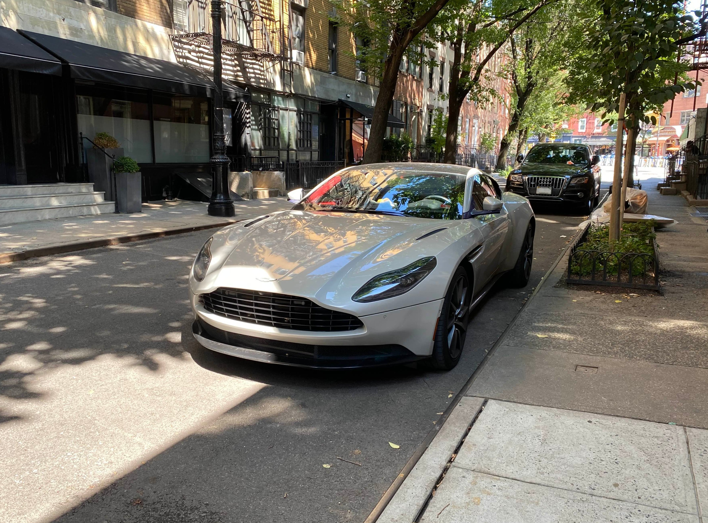
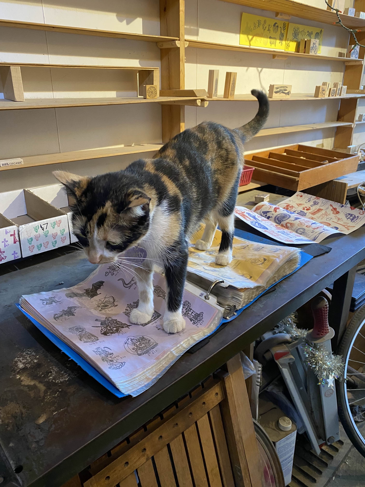
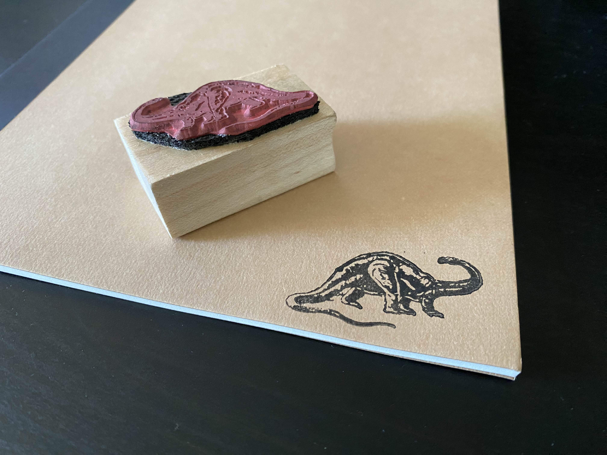
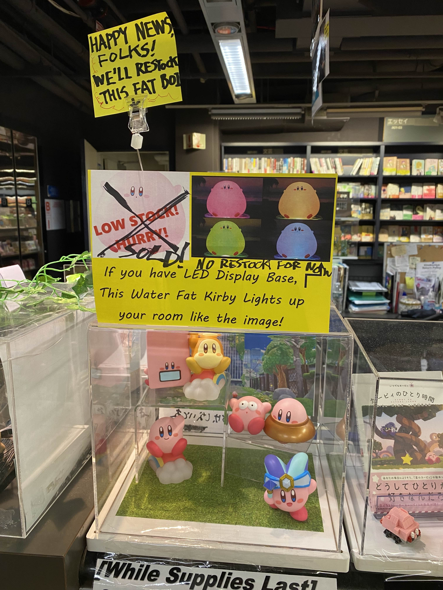

+++
title = "NYC Trip"
date = "2024-09-16"
tags = []
+++

Earlier this month, I finally got out to the city after a month or so! I walked around a ton and mostly stayed in the SoHo area, hopping over to the East Village and the Garment District.

I went to Muji to buy a pack of notebooks for my fall classes. One of my classes prohibit us from using our laptops or any electronic device in class. Initially, the plan was to use my tablet to write all of my notes digitally. Bummer.

On my way to grab lunch, I spotted an Aston Martin DB11 V12. How sick is that? I was so, so excited. I've only seen DBX's and Vantages around, but I haven't seen a DB11 until now!

*Ugh, just look at this beauty!*

I went to get a strawberry latte from Not As Bitter. As much as I love coffee, I can't handle the caffeine, so I usually get decaf. They didn't have decaf, so I got one shot. It was pretty darn good! Definitely not as bitter.

I also went to a stamp store called Casey Rubber Stamps. They had a cat there!

And I bought a stamp of some kind of sauropod. I think it's a brontosaurus.

Kinokuniya has the silliest items. I love going there for the stationery and the figures.

