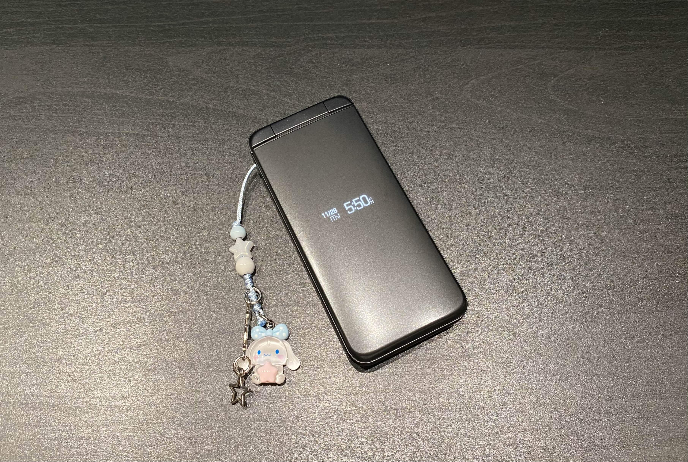
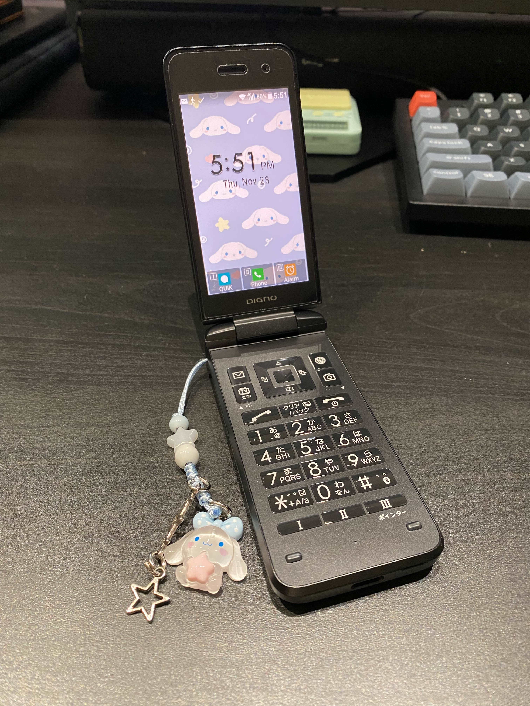

+++
title = "Setting Up My Kyocera 902KC"
date = "2024-11-28"
tags = [ "guide" ]
+++

*Last updated: 2025-08-20.*



About a month ago, I made the semi-impulsive decision to buy a Japanese flip phone off of Ebay. I wanted to spend less time on my smartphone and... I love silly gadgets too. I paid about $120 for mine in mint condition. From the title of the listing, I assumed that it was SIM unlocked. However, it came SIM locked and I paid for a service to SIM unlock the phone for me. Be aware of this—make sure that you are buying a SIM unlocked phone. In my case, I should have messaged the seller first to double-check this. (I brought this up to the seller and they offered to unlock the phone for me, but I already got it unlocked.)

Also, here is the [user's manual](https://www.manualslib.com/manual/1835569/Digno-Keitai-3.html#product-Keitai%203) for the 902KC!

You might also want to pick up a 32 GB microSD card as the phone supports that expansion. It internally has 8 GB.



---

## Screen Mirroring Software

While setting up the 902KC, I found using screen mirroring software very helpful for inputting long text (such as your APN). It lets you navigate the phone with a mouse and keyboard. I use [scrcpy](https://github.com/Genymobile/scrcpy).

---

## Carrier Compatibility (USA)

My carrier is Spectrum, which uses Verizon's networks. I've heard that the 902KC only works with T-Mobile, but I tried putting the nano SIM in anyway. As expected, it didn't work. I ended up going with [Mint Mobile](https://www.mintmobile.com/) after checking that my phone was [compatible with their network](https://www.mintmobile.com/byop/) by entering its IMEI number. You can also check the bands around your area with [CellMapper](https://www.cellmapper.net/map).

To find the IMEI number: `Settings > About phone > Status > IMEI information`

Configuring the 902KC was relatively straightforward with [this guide](https://www.mintmobile.com/help/how-to-configure-android-settings/) from Mint.

To enter your APN settings: `Settings > Wireless/Network > Cellular networks > Access Point Names > Menu > New APN`

---

## Sideloading

There is no pre-installed app store on the 902KC, so I sideload.

On the 902KC:
1. Enable developer mode: `Settings > About phone > Build number (Press this until you see "You are now a developer")`
2. Enable USB debugging: `Settings > More settings > Developer options > USB debugging`

On the computer, install ADB tools. On Ubuntu (22.04), the package is named `adb`. If you use a different distro, Windows, or Mac, there is [this guide](https://www.xda-developers.com/install-adb-windows-macos-linux/#how-to-set-up-adb-on-your-computer).

Plug your phone into your computer and select `Allow` once your phone prompts for permission to grant your computer debugging. To start, open a terminal. Here are the commands I mostly used:
``` bash
$ adb devices # Lists devices
$ adb install # To install an APK file
```

The first app I sideloaded was [F-Droid](https://f-droid.org/en/), an app store of FOSS apps. The process generally looks like this:

1. Download the APK file. The file extension will end in `.apk`.
2. Install the APK file using `adb`:
    ``` bash
    $ adb install org.fdroid.basic_1021050.apk
    ```
3. Yippee! It should appear on your phone. On the home screen, click `Custom > Add application` and your installed APK should be there!

### Installed Apps

Installing F-Droid gave me most of the apps I wanted to install for different purposes. 

|Function|App|Source|
|---|---|---|
|Text|QUIK SMS|[F-Droid](https://f-droid.org/en/packages/dev.octoshrimpy.quik/)|
|Text|Molly (a fork of Signal)|[GitHub](https://github.com/mollyim/mollyim-android)|
|Mail|K-9|[F-Droid](https://f-droid.org/en/packages/com.fsck.k9/)|
|Weather|Clima|[F-Droid](https://f-droid.org/en/packages/co.prestosole.clima/)|
|Music|Spotify Lite|[uptodown](https://spotify-lite.en.uptodown.com/android/download/121328406-x)|
|Maps|Organic Maps|[F-Droid](https://f-droid.org/en/packages/app.organicmaps/)|
|Maps|Waze||
|Keyboard|TT9|[F-Droid](https://f-droid.org/en/packages/io.github.sspanak.tt9/) or [GitHub](https://github.com/sspanak/tt9/releases/tag/v41.0)|
|Key bindings|Key Mapper|[F-Droid](https://f-droid.org/en/packages/io.github.sds100.keymapper/)|
|Package name viewer|Package Name Viewer|[APKPure](https://apkpure.com/package-name-viewer-2-0/com.csdroid.pkg)|
|Manga reader|Kotatsu|[F-Droid](https://f-droid.org/en/packages/org.koitharu.kotatsu/)|

---

## Setting Up The Apps

### K-9

K-9 was a bit of a headache to set up with Gmail. I remembering having a ton of trouble passing the CAPTCHA. To set it up with Gmail, this [forum post](https://forum.k9mail.app/t/how-to-set-up-with-a-gmail-account/3812) came in handy. IMAP must be enabled. In my case, I didn't have to generate an "App Password" unless it was for a Google Workspace account. Also, you may need to enable `Allow less secure apps`, which can be found in [your Google security settings](https://myaccount.google.com/security#signin).

### Key Mapper

With Key Mapper, I was able to set my own bindings to adjust the volume, screen brightness, and toggle the flashlight. I came across [this Reddit post](https://www.reddit.com/r/dumbphones/comments/1dauzdz/kyocera_902903kc_key_mapper_dnd_permission_fix/) about not being able to change the volume due to DND. It turns out that you would need to enable notification access via `Settings > More settings > Apps > Special app access > Notification access > Key Mapper`.

When setting up your triggers, enable `Do not remap`, which adds the key binding without overwriting the original key's functions. This setting is accessed via the 3-dot menu on the top after adding a trigger.

When setting up the key binding to toggle the flashlight, I added constraints so that the key binding would work when the device is locked or unlocked.

The following table shows what triggers I've recorded to bind to what actions on my phone.

|Triggered Key|Trigger|Actions|
|---|---|---|
|Call (or Start) button|Press|Volume down|
|Call (or Start) button|Double press|Volume up|
|F3 (or TV) button|Press|Decrease brightness|
|F3 (or TV) button|Double press|Increase brightness|
|F3 (or TV) button|Long press|Toggle flashlight|

### TT9

To set up TT9 for quicker typing, open the app:
1. `Initial Setup > Select Default Keyboard > Traditional T9`
2. `Languages > Load Selected`
3. `Keypad > Select Hotkeys > Backspace > F4` This sets the backspace to the Camera button, which is useful for when some apps break when the default backspace is broken.
4. `Appearance > Alternative Suggestion Scrolling Method` Ensure this option is enabled. This will allow you to create a lock screen password without being locked out of your phone. Be sure to install the latest APK from the [GitHub](https://github.com/sspanak/tt9).

### Molly (A Fork of Signal)

I really, really wanted to get [Signal](https://signal.org/) working on my device as QUIK and Google Messages didn't thread replies correctly. I kept having issues with passing the CAPTCHA and even if I was able to pass it, I wasn't able to progress any further. I got a fork of Signal, [Molly](https://molly.im/), to work. Here are the steps I took:

1. Download the 3 [microG](https://github.com/microg) APKs: [microG Services](https://github.com/microg/GmsCore/releases/latest), [microG Companion](https://github.com/microg/GmsCore/releases/latest), and [microG Services Framework Proxy](https://github.com/microg/GsfProxy).
2. Sideload each APK onto the device.
3. Grant all permissions for each microG app, which can be found in: `Settings > More settings > Apps > App info`. Also be sure to disable battery optimization under `Settings > Battery > Battery optimization` for each app.
4. I also enabled `Display over other apps` for `microG`. I'm unsure if this is necessary or not: `Settings > More settings > Apps > Special app access > Display over other apps > microG Services`.
5. Configure the app `microG Settings`. Enable `Google device registration`, `Cloud Messaging`, and `Google SafetyNet`. I also signed into my Google account while I was trying to get Signal to work; I don't know if this is necessary for Molly to work. (It's probably not.)
6. Download the APK and sideload [Molly](https://github.com/mollyim/mollyim-android/releases) onto the device. Using `scrcpy` really helped with setting things up.

In `microG Settings`, you'll notice that you won't be able to check off on all of the checklist items. This is because we (unfortunately) can't root the device, so we can't signature spoof. We're using microG just as a regular user app.

---

## Phone Settings

Using `scrcpy`, you can pull down on the screen to access additional settings. I enabled auto night light and auto rotate.

The bottom three buttons that have Roman numerals on them are Quick Keys, which are like customizable shortcuts. I've bound mine to QUIK, Phone, and Alarm.

I wanted a custom ringtone and notification sound, so I transferred the audio files from my computer to the phone. On your phone, the change can be made with `Settings > Sound/Notification > Phone ringtone > Data Folder`.

---

## Debloating

To remove non-functional apps (as some only work in Japan, e.g. radio/TV), I used the [Universal Android Debloater](https://github.com/0x192/universal-android-debloater) and the Package Name Viewer app to view what I could delete. Besides deleting the ones recommended to me, I've uninstalled the following:

* com.mobisystems.office.kyocera
* jp.kyocera.charactercheck
* jp.kyocera.kc_fmradio
* jp.kyocera.weather
* jp.softbank.mb.parentalcontrols
* jp.softbank.mb.mimamorimap

---

## Phone Case & Screen Protector

I tried hunting around for a phone case made for the 902KC, but I haven't found any. I wonder if someone 3D printed their own. I might try that one day. However, I did find [plastic screen protectors](https://www.amazon.com/Puccy-Protector-compatible-Tempered-Protectors/dp/B08TJ1186Z/) on Amazon and I've installed those. They seem to have come already scratched up a bit. Definitely not the best quality, but I suppose it's better than nothing.

---

## Daily Use

### GPS

I installed [Organic Maps](https://organicmaps.app/) through F-Droid and it works! To enable GPS, go into `Settings > More Settings > Location` and enable `Location`. Make sure `Mode` is on `High accuracy` and that `Wi-Fi scanning` and `Bluetooth scanning` are enabled under `Scanning`. Indoors, the GPS doesn't really work but it does outside. Unfortunately, I couldn't get the voice instructions to work either. Depending on where I'm going (and if it's to an unfamiliar area), I keep my smartphone with me so that I can use Apple CarPlay.

But I've been thinking about the Kyocera A202KC. It has Android 10 and I wonder if Android Auto would work.

Update: I installed Waze and its voice instructions work!

### Bluetooth & Music

Bluetooth works with the AirPods Pros (2nd Gen) and it pairs nicely. I'm sure wired headphones or earbuds would also work so long as they are USB-C. My friend Gene ([@spicydorite](https://www.instagram.com/spicydorite/)) told me that [this analog dongle](https://www.amazon.com/dp/B01N0ZYNV8?ref=cm_sw_r_cp_ud_dp_YK7RT9X0HCKJ1DKC93VP_1&ref_=cm_sw_r_cp_ud_dp_YK7RT9X0HCKJ1DKC93VP_1&social_share=cm_sw_r_cp_ud_dp_YK7RT9X0HCKJ1DKC93VP_1&peakEvent=2&dealEvent=0&skipTwisterOG=1) works with the phone! He has a Kyocera 903KC, which is very similar to the 902KC, and confirmed it works. I use Spotify Lite and download the playlists I want when I'm on the go.

As for the drive, bluetooth pairs with the Mazda3 (2016), the CX-30 (2024), and the Audi S5 (2024). The media controls also work in all cars.

### Hotspot/Tethering

To enable hotspot, see: `Service > Tethering > Wi-Fi hotspot`.

### Tips

* There is a feature called `Write Now`, which lets you write text from the home screen. This can be accessed from settings: `Settings > More Settings > Languages & input > Write now`. However, my keyboard seems to break once I use this with TT9.
* The sub-display, which is the outer display that shows time once your phone is closed, can be changed in `Settings > Wallpaper/Display > Sub display`. Changing the `Display pattern` to `Small` gives you the date!
* You can customize your home screen to set your own apps by choosing `Menu > Layout` and then scrolling all the way to the right for the last option. `Edit` should now appear on the bottom of the screen and you can choose an app to add or delete.
* While using the pointer, holding the center D-pad button turns on scroll mode, which is useful for gestures.
* While taking photos, the side button can snap pictures, which helped me avoid getting my fingers caught in the photo. Like in the one below!


---

## References

* Reddit post titled ["Some Tips and Tricks for the Kyocera 902KC!"](https://www.reddit.com/r/dumbphones/comments/16fuvdk/some_tips_and_tricks_for_the_kyocera_902kc/) by u/HogwashDrinker
* Reddit post titled ["Kyocera Digno 3 (902kc vs. 903kc) information & compatibility"](https://www.reddit.com/r/dumbphones/comments/15a5i7w/kyocera_digno_3_902kc_vs_903kc_information/) by u/dche_21
* Blog post titled ["Digital Minimalism: Kyocera 902KC"](https://lagomor.ph/2023/10/digital-minimalism-kyocera-902kc/)
* Reddit post titled ["Kyocera Digno 902KC/903KC — What I've Learnt so Far, and What You Should Know Too! | 1 Week in — (USA)"](https://www.reddit.com/r/dumbphones/comments/1bs2xk6/kyocera_digno_902kc903kc_what_ive_learnt_so_far/) by u/FitAd1732
* Reddit post titled ["Been using a Digno 3 902kc for about 4 months now. Here is my experience."](https://www.reddit.com/r/dumbphones/comments/1e99ibb/been_using_a_digno_3_902kc_for_about_4_months_now/)