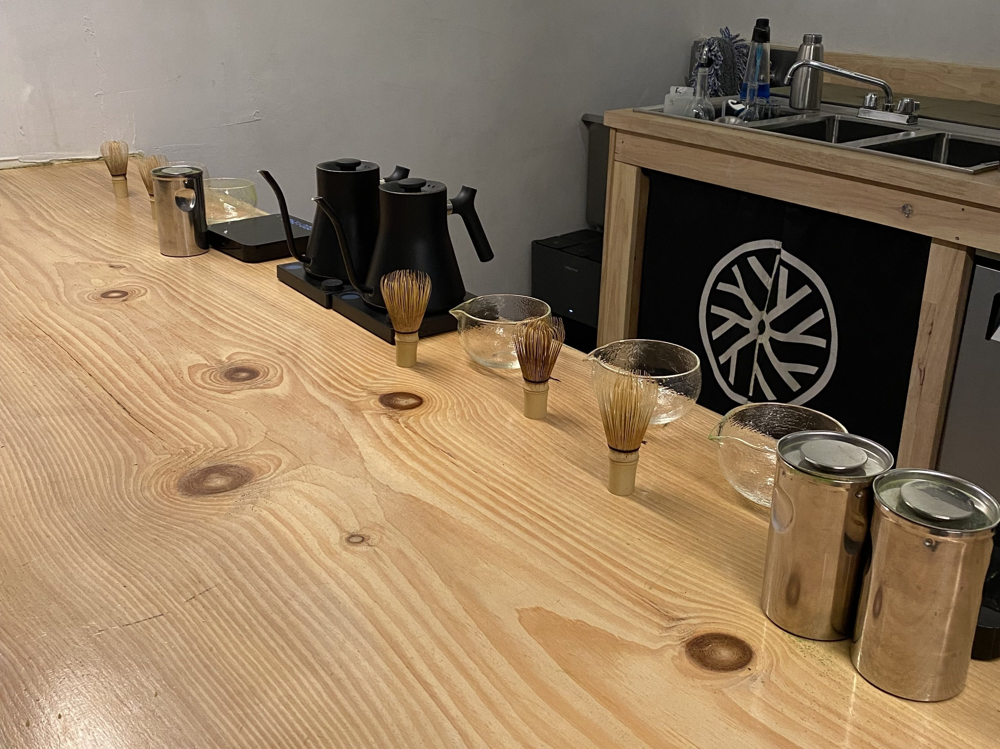
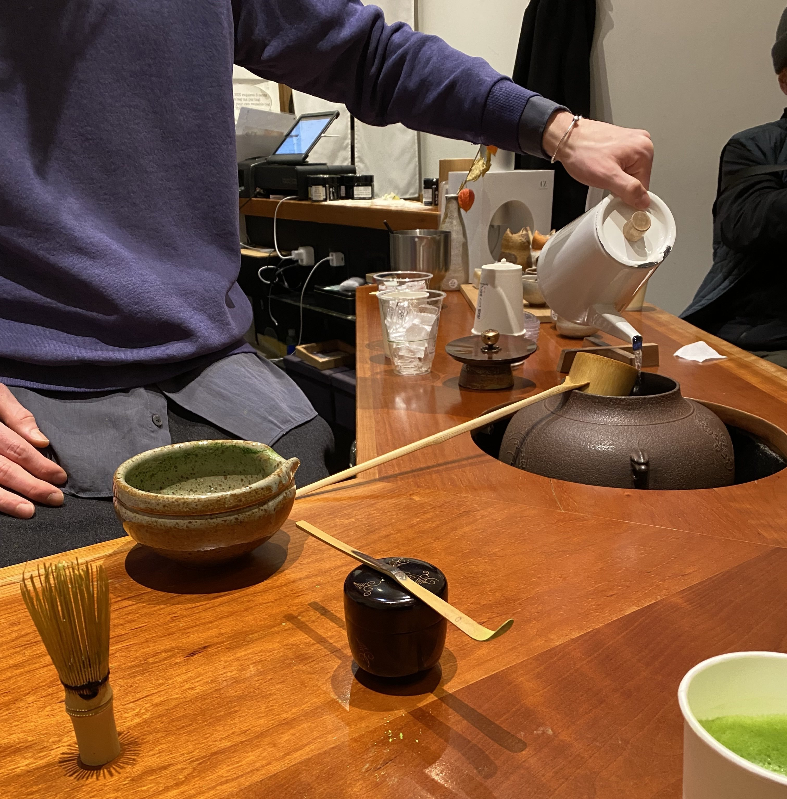
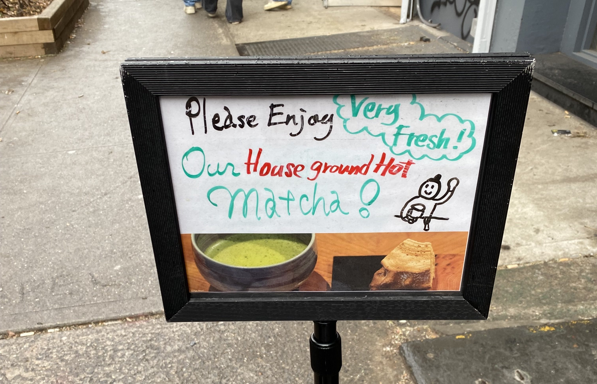
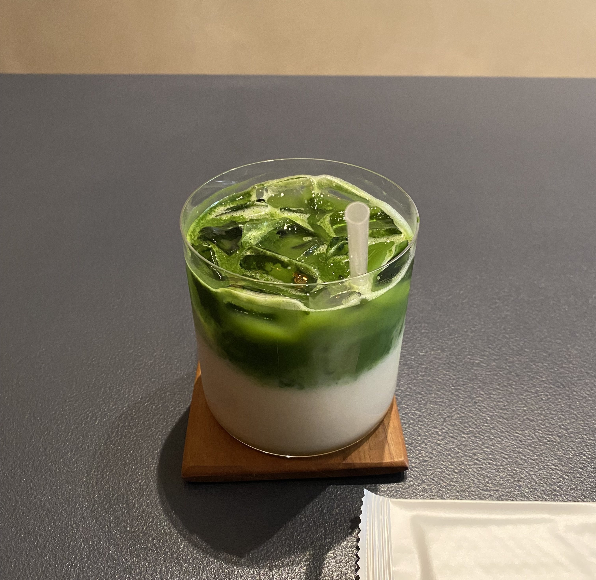

+++
title = "A Few Matcha Spots"
date = "2025-03-25"
tags = []
+++

Because of its lower barrier to entry, making matcha at home has been my go-to drink lately. Finding good matcha has been of particular interest to me! The best matcha latte I've had was from [Ooika](https://ooika.co/). I visited their Princeton (NJ) location and everything was controlled: the humidity, temperature—it was so cool to see. I bought matcha there and making my first latte at home was incredible. It was seriously unlike anything I've ever had. Though the kick of caffeine was too much for me, I'm still getting it the next time I make a trip there! It's worth the long drive.

*This is Ooika's setup!*

I also visited Setsugekka (NYC) and the "dine-in" experience was neat. There was a lot of people, so there was a wait time. The environment in the shop was cozy, facilitated by how methodically the baristas made the drinks.

*A barista pouring water.*

*The sign outside of Setsugekka. It was cute!*

Sorate (NYC) is another solid place for matcha. I really loved the presentation of the lattes when I sat in. I remember getting some reading done. The lighting is on the dimmer side, making it feel more intimate for a matcha shop. I bought their SoKU matcha to get my fix as I ran out of the matcha from Ooika. It's certainly better than the universal grade matcha I was using for a short period of time.

*Sweetened matcha latte with oat milk from Sorate.*