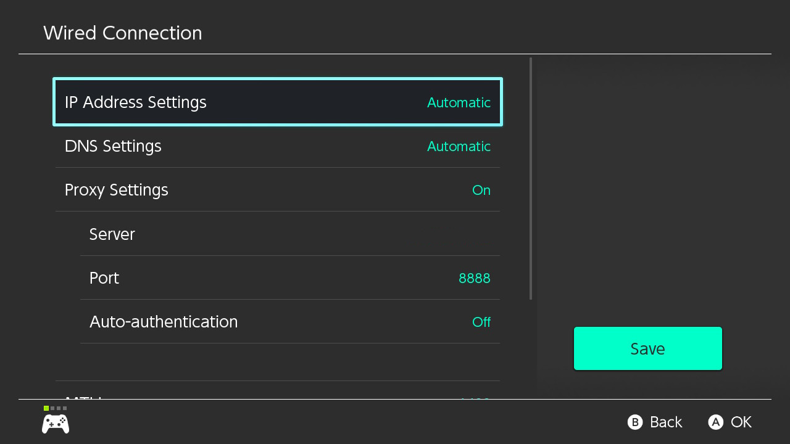

+++
title = "Speeding Up Downloads From Nintendo eShop"
date = "2025-08-18"
tags = [
    "videogames",
    "guide"
]
+++

I wanted to actually finish *The Legend of Zelda: Breath of the Wild*. Long story short, I needed to build back up my Switch game library. After purchasing a digital copy from the eShop, I saw that it would take about 7 hours to finish downloading. Maybe I should've bought a physical copy if I knew I was going to be impatient (but I wonder how long it'll take to download all the updates)...

So I took to searching and I found this [very helpful Reddit post](https://www.reddit.com/r/NintendoSwitch/comments/gswl20/solution_slow_eshop_downloads_on_nintendo_switch/). After running to the store to buy an ethernet cable and an ethernet adapter, I directly connected my Switch to my router. This increased my download speeds by quite a bit, but what really helped was running a proxy as outlined in the post.

I had a Raspberry Pi lying around, so I [flashed the Raspberry Pi OS](https://www.raspberrypi.com/documentation/computers/getting-started.html#installing-the-operating-system) on it and did the following:

1. On the Pi, install `Tinyproxy` via `sudo apt install tinyproxy`.
2. Edit the config file: `sudo nano /etc/tinyproxy/tinyproxy.conf`. The edits I made:
    ```txt
    # Set the port below
    Port 8888

    Allow 192.168.1.0/24

    # For HTTPS connections
    ConnectPort 443
    ConnectPort 80
    ConnectPort 8080
    ```
3. Restart and enable `Tinyproxy`:
    ```bash
    $ sudo systemctl restart tinyproxy
    $ sudo systemctl enable tinyproxy
    $ sudo systemctl start tinyproxy
    $ systemctl status tinyproxy
    ```
4. Note your Pi's IP with `hostname -I`.
5. On the Nintendo Switch, navigate to `System Settings` > `Internet` > `Internet Settings` > `Wired Connection` > `Change Settings`.
6. Change `Proxy Settings` and enter the Pi's IP address in `Server` and set `Port` to `8888`. Hit `Save` and test your internet connection.


I was able to reach download speeds of 211 Mbps, which was much more than the < 50 Mbps I was getting without the proxy and ethernet connection.

The whole process still took ~7 hours because I finished setting everything up 4 hours into the download. (I got sidetracked, corrupted my USB, and flashing the OS took awhile.) But I had fun, so the side quest was worth it.