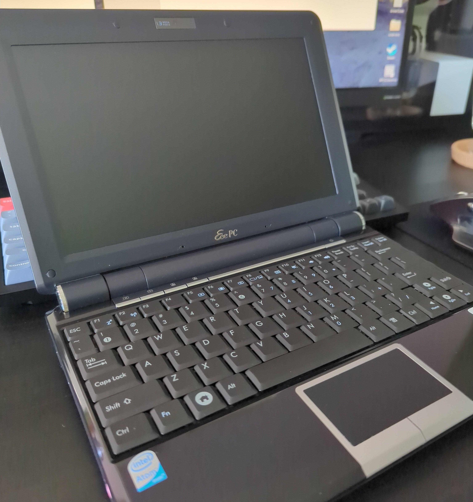
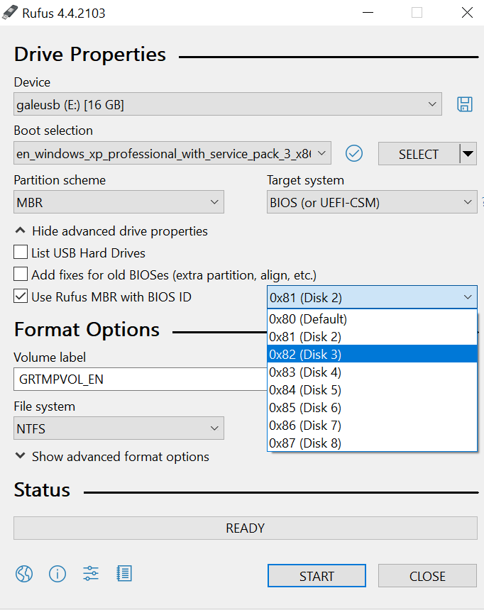
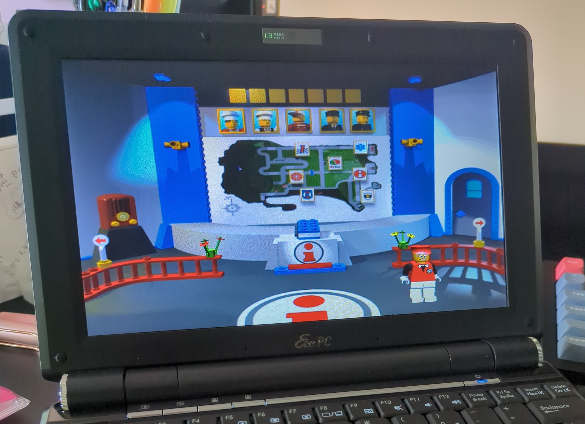
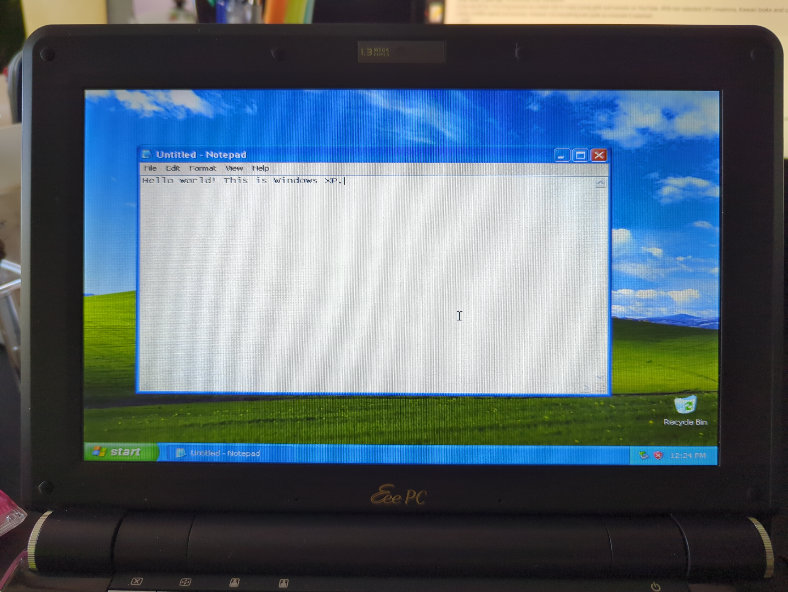

+++
title = "Installing Lego Island on a Netbook"
date = "2025-08-30"
tags = [
    "videogames",
    "guide",
]
+++

Due to my notetaking ecosystem being on Emacs, I wanted a portable laptop. Something that I could take with me "on-the-go." I took a look at netbooks and settled on obtaining an Asus EEE PC 1000HA.

It came with antiX Linux, but I tried installing [32-bit Arch Linux](https://archlinux32.org/) on it to no avail. After leaving the netbook alone for awhile, I decided to try putting Lego Island on it as a gift.

I used Rufus to flash an image of Windows XP to a 16 GB USB stick. You may need to experiment with the partition type. For me, `0x82 (Disk 3)` worked as shown below.

While setting up the Windows XP installation, leave the USB stick in for the entirety of the process. I also installed the [audio drivers](https://www.asus.com/us/supportonly/eee%20pc%201000haxp/helpdesk_download/) for the EEE PC.

To install Lego Island onto the netbook, I mounted the `.iso` on my desktop to extract the files and then copy them to the netbook.

It was also just incredibly nostalgic to poke around in the OS... I remember my family laptop being riddled with viruses. Fun times.

