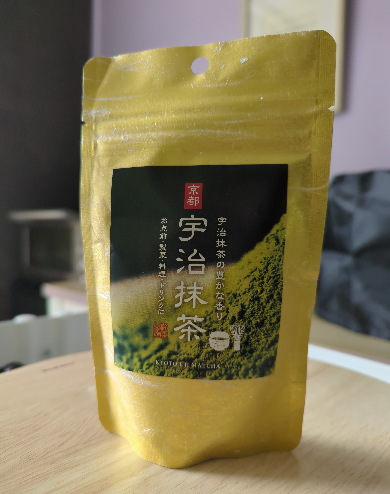
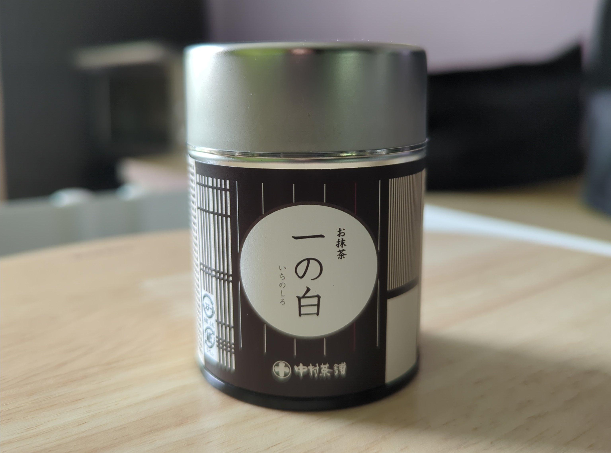
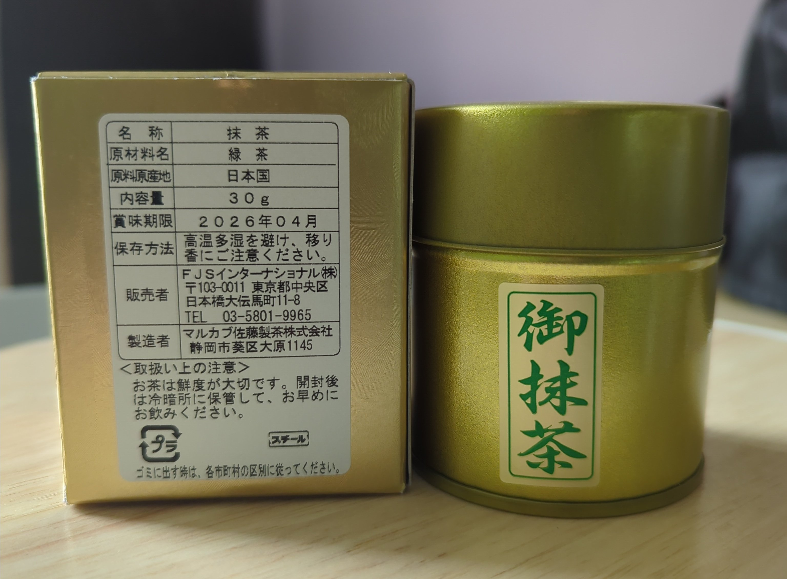
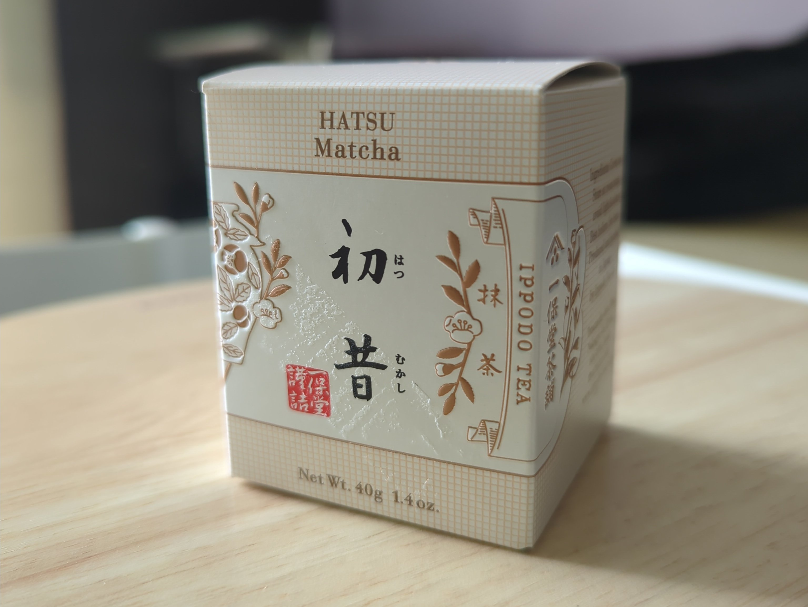
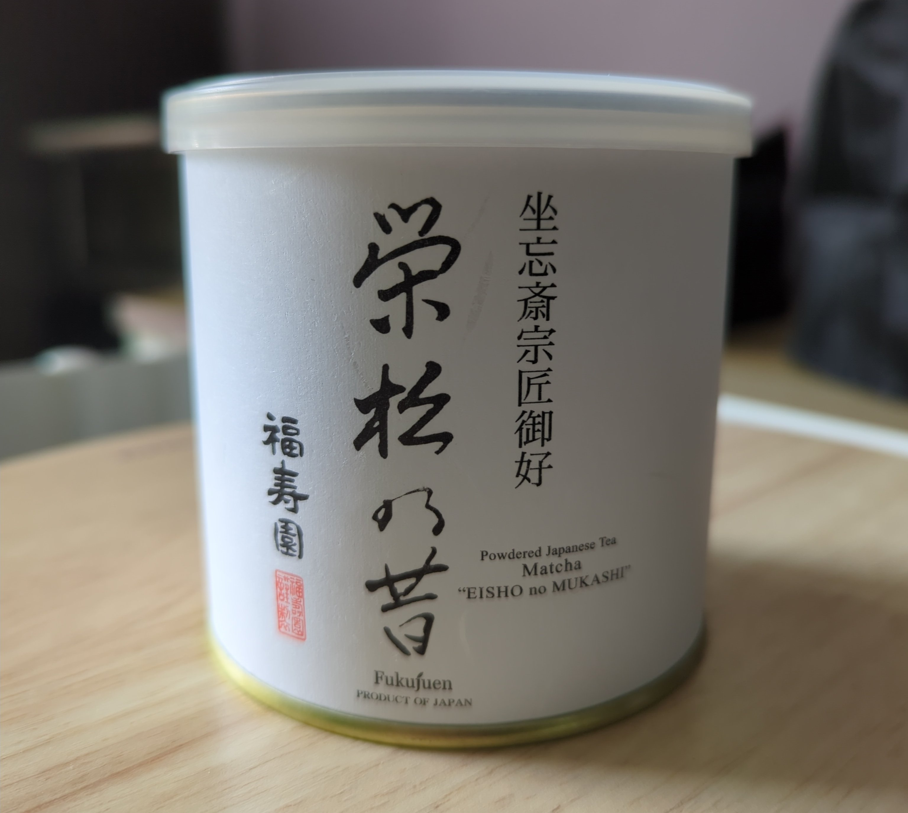
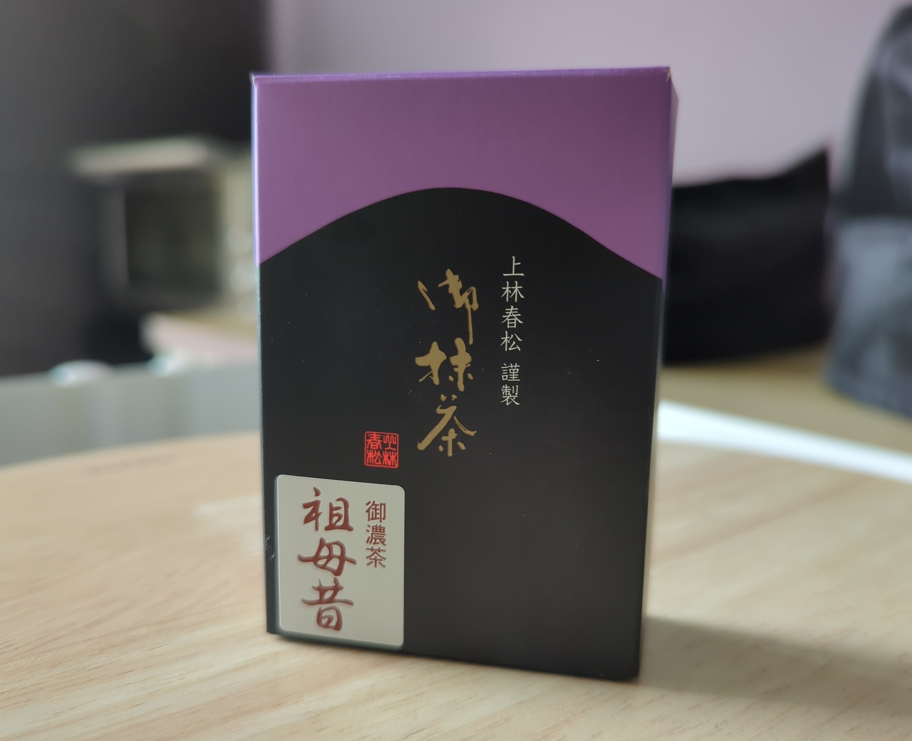

+++
title = "Matcha Review"
date = "2025-08-31"
tags = []
+++

## Kyoto Uji Matcha from [Kyoto Chanokura Matcha](https://nishizawa-en.com/pages/kyoto-chanokura)

This was 70g of matcha in a paperlike sealable bag. Unfortunately, I cannot give a conclusion because it was dull and tasted bad by the time I got to this one. I suspect that it went bad because its container was breathable and it didn't have a desiccant.

## [Ichi no Shiro Matcha](https://www.amazon.co.jp/-/en/Hagiri-Matsue-Nakamura-Chasuke-Matcha/dp/B007BJ30TQ) from [Nakamura Tokichi](https://global.tokichi.jp/)

The caffeine in this 20g container was very mild. As for taste, it was stronger than the Hatsu Matcha from Ippodo Tea but weaker than everything else on this list.

## Matcha from [Marukabu Sato Tea](http://www.marukabu.co.jp/english.html) (Shizuoka City)

This was a 30g tin. The matcha was good; it has a small kick of caffeine, nothing that got my heart to race.

## [Hatsu Matcha](https://ippodotea.com/products/hatsu-mukashi) from Ippodo Tea

Coming in 40g, it had a very green tea-like smell to it. It was very light, reminding of "universal grade" matcha. But it didn't have the quality of that type of matcha. It was very smooth and done tastefully well. I would say that this is very much of its own class in comparison to the other matcha in this post. I think you get a lot of value for your money.

## [Eisho no Mukashi Matcha](https://global.fukujuen.com/en-us/products/eisho-no-mukashi-20g?_fid=c9a007d19&_pos=4&_ss=c) from Fukujuen

I've never received or obtained as much as 100g of matcha until I came across this can. (Yes, it came in a can!) I love the aroma. The color was rich and was nearly as strong as the Koicha Babamukashi Matcha. This gave me the strongest kick of caffeine, so it's definitely something to wake yourself up with!

## [Koicha Babamukashi](https://www.sazentea.com/en/products/p1592-koicha-babamukashi.html) from [Kanbayashi Shunsho Matcha](https://www.sazentea.com/en/products/c114-kanbayashi-shunsho-matcha)

This matcha box came in with 20g. It had a very unique smell to it... that I've never smelled before. Taste-wise, it was very strong and bold. The color itself of the matcha was also a bright, deep green. I really liked it. It also had a pretty good kick of caffeine, but it didn't last for a long time. I felt the punch for about an hour and then it tapered off. This, by far, was my favorite.