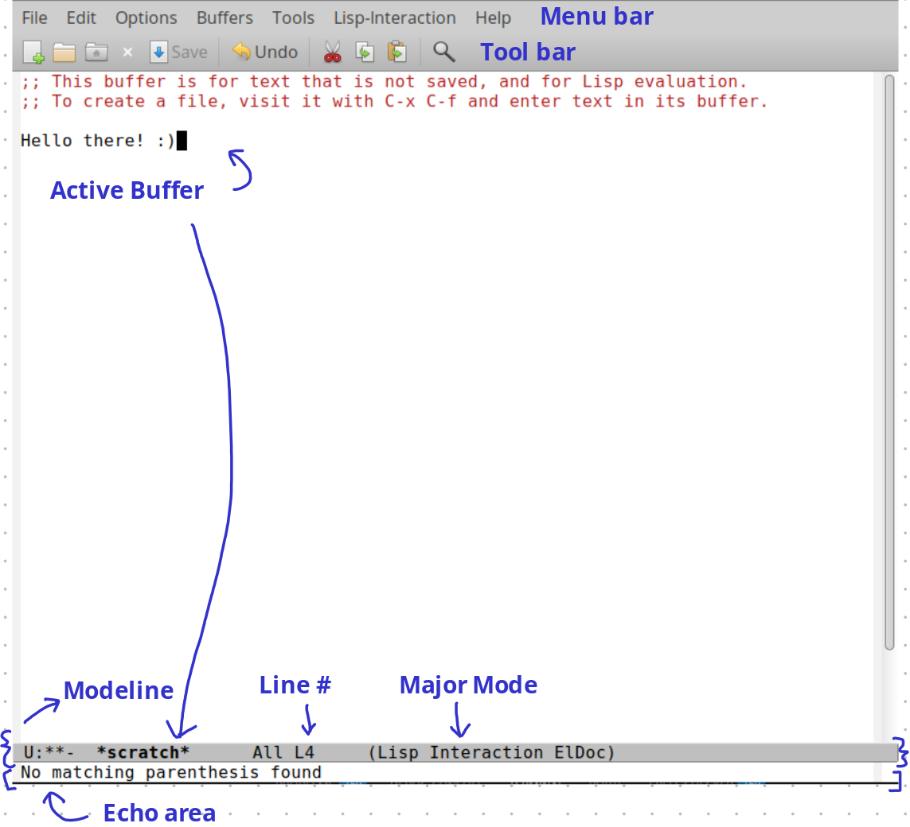
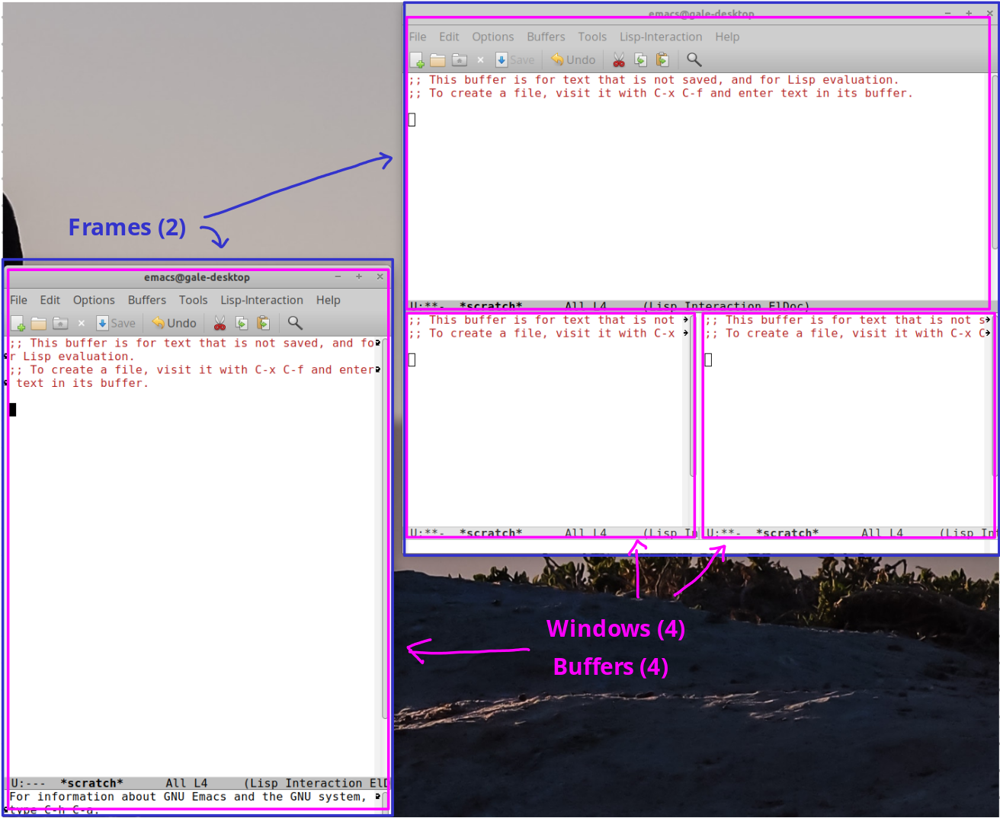
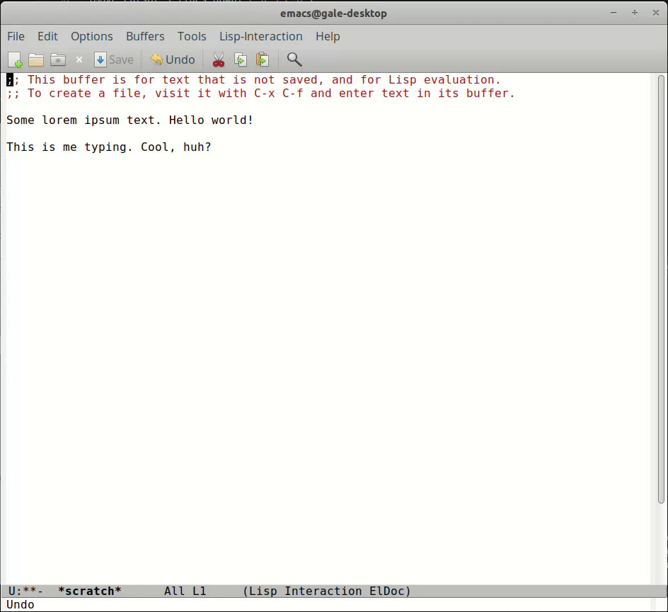
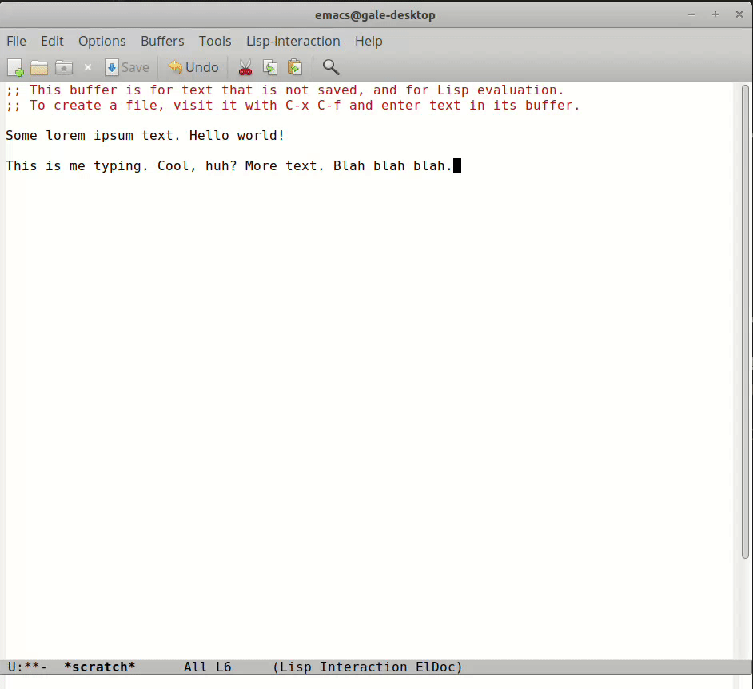
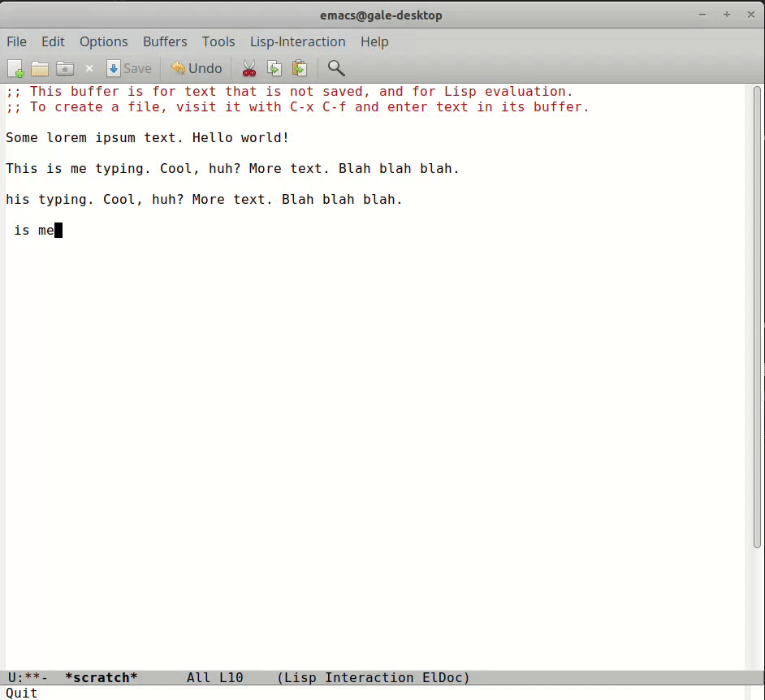
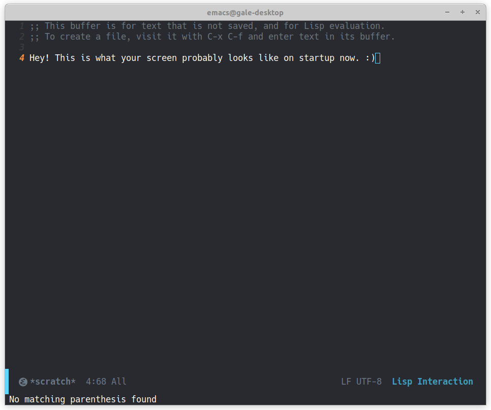

+++
title = "Getting Started with Emacs"
date = "2025-11-04"
tags = [
    "emacs",
    "guide"
]
+++

This blog post was written as a companion to a two-part workshop given on 2025-11-03 at Bergen Community College to show how Emacs can be used as a productivity tool.

---

## Preface

### What is Emacs?

According to [the site](https://www.gnu.org/savannah-checkouts/gnu/emacs/emacs.html), Emacs is "an extensible, customizable, free/libre text editor." ([Free as in freedom.](https://www.gnu.org/philosophy/free-sw.html)) It also includes a Lisp interpreter. Just for fun, check [this video](https://youtu.be/urcL86UpqZc?si=OTg1cgwf2H4Ib5Uh) out.

To me, it's almost an ecosystem—people joke that it is an operating system, and rightly so. My entire life is in Emacs. It grows with you. I find that I configure it based on my needs. The question to ask is not "What is the best Emacs config?"—it's "What do I need? What works for me? What will help me to do x, y, and z?" You are building your own tool.

For the past few years, I've primarily used it as a note-taking and task management environment rather than a software development one.

The first public release of Emacs was in 1985, first written in 1976, which predates a lot of current systems. This guide will be littered with definitions that may not make so much sense today, so hang in there with me.

### What will I need?

- Laptop with an internet connection
- Charger

No programming experience is required, but basic computer knowledge is helpful.

### Notes

The screenshots shown in this guide were made on Ubuntu 22.04. This guide was tested on Ubuntu 22.04 with Emacs version 27.1 and Windows 10 with Emacs version 30.2.

---

## The Objective

The goals of today's workshop are to install Emacs onto your machine, get familiar with the keybindings, and start an initialization file for configuration. It is to prepare us for the next workshop session, which will be on two packages called `org-mode` and `org-super-agenda`.

---

## Installation

For this workshop, we're going to focus on GUI Emacs. The terminal is exclusively a keyboard-driven experience.

### GNU/Linux
Your package manager very likely has Emacs in its repository. You can install it from the terminal.
```bash
$ sudo apt install emacs # For my Debian and Ubuntu users
$ sudo pacman -S emacs # For Arch ;)
```
### macOS
You can use [Homebrew](https://brew.sh/).
```bash
brew install --cask emacs
```
### Windows
Run an installer (`.exe`) from a [nearby mirror](https://gnu.mirror.constant.com/emacs/windows/).

---

## The User Interface (UI)

You can launch Emacs from the terminal or interface with your system's launcher.

If you've had experience with other text editors, such as VS Code, you're probably expecting a file tree to appear on your left. This visual is not so much the case in Emacs. On startup (past the splash screen), you will see this.



The **modeline** is typically found at the bottom of the window. This contains useful information on the current buffer. The important ones to pay attention to are indicated in the image above, primarily the name of the buffer displayed, line number, and the **major mode**. A **major mode** is the main editing mode for the buffer, such as `Org mode` and `Text mode`. A **minor mode** may also be present, which provide extra features on top of the major mode.

The **echo area** displays a small amount of text. It echos (or displays) the characters of a multi-character command entered. Error messages are also displayed here, which is accompanied by a beep. Lengthier, informative echo area messages are saved in a special buffer called \*Messages\*.

**Buffers** contain what you are displaying or editing in **windows**. **Windows** are subdivisions of **frames**, and **frames** are what we think of windows as today (i.e. the rectangular graphical control element).



*In the image above, there are a total of two frames. The frame to the left has one window that shows a buffer. The frame to the right has a three windows.*

A **scratch** buffer is a buffer that is not visiting any file. I use it like scrap paper: jot something down and save it for later.

---

## Keybindings

The most efficient way to use Emacs is with the keyboard. Using the mouse starts to become inefficient at a certain point. In documentation relating to Emacs, you'll see commands like `C-x C-s` and `C-n`.

|Key|Notation|Notes|Example|
|---|---|---|---|
|CTRL|`C`||`C-n` would be entered as `CTRL + n`|
|ALT|`M`|Also known as the "meta" key.|`M-x` would be entered as `ALT + x`|
|SHIFT|`S`||`S-f` is `SHIFT + f`|
||`C-u <number>`|Numeric argument|`C-u 20 C-n` moves the cursor 20 lines down.|
||`M-x <name>`|Execute a command||

### Navigating the Buffer
|Operation|Keybind|
|---|---|
|Move cursor forward|`C-f`|
|Move cursor forward one word|`M-f`|
|Move cursor back|`C-b`|
|Move cursor back one word|`M-b`|
|Move cursor next line|`C-n`|
|Move cursor previous line|`C-p`|
|Move cursor to the end of line|`C-e`|
|Move cursor to the beginning of line|`C-a`|
|Move cursor 5 lines down|`C-u 5 C-n`|
|Move one "screenful" down|`C-v`|
|Move one "screenful" up|`M-v`|
|Jump to end of buffer|`M->`|
|Jump to beginning of buffer|`M-<`|


*The gif above demos navigating a buffer.*

### Basic Operations

|Operation|Keybind|
|---|---|
|Help|`C-h`|
|Search|`C-s`|
|Abort|`C-g` or `ESC-ESC-ESC`|
|Undo|`C-/`|
|Run Dired|`C-x d`|
|Quit Emacs (but why would you?)|`C-x C-c`|

Abort (`C-g`) is typically used to cancel a command. I hardly run **Dired** (`C-x d`) to manage my files as I use a different package for that (called [Treemacs](https://github.com/Alexander-Miller/treemacs)), but it's good to explore. Hit `q` to exit its interface.


*The gif above demos some basic operations.*

|File Operation|Keybind|
|---|---|
|Find (or create) file to edit|`C-x C-f`|
|Save file|`C-x C-s`|
|Save all files|`C-x s`|
<br>

|Text Operation|Keybind|
|---|---|
|Set mark (lets you "highlight" text/region)|`C-SPC`|
|Copy region to kill ring|`M-w`|
|Kill region|`C-w`|
|Yank last thing killed|`C-y`|

Copy, cut, and paste are termed a bit differently in Emacs. A **kill ring** refers to a data structure (i.e. a circular linked list) where the contents you've copied are stored. So "copy region to kill ring" means you're copying a string of text. "Kill region" (`C-w`) is analogous to cut text. **Yanking** (`C-y`) retreives the latest string of text copied or killed on the kill ring; this is the same as pasting text.


*The gif above demos text operations.*

|Buffer/Window Operation|Keybind|
|---|---|
|Select a buffer|`C-x b`|
|Delete all other windows|`C-x 1`|
|Split window|`C-x 2`|
|Delete current window|`C-x 0`|
|Switch cursor to another window|`C-x o`|
|Switch to another buffer|`C-→`|


*The gif above demos buffer/window operations. I accidentally had caps lock on in the beginning.*

### Exercise
1. Without using the mouse, create a file, enter some text, and save it.
2. Practice moving your cursor around with your keyboard with this [dummy textfile](./lorem.txt). Copy, kill, and yank text around. Split windows and switch your cursor to another window.

---

## Creating Your Initialization (`.el`) File

It looks a bit bland, right? To customize it, we're going to create our own initialization (init) file. Emacs looks for an init file in several places from your home directory: `~/.emacs.el`, `~/.emacs`, or `~/.emacs.d/init.el`. Ensure that you can see hidden files in your file manager. In my case, I created my init file (`.emacs.el`) directly in my home directory. Name your file `init.el`, but `.emacs.el` works for Ubuntu 22.04.

On Windows, use `C-x C-f` to create the file `~/.emacs.d/init.el`.

You don't really need to know Emacs Lisp to start writing an init file. (I didn't know what I was doing either.) Being able to wrangle things around and experiement is key, so there will be a ton of provided snippets and a complete `init.el` at the end of this guide.

Lisp expressions are enclosed in parentheses. The code block below shows what the syntax looks like.
```lisp
(function-name arg1 arg2)
(function variable-name value)
; This is a comment!
```

That splash screen in the beginning was annoying, wasn't it? We can disable that. To reduce the number of files made, I also prefer disabling backup files. The following is a snippet of some basic settings that I prefer.
```lisp
(setq inhibit-startup-message t) ;; Don't show splash screen

(setq make-backup-files nil) ;; Don't make backup files

(setq visible-bell t) ;; Flash on error

(tool-bar-mode -1) ;; No tool bar

(menu-bar-mode -1) ;; No menu bar

(add-to-list 'default-frame-alist '(vertical-scroll-bars)) ;; No vertical scroll bar

(global-display-line-numbers-mode) ;; Show line numbers

;; Scrolling - I found the default settings jarring, especially on a laptop; this is what works for me
(setq scroll-conservatively 101)
(setq scroll-margin 20)
(setq fast-but-imprecise-scrolling t)
(setq
     mouse-wheel-follow-mouse 't
     mouse-wheel-progressive-speed nil
     ;; Hold down shift to move twice as fast, or hold down control to move 3x as fast. Perfect for trackpads.
     mouse-wheel-scroll-amount '(1 ((shift) . 3) ((control) . 6)))
```

The init file is loaded when Emacs starts. Thus to see the changes you made, save the file, close the editor, and then start Emacs again.

Downloading packages add functionality to our base editor. Emacs comes with a default package manager (`package.el`), like how `apt` is for Ubuntu and `pacman` is for Arch. *Package managers handle installs, updates, configuration, and removal of software and their dependencies.* Add the [MELPA repository](https://melpa.org/#/) so we can get some cool packages! I recommend adding this to the top of your `init.el`.

```lisp
;; MELPA package
(require 'package)
(add-to-list 'package-archives
	'("melpa" . "https://melpa.org/packages/") t)
(package-initialize)
```

Now's a good time to prettify our environment. You can customize the theme, font, and modeline. To this, we'll need to install some packages. Install `doom-modeline`, `doom-themes`, `nerd-icons`, and `all-the-icons` by entering `M-x package-list-packages` to refresh the package list and then run `M-x list-packages`.


*The gif above shows how to refresh the MELPA package list and locate two packages to install. They are already installed on my system.*

The snippet below makes use of the packages to customize the visual experience of our editor. I used the Hack 13 font, which can be installed from [here](https://github.com/source-foundry/Hack?tab=readme-ov-file#quick-installation). For the icons to work on Linux/macOS, run `M-x nerd-icons-install-fonts` and `M-x all-the-icons-install-fonts`. On Windows, install [Symbols Nerd Font](https://www.nerdfonts.com/font-downloads) from [nerd-fonts](https://github.com/ryanoasis/nerd-fonts). Unzip the file and install each font file.

```lisp
;; Font family
(set-frame-font "Hack 13" nil t)

;; Modeline settings
(setq display-time-default-load-average nil)
(line-number-mode)
(column-number-mode)
(display-time-mode -1)
(size-indication-mode 0)

;; Icons
(require 'nerd-icons) ;; Nerd-icons for doom-modeline to display icons
;; all-the-icons
(use-package all-the-icons
	:if (display-graphic-p))

;; Doom-modeline
(use-package doom-modeline
    :config
    (doom-modeline-mode)
    (setq doom-modeline-icon t
         doom-modeline-major-mode-icon t
	     doom-modeline-battery t
	     doom-modeline-buffer-name t
	     doom-modeline-height 50
	     doom-modeline-bar-width 7))

;; Doom theme
(require 'doom-themes)
(setq doom-themes-enable-bold t  
    doom-themes-enable-italic t)
(load-theme 'doom-xcode t) ; doom-gruvbox
(doom-themes-visual-bell-config)
(setq doom-themes-treemacs-theme "doom-colors")
(doom-themes-treemacs-config)
;; Change treemacs font face b/c doom-themes pkg forces treemacs to use a variable pitch font
(setq doom-themes-treemacs-enable-variable-pitch nil)
(doom-themes-org-config)
```



Feel free to explore other themes, fonts, and functions or variables to change. Make it yours. :)

Here is the complete [`init.el`](./init.el):
```lisp
;; MELPA package
(require 'package)
(add-to-list 'package-archives
	'("melpa" . "https://melpa.org/packages/") t)
(package-initialize)

(setq inhibit-startup-message t) ;; Don't show splash screen

(setq make-backup-files nil) ;; Don't make backup files

(setq visible-bell t) ;; Flash on error

(tool-bar-mode -1) ;; No tool bar

(menu-bar-mode -1) ;; No menu bar

(add-to-list 'default-frame-alist '(vertical-scroll-bars)) ;; No vertical scroll bar

(global-display-line-numbers-mode) ;; Show line numbers

;; Scrolling - I found the default settings jarring, especially on a laptop; this is what works for me
(setq scroll-conservatively 101)
(setq scroll-margin 20)
(setq fast-but-imprecise-scrolling t)
(setq
     mouse-wheel-follow-mouse 't
     mouse-wheel-progressive-speed nil
     ;; Hold down shift to move twice as fast, or hold down control to move 3x as fast. Perfect for trackpads.
     mouse-wheel-scroll-amount '(1 ((shift) . 3) ((control) . 6)))

;; Font family
(set-frame-font "Hack 13" nil t)

;; Modeline settings
(setq display-time-default-load-average nil)
(line-number-mode)
(column-number-mode)
(display-time-mode -1)
(size-indication-mode 0)

;; Icons
(require 'nerd-icons) ;; Nerd-icons for doom-modeline to display icons
;; all-the-icons
(use-package all-the-icons
	:if (display-graphic-p))

;; Doom-modeline
(use-package doom-modeline
    :config
    (doom-modeline-mode)
    (setq doom-modeline-icon t
         doom-modeline-major-mode-icon t
	     doom-modeline-battery t
	     doom-modeline-buffer-name t
	     doom-modeline-height 50
	     doom-modeline-bar-width 7))

;; Doom theme
(require 'doom-themes)
(setq doom-themes-enable-bold t  
    doom-themes-enable-italic t)
(load-theme 'doom-xcode t) ; doom-gruvbox
(doom-themes-visual-bell-config)
(setq doom-themes-treemacs-theme "doom-colors")
(doom-themes-treemacs-config)
;; Change treemacs font face b/c doom-themes pkg forces treemacs to use a variable pitch font
(setq doom-themes-treemacs-enable-variable-pitch nil)
(doom-themes-org-config)
```

---

## Resources

- [Emacs Manual](https://www.gnu.org/software/emacs/manual/html_node/emacs/index.html)
- [DistroTube](https://www.youtube.com/@DistroTube)
- [Jake B](https://www.youtube.com/@JakeBox0)
- [System Crafters](https://www.youtube.com/@SystemCrafters)
- [The Org Manual](https://orgmode.org/org.html)
- [Emacs](https://www.gnu.org/software/emacs/)