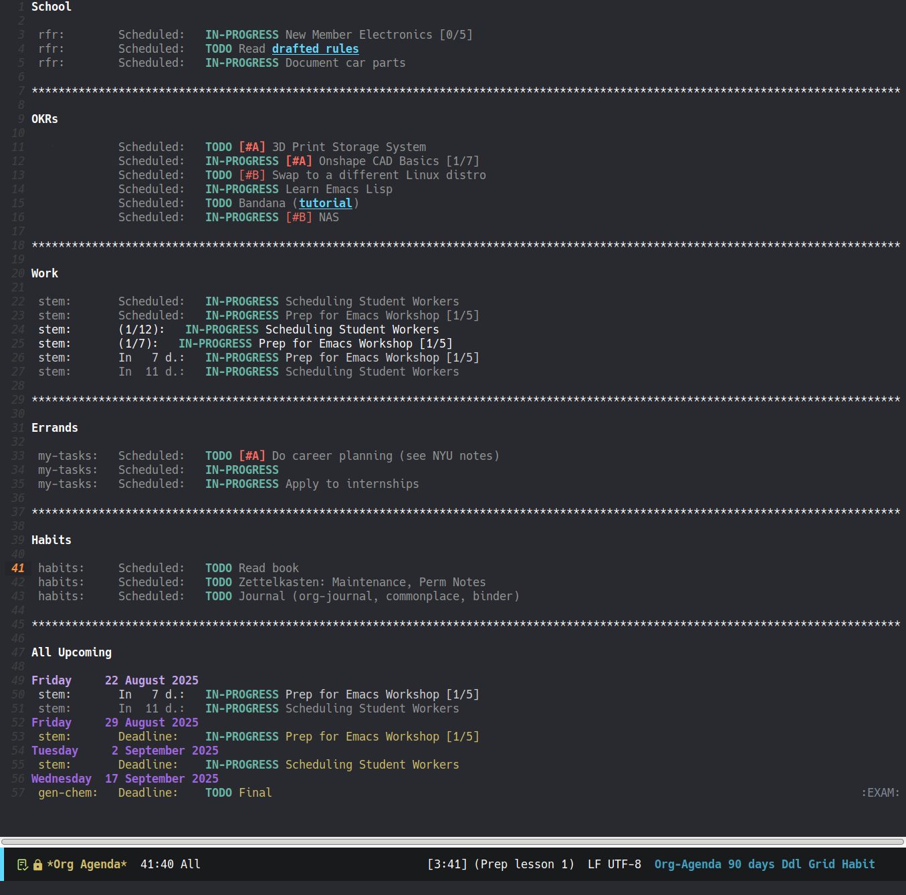

+++
title = "Getting Started with Emacs: org-mode and org-super-agenda"
date = "2025-11-08"
tags = [
    "emacs",
    "guide"
]
+++

This blog post was written as a companion to a two-part workshop given on 2025-11-10 at Bergen Community College to show how Emacs can be used as a productivity tool.

---

## Preface

To keep your files organized, I recommend creating an `emacs` directory (folder) in your home directory. Create another directory called `planner` within `emacs`, which will come into use when we get to use `org-super-agenda`.

On Windows, enter `C-x C-f ~/emacs`.

---

## The Objective

The goals of today's workshop are to familiarize yourself with `org-mode` and make use of `org-super-agenda` as a planner.

---

## org-mode

`org-mode` is a major mode in Emacs for notes, literate programming, and making to-do lists... it's like [Markdown](https://www.markdownguide.org/) on steroids. It's very powerful for plain text documentation. You can find the manual [here](https://orgmode.org/manuals.html).

Create a file named `scratch.org` in your `emacs` directory.

### Basic Syntax

#### Preambles

This is the start of a file, which sets the title, author, date, and other export options.

```org
#+TITLE: Org-mode is cool
#+AUTHOR: Rebekah
#+DATE: <2025-08-22>
```

#### Heading
|Operation|Keybind|
|---|---|
|Indent heading|`M-→`|
|De-indent heading|`M-←`|
|Enter a new heading on newline|`M-ENTER`|
|Fold a heading|`TAB`|
|Shift a heading and its children|`M-S-→`|

```org
* H1
** H2
*** H3
**** H4... and so on
```

#### Drawers

If you want to keep some information associated with something but you don't want to see it, you can use a drawer.

```org
* Headline
Some text...
:DRAWER_NAME:
Text inside the drawer. Drawers are collapsed by default.
:END:
```

#### Text
```org
**bold**
/italics/
_underline_
~inline code~
=verbatim=
+strikethrough+
[[URL][Link description]]
```

#### Images

Image links will render as images on export. Do not include a description.

```org
[[https://en.wikipedia.org/wiki/Electronic_control_unit#/media/File:2008-04-17_ECU.jpg]]
```

#### Code Blocks

Source blocks are interactive, allowing for code execution and literate programming. To execute code within a source block, hit `C-c C-c`.

```org
#+BEGIN_SRC c
    #include <stdio.h>

    int main() {
        printf("Hello world!\n");
        return 0;
    }
#+END_SRC
```

#### Lists
|Operation|Keybind|
|---|---|
|Move a list item up or down|`M-↑` or `M-↓`|
|Sort a list|`C-c ^`|
|Create a checkbox item on newline|`C-M-ENTER`|
|Mark a checkbox item as complete|`C-c C-c`|
|Change list prefix|`C-c -`|

```org
- Unordered list
- Item 1
- Item 2

1. Ordered list
2. Item 1
3. Item 2

- [ ] Checklist item
- [ ] Another checklist item
- [x] A completed checklist item
```

#### Tables
|Operation|Keybind|
|---|---|
|Move a row up or down|`M-↑` or `M-↓`|
|Move a column to the left or right|`M-←` or `M-→`|

```org
|First Header|Second Column|
|---|---|
|First cell|Another one!|
|Another item|Some text here|
```

### Exporting

`org-mode` allows you to export your file (`C-c C-e`) in many formats:
- HTML
- PDF
- LaTeX
- ODT
- Plain Text

### Configuration

Returning to our `init.el` file, we can add syntax highlighting to our code blocks and change some of the default behavior.

```lisp
;; Org mode config
(setq org-ellipsis "...") ;; You can change the `...` to anything you want
(setq org-startup-folded t) ;; Fold headers
(setq org-startup-with-inline-images t) ;; Show inline images, may blow up the screen
(setq org-image-actual-width nil) ;; Lets you set your own image width
(setq org-hide-emphasis-markers t) ;; Hide markup elements
(add-hook 'org-mode-hook 'turn-on-auto-fill) ;; Wrap text at 80 char
(add-hook 'org-mode-hook 'org-indent-mode) ;; Automatically starts org-indent-mode

;; Retain new lines separating headings
(customize-set-variable 'org-blank-before-new-entry 
	    '((heading . nil)
          (plain-list-item . nil)))
(setq org-cycle-separator-lines 1)

;; Active Babel languages
(org-babel-do-load-languages
     'org-babel-load-languages
     '((scheme . t) ;; Here is where you can list what languages you want syntax highlighting for
       (ledger . t)
       (latex . t)
       (java . t)
       (C . t)))

;; Syntax highlighting for source blocks
(setq org-src-fontify-natively t)
```

### Demo

Below is a video demo of the features listed.




---

## org-super-agenda

`org-super-agenda` builds on top of `org-agenda`, letting you group items into sections. This is very useful for when you want to group your tasks. Install the `org-super-agenda` package via `M-x list-packages`.

In your `init.el`, create a keybind for `org-agenda`. I have mine bound to `C-c a`.

```lisp
(global-set-key "\C-ca" 'org-agenda) ;; Agenda view keybind
```

Before we get into configuring `org-super-agenda`, let's create a few files to play around with. We're going to organize our todo lists for each class by file within a `college` folder and for each workplace within a `work` folder. This is what your file tree probably looks like now:

```bash
~/
├── emacs/
│   ├── planner/
│   │   ├── college/
│   │   │   ├── wrt101.org
│   │   │   ├── cis265.org
│   │   │   └── mat280.org
│   │   └── work/
│   │       ├── bcc.org
│   │       └── cafe.org
│   └── scratch.org
└── .emacs.d/
    └── init.el
```

Now, let's set up the `.org` files. Firstly, we'll write a preamble at the top of our file and add a todo item by writing a header and `TODO` (or by pressing `S-→`). Ensure that the preamble takes effect by pressing `C-c C-c`.

```org
#+SEQ_TODO: TODO(t) IN-PROGRESS(i) | DONE(d)
#+TAGS: ASSIGNMENT(a) EXAM(x) QUIZ(q) PROJECT(p) LAB(l) READING(r)
#+CATEGORY: wrt101

* TODO This is a todo item
```

Next, schedule today's date for the todo item so that it shows up on today's agenda view. You can invoke this by pressing `C-c C-s` to bring up a calendar. Set a deadline for it by pressing `C-c C-d`.

It is possible to schedule a task over a period of time. To ensure that this feature shows up properly in `org-super-agenda`, I recommend ensuring that your scheduled date comes first, then your deadline. I've had issues with this before.

You can also tag your todo items with `C-c C-q`, which was customized in our preamble with `#+TAGS`. We can also cycle through the status of our tasks with `S-→`, which was predefined in `#+SEQ_TODO`. `#+CATEGORY` sets a name for the file that will appear in our agenda view. I've had an issue before where the filename would show up as `???` and this resolved that issue.

*The video below demos the instructions above.*


Now let's configure `org-super-agenda` in our `init.el` file.

```lisp
;; org-super-agenda
(require 'org-super-agenda)
     (setq org-agenda-custom-commands
	   '(
	     ("r" "Today's Agenda"
	      ((agenda ""
		       ((org-agenda-block-separator ?*) ;; Makes the separator *'s
			    (org-agenda-span 1) ;; Lists items scheduled or deadlined for today
			    (org-agenda-format-date "")
			    (org-agenda-files '("~/emacs/planner/college")) ;; Specify folder the .org files are in
			    (org-agenda-overriding-header "School"))) ;; Title of header
	       (agenda ""
		       ((org-agenda-block-separator ?*)
                (org-agenda-span 1)
                (org-agenda-format-date "")
                (org-agenda-files '("~/emacs/planner/work"))
                (org-agenda-overriding-header "\nWork")))
	       (agenda ""
		       ((org-agenda-block-separator ?*)
                (org-agenda-span 90)
                (org-agenda-entry-types '(:deadline)) ;; Show only deadlines
                (org-agenda-show-all-dates nil)
                (org-agenda-files '("~/emacs/planner/college" "~/emacs/planner/work"))
                (org-agenda-overriding-header "\nAll Upcoming\n")))
            ))
	     ("w" "Week's Agenda"
	      ((agenda ""
		       ((org-agenda-block-separator ?*)
                (org-agenda-span 7)
                (org-agenda-files '("~/emacs/planner/college" "~/emacs/planner/work"))
			))
	       ))
	     ("q" "Week's Deadlines"
	      ((agenda ""
		       ((org-agenda-block-separator ?*)
                (org-agenda-span 7)
                (org-agenda-entry-types '(:deadline))
                (org-agenda-files '("~/emacs/planner/college" "~/emacs/planner/work"))
			))
	       ))
	     ))
```


*The demo above shows some actions you can perform in the `org-agenda` view.*

The most common operations I use are `S-f`, which follows a task to its originating file, and `m` to mark a task for bulk action, such as for rescheduling.

*The image below shows my agenda view. See the [documentation for org-super-agenda](https://github.com/alphapapa/org-super-agenda?tab=readme-ov-file) for more snippets and customization options.*


Here is the complete [`init.el`](./init.el):
```lisp
;; MELPA package
(require 'package)
(add-to-list 'package-archives
	'("melpa" . "https://melpa.org/packages/") t)
(package-initialize)

(setq inhibit-startup-message t) ;; Don't show splash screen

(setq make-backup-files nil) ;; Don't make backup files

(setq visible-bell t) ;; Flash on error

(tool-bar-mode -1) ;; No tool bar

(menu-bar-mode -1) ;; No menu bar

(add-to-list 'default-frame-alist '(vertical-scroll-bars)) ;; No vertical scroll bar

(global-display-line-numbers-mode) ;; Show line numbers

;; Scrolling - I found the default settings jarring, especially on a laptop; this is what works for me
(setq scroll-conservatively 101)
(setq scroll-margin 20)
(setq fast-but-imprecise-scrolling t)
(setq
     mouse-wheel-follow-mouse 't
     mouse-wheel-progressive-speed nil
     ;; Hold down shift to move twice as fast, or hold down control to move 3x as fast. Perfect for trackpads.
     mouse-wheel-scroll-amount '(1 ((shift) . 3) ((control) . 6)))

;; Font family
(set-frame-font "Hack 13" nil t)

;; Modeline settings
(setq display-time-default-load-average nil)
(line-number-mode)
(column-number-mode)
(display-time-mode -1)
(size-indication-mode 0)

;; Doom-modeline
(use-package doom-modeline
    :config
    (doom-modeline-mode)
    (setq doom-modeline-icon t
         doom-modeline-major-mode-icon t
	     doom-modeline-battery t
	     doom-modeline-buffer-name t
	     doom-modeline-height 50
	     doom-modeline-bar-width 7))

;; Doom theme
(require 'doom-themes)
(setq doom-themes-enable-bold t  
    doom-themes-enable-italic t)
(load-theme 'doom-xcode t) ; doom-gruvbox
(doom-themes-visual-bell-config)
(setq doom-themes-treemacs-theme "doom-colors")
(doom-themes-treemacs-config)
;; Change treemacs font face b/c doom-themes pkg forces treemacs to use a variable pitch font
(setq doom-themes-treemacs-enable-variable-pitch nil)
(doom-themes-org-config)

;; Org mode config
(setq org-ellipsis "...") ;; You can change the `...` to anything you want
(setq org-startup-folded t) ;; Fold headers
(setq org-startup-with-inline-images t) ;; Show inline images, may blow up the screen
(setq org-image-actual-width nil) ;; Lets you set your own image width
(setq org-hide-emphasis-markers t) ;; Hide markup elements
(add-hook 'org-mode-hook 'turn-on-auto-fill) ;; Wrap text at 80 char
(add-hook 'org-mode-hook 'org-indent-mode) ;; Automatically starts org-indent-mode

;; Retain new lines separating headings
(customize-set-variable 'org-blank-before-new-entry 
	    '((heading . nil)
          (plain-list-item . nil)))
(setq org-cycle-separator-lines 1)

;; Active Babel languages
(org-babel-do-load-languages
     'org-babel-load-languages
     '((scheme . t) ;; Here is where you can list what languages you want syntax highlighting for
       (ledger . t)
       (latex . t)
       (java . t)
       (C . t)))

;; Syntax highlighting for source blocks
(setq org-src-fontify-natively t)

(global-set-key "\C-ca" 'org-agenda) ;; Agenda view keybind

;; org-super-agenda
(require 'org-super-agenda)
     (setq org-agenda-custom-commands
	   '(
	     ("r" "Today's Agenda"
	      ((agenda ""
		       ((org-agenda-block-separator ?*) ;; Makes the separator *'s
			    (org-agenda-span 1) ;; Lists items scheduled or deadlined for today
			    (org-agenda-format-date "")
			    (org-agenda-files '("~/emacs/planner/college")) ;; Specify folder the .org files are in
			    (org-agenda-overriding-header "School"))) ;; Title of header
	       (agenda ""
		       ((org-agenda-block-separator ?*)
                (org-agenda-span 1)
                (org-agenda-format-date "")
                (org-agenda-files '("~/emacs/planner/work"))
                (org-agenda-overriding-header "\nWork")))
	       (agenda ""
		       ((org-agenda-block-separator ?*)
                (org-agenda-span 90)
                (org-agenda-entry-types '(:deadline)) ;; Show only deadlines
                (org-agenda-show-all-dates nil)
                (org-agenda-files '("~/emacs/planner/college" "~/emacs/planner/work"))
                (org-agenda-overriding-header "\nAll Upcoming\n")))
            ))
	     ("w" "Week's Agenda"
	      ((agenda ""
		       ((org-agenda-block-separator ?*)
                (org-agenda-span 7)
                (org-agenda-files '("~/emacs/planner/college" "~/emacs/planner/work"))
			))
	       ))
	     ("q" "Week's Deadlines"
	      ((agenda ""
		       ((org-agenda-block-separator ?*)
                (org-agenda-span 7)
                (org-agenda-entry-types '(:deadline))
                (org-agenda-files '("~/emacs/planner/college" "~/emacs/planner/work"))
			))
	       ))
	     ))
```

---

## Next Steps

- Explore what other packages has to offer. You can check out [my config](https://github.com/burntraisin/burntemacs/blob/main/config.org) for some inspiration.
- I recommend checking out:
    - [Treemacs](https://github.com/Alexander-Miller/treemacs) for a file explorer
    - [counsel](https://github.com/abo-abo/swiper) and `ivy` for completion and file searching
    - [org-roam](https://www.orgroam.com/) for knowledge management
    - [org-journal](https://github.com/bastibe/org-journal) for keeping a daily record of things
    - [elfeed](https://github.com/skeeto/elfeed) for an RSS feed