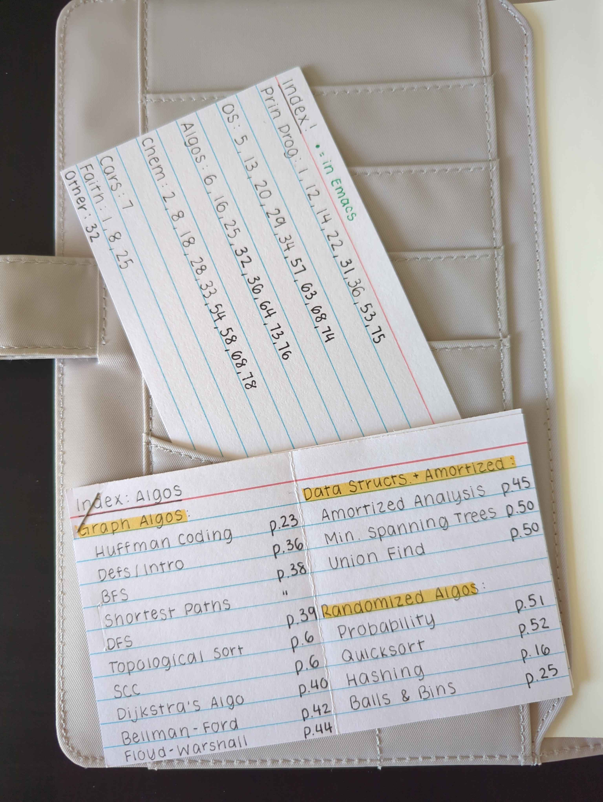

+++
title = "Revising My Note-Taking System"
date = "2025-12-24"
tags = []
+++

This past fall semester was rough. I was juggling three upper-level CS courses (which was my first time doing so) and one engineering pre-requisite notorious for its difficulty. Combined with working part-time and a long commute, I struggled to focus and retain information.

For one, I was extremely distracted during lecture. I exclusively took notes digitally on my laptop by typing them up in Emacs using `org-mode`, but this also meant that I would check my emails, Google something random, or message my friends. I had a lot of trouble focusing on the lecture itself. I couldn't recall anything when it came to taking an exam.

So I tried something new. I tried going analog. I decided to keep one "commonplace" book for all of my captured notes. The notebook I used was the [Midori MD A5 Grid Notebook](https://www.jetpens.com/Midori-MD-Notebook-A5-Grid/pd/13607). I paired it with a Hobonichi A5 cover I had lying around to hold my index and stickers. The quality of the paper is fantastic, and it works well with fountain pens.

## The Notebook Setup

I color-coded my subjects with dot stickers. I bought [Avery Color Coding Labels](https://www.avery.com/products/labels/5472), which were quite expensive---I saw some at Daiso later, and I will get them from there next time. The yellow ones I reserved for my classes since I could write the class name on the sticker. The other stickers were reserved for my other interests.

*^ This is the key for the stickers I used! They are on the first page.*

In order to work out the practice problems from class, I turned to using the [Maruman B5 Session Binder](https://www.jetpens.com/Maruman-Session-Binder-B5-26-Holes-Sky-Blue/pd/40565) as the benefits of my iPad seemed to have tapered off when I had trouble retaining information.

## The Initial Workflow

I aimed to jot down questions or note anything important during lecture with my notebook, especially items talked about that weren't in the slide deck the professor was lecturing. The goal wasn't to document, but it was to understand. After class, it would be ideal to look back at the slides and any other additional material (e.g. the textbook). However, I often found myself too exhausted after class and would just go to bed.

*^ An example spread of my notes. Note that a margin was drawn and the pages are numbered. I find sticky notes useful for drawing pictures or for post-lecture revision for when I need to add more information.*

For exams, I resorted to creating physical flashcards, which helped synthesize important information. However, I ended up cramming for all of my exams, which really wasn't an efficient way to go about memorizing the material.

*^ I used an index card as my index. It lists the page numbers for where you can find each subject at. I made one specific to my algorithms class.*

## Reflections

I implemented this about halfway through my fall semester, and here were some things I noticed:
- I was running out yellow dot stickers very quickly.
- I was consuming a lot of pages, but I found the rate of consumption acceptable. I completed half of my notebook by the end of the semester. This means that I would need about 2 notebooks to last me a semester.
- My focus was extremely divided this semester, and it was difficult to prioritize what tasks to complete. This did not help with how I seemed to work: I worked on one thing at a time without making progress on anything else, such as on a programming project. This seems to be a pattern, where I tend to put all of my energy into one or two things at the expense of my other obligations. I have these long periods of focus and switching over to another task (or getting interrupted) ruins my flow or tires me out.
- I see that a lot of studying advice proposes that you study more often for different classes instead of 1 class a day for 3 hours. However, this kind of advice never really worked for me. I would find it hard to study four subjects well in a day unless they were light, like some kind of flashcard review.

## A Proposed Workflow for the Spring Semester

1. **Priming**

    If the professor posts the lecture slides in advance, skim to jot down headers and notice diagrams. Create 2 - 3 questions. I would do this in my legal pad, which is brought to lecture. *In general, I find having a legal pad very useful for scrap notes!*

2. **Commonplace notes during lecture**

    The goal is to understand and process, not document. Jot down questions or answers to the questions you've created.

3. **Post-lecture revision**

    Use the lecture slides to fill in any gaps or misunderstandings. The goal is to answer the questions you've written. This is where you'd make questions to bring to office hours if needed.

4. **Deeper dive (as needed)**

    If the material is still unclear, read the textbook or find a YouTube video.

5. **Create flashcards**

    Review flashcards daily.

6. **Zettelkasten on Emacs**

    At the end of the week, stack your flashcards nearby. In an `.org` file, set a timer for 20 minutes to type out all of the flashcards in a single list and then transfer them to `org-roam` via `M-x org-roam-extract-subtree`. If I am short on time, this is the first step to go.

Since my classes run later into the evening, the post-lecture revision, priming, and flaschard review are to be done the next morning. I also designated a block of time on Saturdays in case there is still material I don't understand and would need a longer "deeper dive" session.

I will create another post at some point during the next spring semester to see how this proposal goes! :)