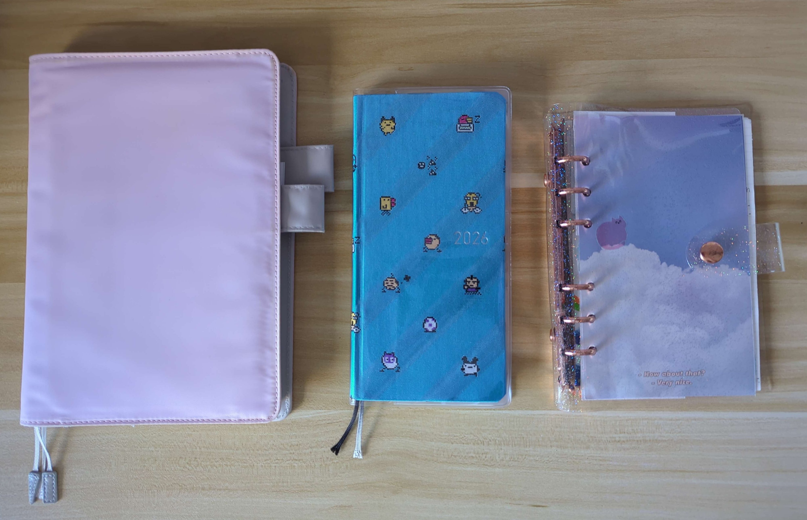
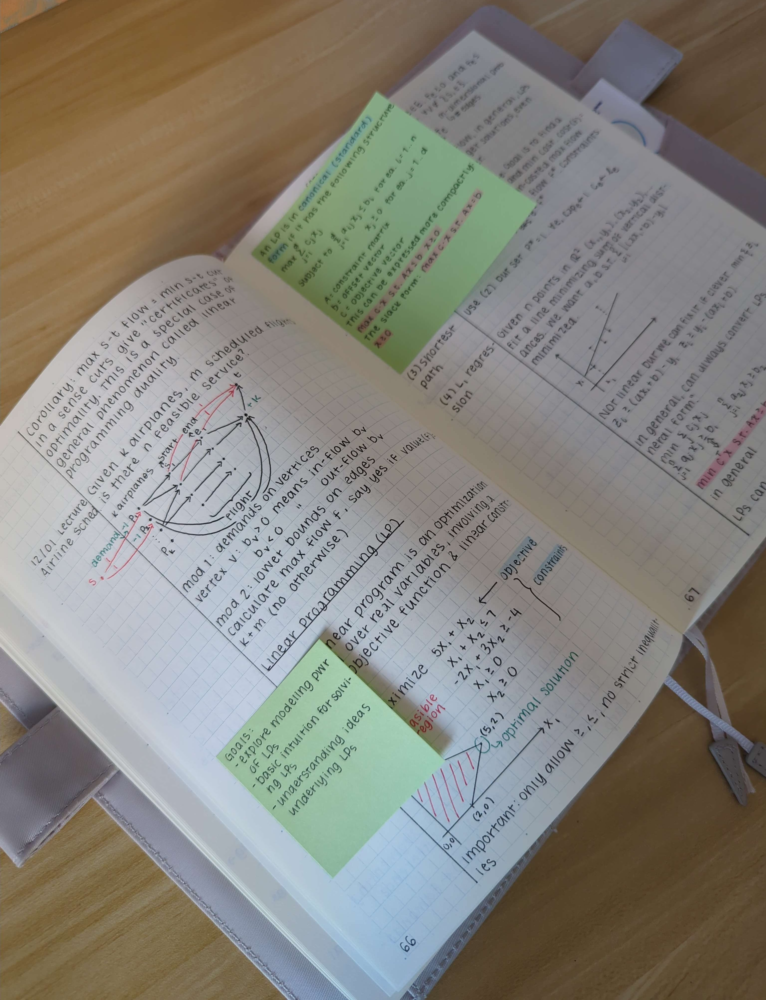
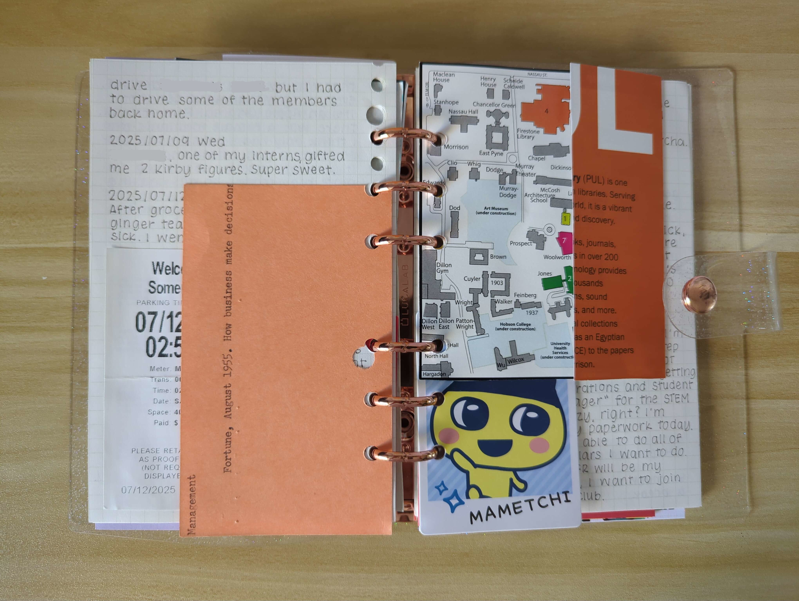
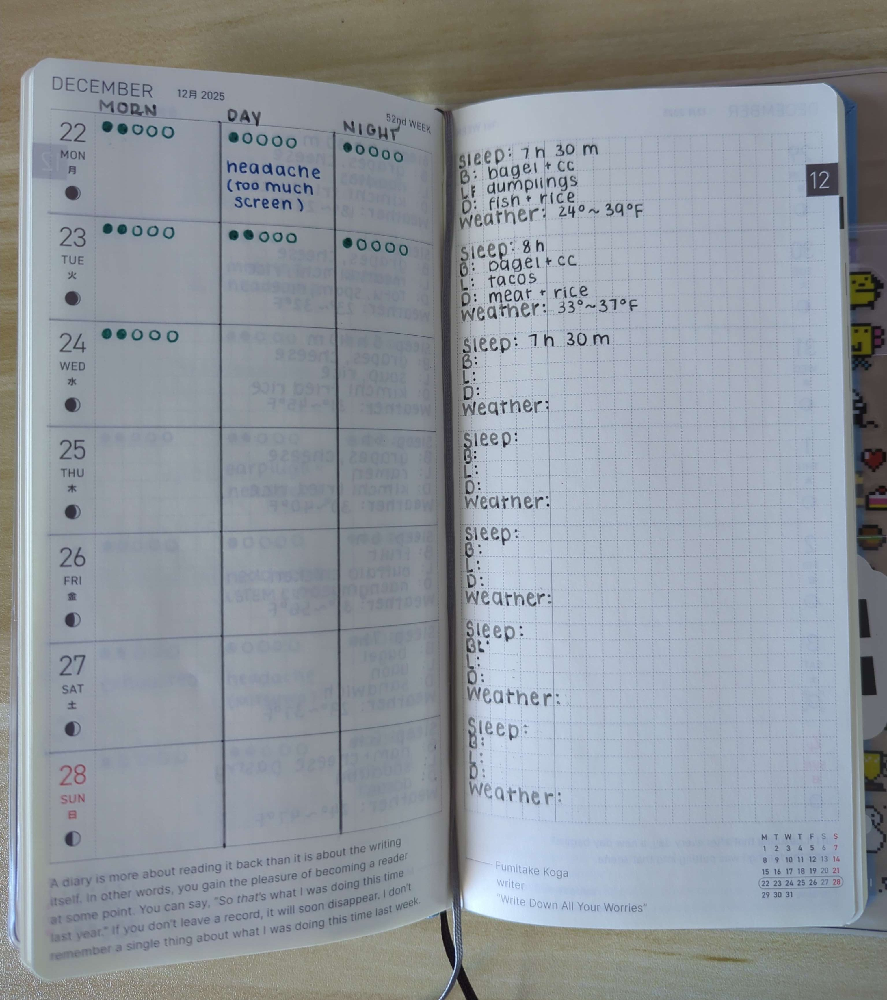
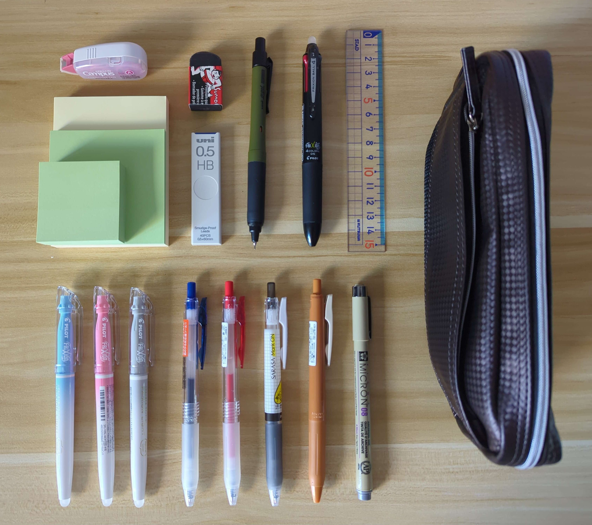

+++
title = "My Notebook Ecosystem"
date = "2025-12-26"
tags = []
+++

Hello! I intend to focus on discussing the physical notebooks that I plan on using for the upcoming year (2026).

*^ The lineup! To the left is the Midori A5 Grid Notebook, then the Hobonichi Weeks, and an A6 binder to the right.*

## Commonplace

My commonplace notebook is the [Midori MD A5 Grid Notebook](https://www.jetpens.com/Midori-MD-Notebook-A5-Grid/pd/13607). I use an A5 Hobonichi Cover to go with it, which stores all of my stickers and other loose papers. This functions as my first stop to information-gathering. If I want to learn a new topic or I saw something interesting, then I will jot some notes down here to learn or to reference later. The notebook lays flat, and it is such a pleasant experience to write with. I also use a color-coded sticker system to track what topics I am writing about. For example, I'll use a yellow dot sticker for my university classes.

*^ These are notes from my algorithms lecture! :)*

### Not Pictured: The Legal Pad

Accompanying my commonplace notebook is a junior legal pad, which functions as scrap paper. I found it helpful for re-writing things when I'm trying to memorize something and for jotting down quick notes during a meeting. It's frictionless and there's a lower "barrier" to entry in comparison to using a dedicated small notebook since the paper is of low quality. Also, I think it's neater than carrying around loose pieces of printer paper around. There's no pressure!

## Diary

For writing things out, I use an A6 binder. I ordered it from [Lucalab](https://lucalabglobal.com/) a long time ago. I cut some graph paper to size that I had lying around. This [Officemate 6-Hole Puncher](https://www.amazon.com/Officemate-Adjustable-Planners-Capacity-90163/dp/B0B7C7LD6Z?dib=eyJ2IjoiMSJ9.xhD7Z9_Yavdj1whZK0ExDUtufncr6vdFExsdnXuWdwJauCyyo_quIor-x9CeObTzK1PKRVfMzqFzE0AhXUmiHefKpZP1UBFeuIEob8I2sbEwFV1YM3_VhKt8ZwIK8j7PqrCDySZP4lA1RMmGQkWC8UzKkimpK5NV3l4weJp6j-Q_s2gz46eD1l_VyAR1uaoo7xsRJG98rnhqdc6hTuEhhN7Mo6Wdqx5-my_BxnRq28rm2cvycF-OcYaM1GO43BT9jq0m-BdR5OPLeIlN3l_utb-uAZSBTUATDgsrkQWfx9E.KHENpt9SAlduy2g6DLPp1CZO-oSMKYBTWzkQx7N1lOE&dib_tag=se&keywords=filofax%2Bhole%2Bpunch&qid=1766498065&sr=8-9&th=1) is super useful for creating your own inserts (and it is compatible with Filofax planners).

*^ I love how I can punch holes in loose pieces of paper. It makes collecting little items from where I've visited fun!*

## Health Tracker

I wanted to keep track of several health-related metrics, and I chose the [Hobonichi Techo Weeks](https://www.jetpens.com/Hobonichi-Techo-Weeks-English-Tamagotchi-Our-Tamagotchi-2026-Jan-Start/pd/49328). I last used the Hobonichi Weeks about five years ago, so this was like seeing an old friend! I was able to obtain the Tamagotchi edition, which was really exciting! I noticed that some things drain me quicker than others, and I want a better idea of how my energy levels look throughout the day.

*^ Here is my layout! My energy levels are indicated by the green circles and I list any symptoms in blue. I also take note of how much sleep I got, what I ate, and the weather for that day on the right.*

In my calendar view, I keep track of my gym attendance and workouts. There is also extra graph paper at the end of book, in which I intend to jot down any noticeable patterns.

## Stationery

I used to be very interested in stationery when I was younger, so making the switch to primarily analog-based note-taking wasn't difficult, especially in terms of selecting my tools.

The following are several items that live inside my [Nomadic's Wise-Walker Pencil Case](https://www.jetpens.com/Nomadic-s-Wise-Walker-PF-03-Carbonium-Pen-Case-C-Black/pd/13288):

- [FriXion Light Natural Color Highlighters](https://www.jetpens.com/Pilot-FriXion-Light-Natural-Color-Erasable-Highlighter-6-Color-Set/pd/29731)
- [Sakura Pigma Micron Pen Light Cool Gray 08](https://www.dickblick.com/items/sakura-pigma-micron-light-cool-gray-08/?pr_rd_page=7)
- [Sarasa Mark ON 0.5 mm Gel Pen](https://www.jetpens.com/Zebra-Sarasa-Mark-On-Gel-Pen-0.5-mm-Black/pd/23781)
- [FriXion Ball 4 Color Gel 0.5 mm Multi-Pen](https://www.jetpens.com/Pilot-FriXion-Ball-4-4-Color-Gel-Multi-Pen-0.5-mm-Black/pd/12532)
- [Uni Alpha Gel Switch Mechanical Pencil 0.5 mm](https://www.jetpens.com/Uni-Alpha-Gel-Switch-Mechanical-Pencil-0.5-mm-Dark-Olive/pd/34123)
- [Uni Smudge-Proof Lead 0.5 mm](https://www.jetpens.com/Uni-Smudge-Proof-Lead-0.5-mm-HB/pd/31265)
- [Sarasa Clip Gel Pen 0.5 mm Vintage Color in Camel Yellow](https://www.jetpens.com/Zebra-Sarasa-Clip-Gel-Pen-0.5-mm-Vintage-Color-Camel-Yellow/pd/26569)
- [Sarasa Study Gel Pen 0.5 mm](https://www.jetpens.com/Zebra-Sarasa-Study-Gel-Pen-0.5-mm-Blue/pd/11546)
- [Sakura Sumo Grip Eraser](https://www.jetpens.com/Sakura-Sumo-Grip-Eraser-B80/pd/20740)
- [Kokuyo Campus Refillable Correction Tape 6.5 x 6 mm](https://www.jetpens.com/KOKUYO-Campus-Refillable-Correction-Tape-Mini-6.5-mm-x-6-m-Off-White-Tape/pd/46988)

*^ The essentials!*

I really love the Sarasa Mark On gel pens. They're fantastic for taking notes in class because it dries quickly. Highlighting leaves no smudges! Refills for the ink are sold, and whenever I need them, I buy a bunch. It's not as smooth as the regular Sarasa gel pens, but it is smooth and pigmented enough. Also, the Uni Alpha Gel Switch mechanical pencil is an absolute dream to write with. The grip is soft and very comfortable. It also has two writing modes: "Kuru Toga" and "Hold." This gives you the option of having the lead rotate as you write (thus giving you sharp lines) or keeping the lead in one place, as with traditional mechanical pencils. I often find myself using it in "Kuru Toga" mode!