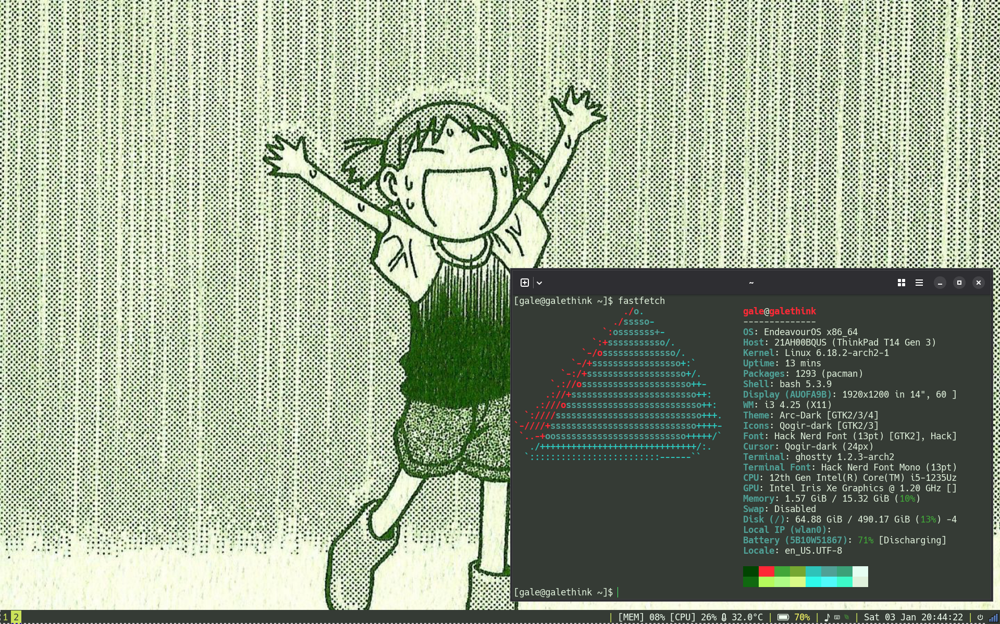

+++
title = "Installing EndeavourOS"
date = "2026-01-03"
tags = []
+++

Partway through my fall semester (2025), I decided to semi-impulsively install [EndeavourOS](https://endeavouros.com/) (an Arch-based distro) on my Thinkpad T14 Gen 3 (Intel) on a Saturday. It was semi-impulsive because it had been in my task list for quite some time and the real desire to do it coincided when I needed to study for an exam (I was procrastinating, probably). I really missed `pacman`, the default package manager for Arch Linux. I did not want to install vanilla Arch as I already had done so---and broke it. Many months later, I recovered my files from my desktop and reformatted my disk. I am still in between installing EndeavourOS, Debian, or NixOS on it.

Installing EndeavourOS was pretty straightfoward, making it a less painful process than installing vanilla Arch. I chose to go with `i3` for my window manager. I would like to briefly focus on two humps I encountered along the way.

After installing [Ghostty](https://ghostty.org/), I encountered an issue with terminal responsiveness. It was really, really slow. I thought it was completely unresponsive. The default (XFCE) terminal worked fine. The issue turned out to be with the renderer: Ghostty was software rendering instead of using accelerated graphics. I uninstalled `xf86-video-intel` and forced Iris (the driver) to run with `MESA_LOADER_DRIVER_OVERRIDE=iris` in `/etc/envirionment`. Also, I think I was missing some Intel graphics packages, so those were installed throughout my troubleshooting. Unfortunately, I am writing this so long after the fact that I can't recall what packages I installed.

Given that my main system is Ubuntu 22.04, I was coming from Emacs 27.1 (which was released in 2020). Since Arch is on the "bleeding edge," I was upgraded to 30.2. For some reason, `ledger-mode` did not work when I went to revise my ledger document for [ledger-cli](https://ledger-cli.org/), which I highly recommend for finance management! According to [this mail thread](https://lists.nongnu.org/archive/html/emacs-orgmode/2022-04/msg00121.html), `ob-ledger` was pulled out of the `org-babel` package and added to [org-contrib](https://git.sr.ht/~bzg/org-contrib) in the Org 9.5 release. It reminded me of how important it is to read the release notes as I am well behind on them.

I wanted to make my laptop Yotsuba-themed (from the greatest manga series [Yotsuba&!](https://en.wikipedia.org/wiki/Yotsuba%26!)). [Here is the link](https://wallpapercave.com/w/wp11968858) to the wallpaper. I love how simplistic it is and all of my apps are out of sight, so it's nice to just focus on what I actually need to do.

*^ Enjoy everything! 🍀*