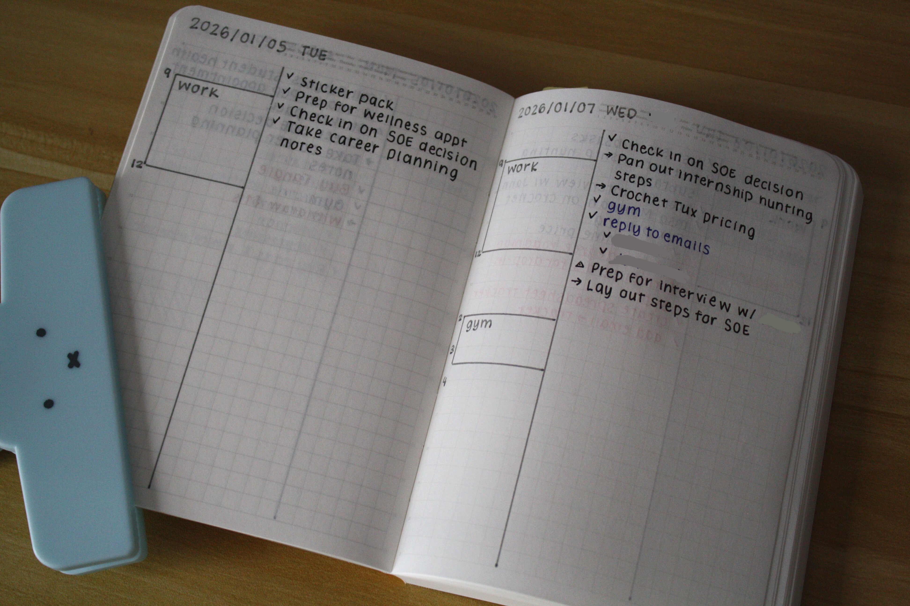
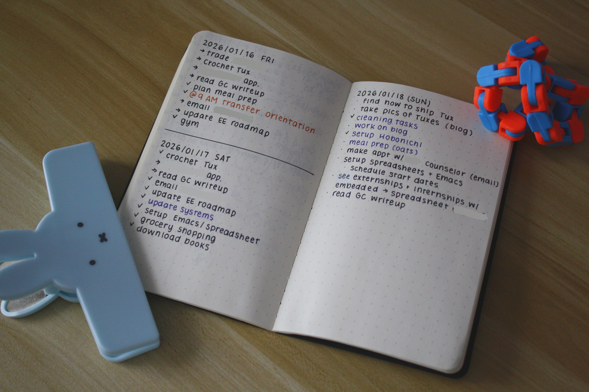

+++
title = "New Year, New Me?"
date = "2026-01-18"
tags = []
+++

By the time this post is uploaded, we will be well into the New Year. Early this month, New Year resolutions were shared and some have asked me what mine were. I didn't set any in the way most people would expect, I think. Setting New Year resolutions hasn't really ever worked for me. I would set them and then never look at them again. Rather, I found implementing procedures or introducing new habits more effective.

One recent-ish revelation I had was to work with myself rather than against myself. There is no need to reinvent yourself when you can try to make your own tendencies work for you. Try new things, but don't force yourself to do something again if it doesn't feel right and align with your needs or values.

When I was younger, I was really hung-up on following other people's planning systems, replicating their workflows, or even their goals, even if they did not work for me. I boxed myself, thinking that this was the ideal, despite waking up feeling awful, drained, or hazy. I did not realize this at the time, but they were the physical consequences in trying to become or perform as someone I was not.

Rather, I strive to adapt to my current needs by...
- getting at least 7 hours of sleep,
- socializing if I can take a rest day the next day,
- exercising at least every 2-3 days,
- and maintaining my commonplace notebook to assist me with memory.

Perhaps these are considered my resolutions, but they are not for the year---they're for life (or until life throws a curveball).

## Finding a Way to Prioritize

Every morning, looking at my agenda is... intimidating. I have many tasks that span multiple days, some of which do not have a deadline and can be put on the back-burner. To help myself not feel overwhelmed, I treat my agenda as a list of tasks to pick and choose from. The aim was to select 3 main tasks that I know I want done by the end of the day (but as you'll see, I'll quickly break this and it'll turn into a small list).

The chosen tasks get written down. I initially started using an [A6 Stalogy 365 Days Notebook](https://www.jetpens.com/STALOGY-Editor-s-Series-365Days-Notebook-A6-Grid-Yellow/pd/37804). The notebook also functions as a space for ideas, miscellaneous lists, and sketches. I really liked the marked times on the left so that I could block out my time. But since I live by Google Calendar and events will move around, I knew that documenting my events for the week or month on paper was not sustainable for me. (As much as I wish to make things increasingly analog and forgo my Pixel completely, the visualization and flexibility Google Calendar provides is something I can't give up yet. Though, I think so long as I have my laptop with me, I can ditch the smartphone...)

*^ My to-do list for 2 days in the Stalogy notebook. Apologies for the dim lighting; it was a snow day.*

About a week later, I returned to the [Moleskine Cahier Pocket Journal](https://www.moleskine.com/en-us/shop/notebooks/journals/cahier-journals/cahier-journals-black-9788883704895.html) since it was smaller and thinner, making it far more portable than the Stalogy notebook. I would prefer it to have grid lines, so when I am finished with the current set of notebooks I bought however many years ago, I will likely purchase the [Field Notes Graph Kraft Notebooks](https://fieldnotesbrand.com/products/original-kraft). I like how easily these pocket notebooks fit in my sling bag and jacket pocket.

*^ My to-do list for 3 days in the Moleskine notebook.*

It's kind of funny how I put a lot of my notebooks away a few years ago, thinking I'd never touch them again, only to pull a couple of them out of retirement.

*Let me know your thoughts on New Year resolutions or any ongoing or new plans you have! I love receiving emails. :)*

