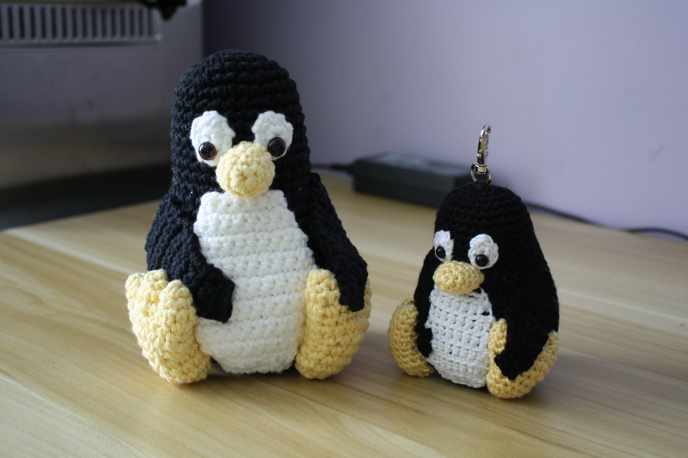
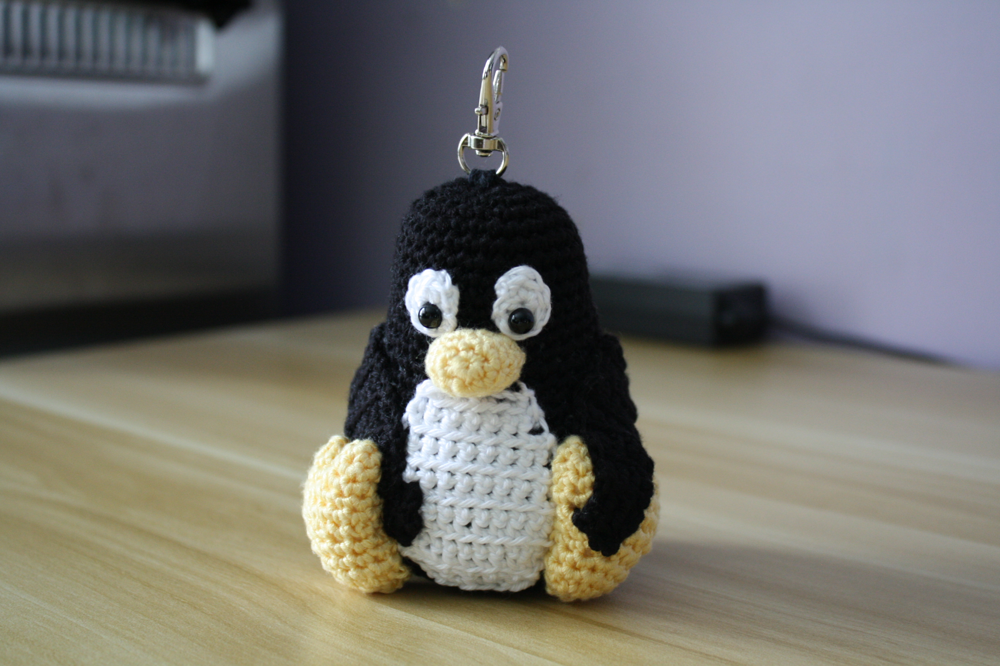

+++
title = "Keychain-Sized Crochet Tux"
date = "2026-01-25"
tags = []
+++

Crocheting has been an on-and-off hobby of mine, typically only taking place during the winter or summer break. My friend requested that I crochet a keychain of [Tux](https://en.wikipedia.org/wiki/Tux_(mascot)). I used [this Tux crochet pattern](https://stringydingding.com/tux-the-linux-penguin-amigurumi-free-crochet-pattern/) to make the keychain. However, I used different materials to achieve a smaller size. The original pattern yielded a Tux that stood about 15 cm (5.9 in) tall and 12 cm (4.7 in) wide, which is pretty huge.

*^ The original size is to the left.*

I got into crocheting after purchasing the [Lion Crochet Kit by the Woobles](https://thewoobles.com/products/lion-crochet-kit). I really liked how the yarn was very easy to work with. There was no splitting nor slipping, and it was easy to see the stitches you've made.

As for the materials used for the Tux pattern, they are listed below:

- 3.5 mm crochet hook
- Weight 3 rayon yarn (black and yellow)
- Weight 3 cotton yarn (white)
- 6 mm eyes
- Keychain attachment
- Stuffing

This yielded a Tux that stood about 10 cm (3.9 in) tall and 8.5 cm (3.3 in) wide, which would make it a keychain on the larger side.

The only real deviation from the pattern came when I crocheted his white belly. Because of the difference in yarn material (rayon and cotton), with cotton being "thicker," I crocheted fewer rounds for his belly. Namely, omitting rows 11-15, 17, and 19.

It was very difficult to find weight 3 yarn at Michaels, the closest craft store by me, especially with JOANN stores closing out of bankruptcy. Because of this, I didn't pay much attention to the material of the yarn itself. But I should have. I did not anticipate how slippery rayon yarn was and how easily the individual strands split. It was frustrating to work with and it caused my hands to cramp more than usual. So far, non-pilling acrylic yarn has been the best material to work with for me.

Despite this, I enjoyed crocheting another little Tux, and it has me on the hunt for a gnu crochet pattern to go with him! (If you find a good pattern... please feel free to email it to me. It would be much appreciated. ^^)