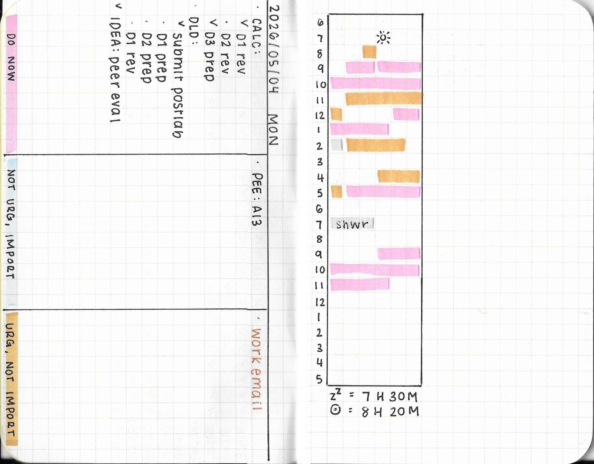
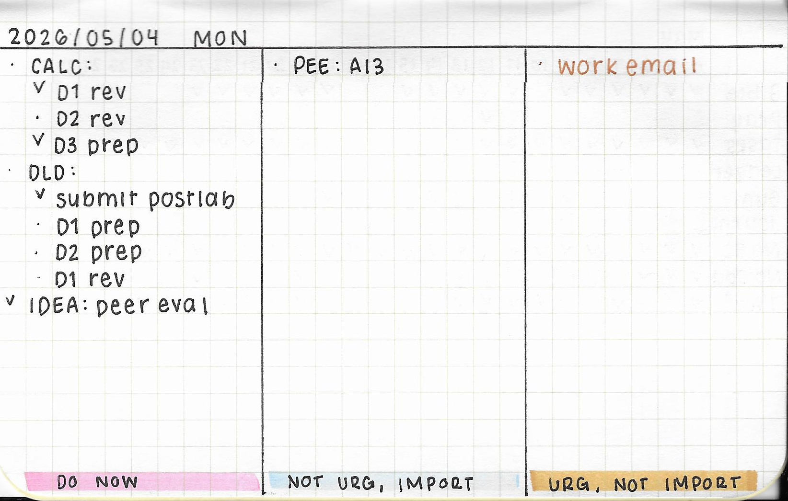

+++
title = "Prioritizing Things"
date = "2026-06-07"
tags = []
+++

At the beginning of this year, I wrote about finding a way to prioritize my tasks using different pocket notebooks. Indeed, I ended up using the [Field Notes Graph Notebooks](https://fieldnotesbrand.com/products/national-parks). The grid is light, so it's not bothersome to look at, and the paper is comfy to write on. The National Parks edition also has a little spot to stamp for when you do visit a national park. Neat!

I ended up using a system inspired by the Eisenhower Matrix and the time graph commonly found in Korean study planners. There two main parts of this system: the prioritization of tasks and the documentation of what was done. Sort of like interstitial journaling. My friend sent me [this cool video](https://www.youtube.com/watch?v=UFidZJhxz84) about it.

*^ The full spread. I scanned this. The blue highlighter doesn't show up very well.*

The left side of the notebook is split into three categories: DO NOW, NOT URGENT & IMPORTANT, and URGENT & NOT IMPORTANT. You can also think of these as tasks from highest priority to lowest priority. For me, the DO NOW category means that the task is due within three days. The NOT URGENT & IMPORTANT category means that the task is due seven days from now. The URGENT & NOT IMPORTANT category usually consists of tasks that don't have as much of a consequence as the other tasks if I do not do them that day.

Pretty much all of my school tasks fall into the DO NOW and NOT URGENT & IMPORTANT categories. Work tasks tend to fall into URGENT & NOT IMPORTANT, but it's still important. These are just names on a sliding scale of priorities.

The right side of the notebook has a time graph. This is where I use a highlighter to mark how much time I spent working on a task. Each box corresponds to 10 minutes. The graph is created by drawing a 6 by 24 rectangle. Mine starts from 6 AM and ends at 5 AM (the following day). I don't really have a good reason for this, other than the fact this was the same format used in the [MOTEMOTE 10 Minutes Planner](https://www.amazon.com/MOTEMOTE-Minutes-Planner-Rosequartz-planner/dp/B079NBSM6Q). To clarify, I am not planning how I will spend my time. Rather, I'm documenting what I have done (with fewer words). There's some space after the rectangle, which I tend to use as overflow if I've done more than what I was able to highlight. Maybe that can function as some room for interstitial journaling.

In my notebooks, I kept DO NOW tasks in pink, NOT URGENT & IMPORTANT tasks in blue, and URGENT & NOT IMPORTANT tasks in yellow. If I went to the gym or ran an errand, I highlighted that in gray.

*^ Just the tasks! I was preparing for my final exams here.*

I think I cracked the code. I tend to keep all of my deadlines in Emacs, and I also like to map everything out in a spreadsheet as a visual companion. This helps me narrow my focus to today. Hopefully this helps you. :)