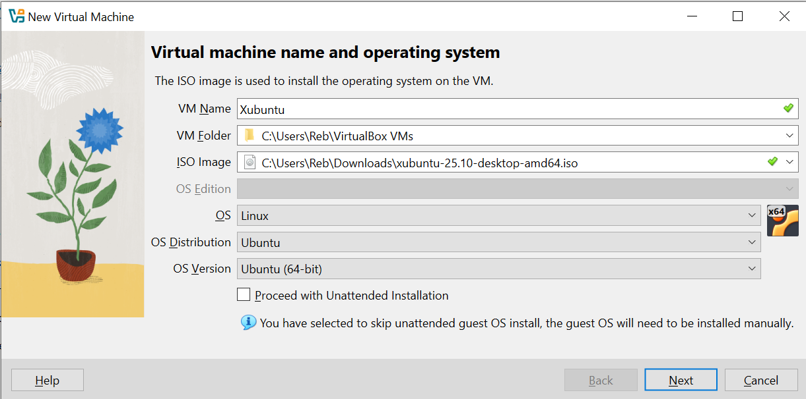
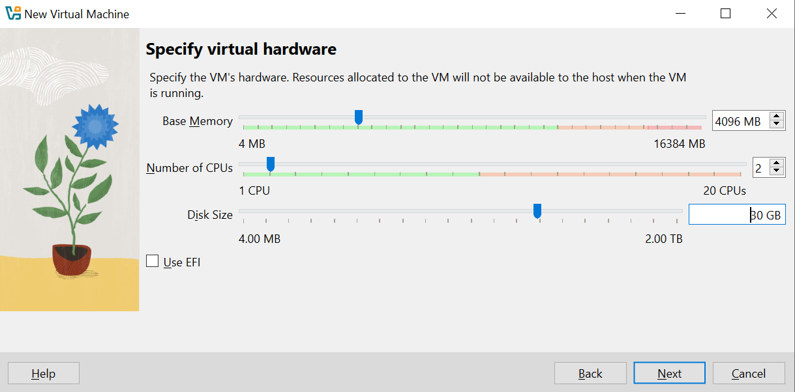
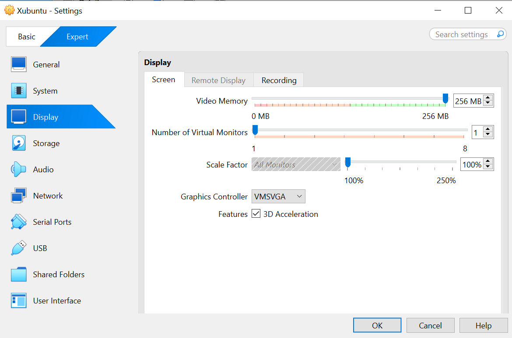
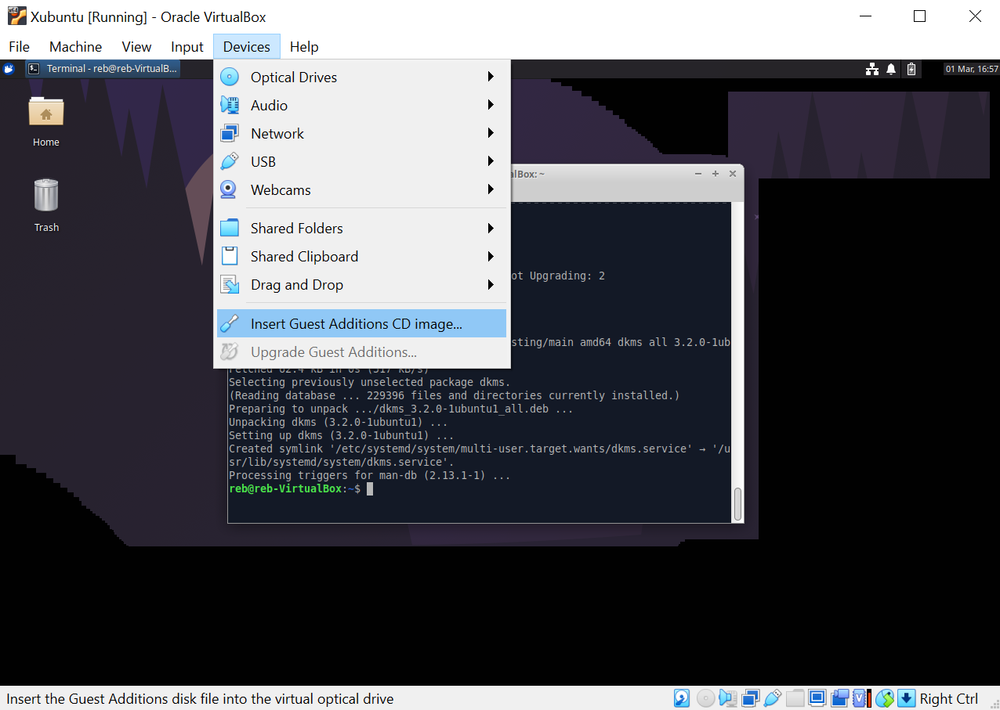
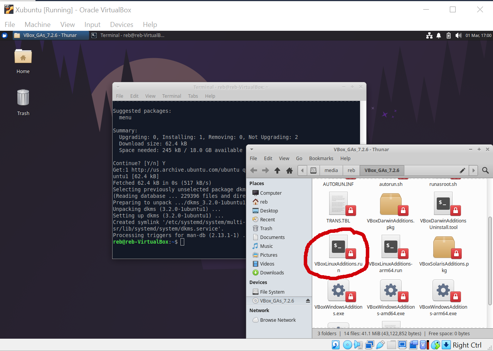
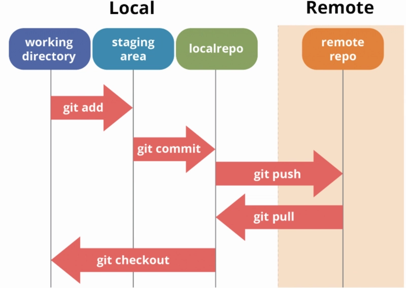
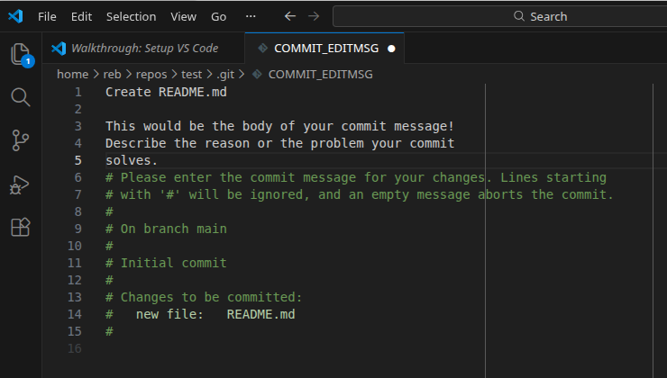
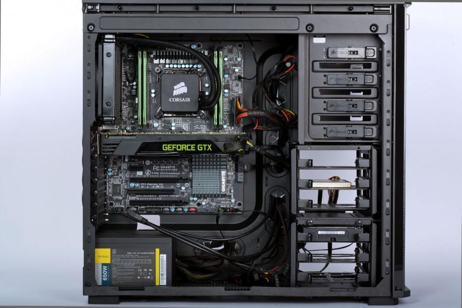
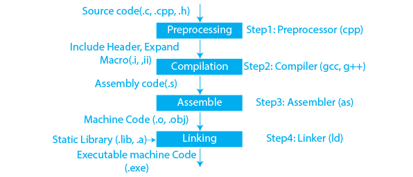

+++
title = "C++ Project Design Workshop: Part 1"
date = "2026-07-05"
tags = [
    "guide"
]
+++

During March and April of this year, I coordinated and taught a C++ Project Design workshop at Bergen Community College. This serves as an introduction to programming in C++, as well as some introduction to Linux and software development ideologies, such as Agile.

This was a four-part workshop, each lesson an hour long.

This post contains the first lesson of the workshop.

---

# Workshop Outline

1. **Setup (today!)**
2. Programming fundamentals
3. Project introduction
4. Software methodologies

---

# Today's Outline

1. Install Linux on a VM (if necessary)
2. Install Git and VS Code
3. Create a GitHub account
4. Write commit messages and comments
5. Know parts of a computer, compilation, how to create a program

---

# 1. Install Linux 🐧

If you already use Linux or MacOS, hang tight! This is for Windows users.

1. Download [VirtualBox](https://www.virtualbox.org/)
2. Download the ISO image for [Xubuntu](https://xubuntu.org/download/)

## Setting Up a New Virtual Machine in Virtual Box

1. Upon opening VirtualBox, hit `New` to create a VM.
2. Be sure to select the Xubuntu ISO image for `ISO Image`.
3. Uncheck `Proceed with Unattended Installation`.



4. Allocate your `Base Memory` (at most half of your total RAM) and 2 CPUs.
5. Allocate at least 30 GB for your virtual hard disk.
6. Select `Finish`.



7. Click `Settings` > `Expert` > `Display`
    - Enable `3D Acceleration`
    - Increase `Video Memory` to 256 MB (the max)



## Setting Up Xubuntu 🐀

Follow the on-screen instructions when installing Xubuntu!

## Post Installation Steps

1. Open the terminal with `CTRL + ALT + t` and enter the following:
    ```bash
    sudo apt update
    ```
2. Now, upgrade your packages:
    ```bash
    sudo apt upgrade
    ```
3. Install two packages, which will help us install Guest Additions (that'll help Xubuntu use the VM's hardware):
    ```bash
    sudo apt install build-essential dkms
    ```
4. Install Guest Additions: `Devices > Insert Guest Additions CD image...` and find `VBoxLinuxAdditions.run`. In your terminal, type `sudo` and then drag `VBoxLinuxAdditions.run` into the terminal. Hit `ENTER` to install the Guest Additions.





5. Reboot with `sudo reboot`. You should have less lag or performance issues now!
6. Eject the Guest Additions image.

---

# 2. Install Git and VS Code

## On Linux

Open the terminal with `CTRL+ALT+T` and enter the following

```bash
sudo apt install git
```

To install VS Code, [download the `.deb` file](https://code.visualstudio.com/Download). Locate the file and then install with
```bash
sudo apt install ./codefilename.deb
```

## On MacOS

Install [Homebrew](https://brew.sh/), a popular package manager for MacOS among developers. Follow the install instructions.

To install VS Code, enter
```bash
brew install --cask visual-studio-code
```
To install Git, enter
```bash
brew install git
```

---

# 3. Creating a GitHub Account

Create an account on [GitHub](https://github.com/).

## Configuring Git

```bash
git config --global user.name "John Doe"
git config --global user.email "johndoe@example.com"
git config --global init.defaultBranch main # The default branch used to be master
git config --global pull.rebase false # Sets default branch reconciliation; safer than rebasing
```

Check that the appropriate changes were made. 👇
```bash
git config --get user.name
git config --get user.email
```

## MacOS: Configuring Git

```bash
echo .DS_Store >> ~/.gitignore_global
git config --global core.excludesfile ~/.gitignore_global
```

This tells Git to ignore `.DS_Store` files, which has to do with `Finder`.

## Create an SSH Key

An SSH key is a secure identifier used to identify your machine.

```bash
ls ~/.ssh/id_ed25519.pub # Check if you have an Ed25519 algorithm key installed
ssh-keygen -t ed25519 # Create one if not
```

When prompted, the password is used to encrypt the private SSH key stored on your computer. Enter one if you want; not required.

## Link Your SSH Key to GitHub

1. On GitHub, go to: `Settings` > `SSH and GPG keys` > `New SSH Key`
2. Name the key descriptive to your machine, something like `thinkpad-xubuntu`
3. Copy your public SSH key and paste it into the key field
    ```bash
    cat ~/.ssh/id_ed25519.pub
    ```

## Test Your SSH Connection

1. Enter the following in the terminal
    ```bash
    ssh -T git@github.com
    ```
2. Verify that the fingerprint in the message matches [GitHub's public key fingerprint](https://docs.github.com/en/authentication/keeping-your-account-and-data-secure/githubs-ssh-key-fingerprints) and enter `yes`

---

# 4. Using Git: Commit Messages (and Comments)

Git is a **version control system (VCS)**.

A VCS tracks changes to code over time, allowing people to *revert* to an old version, create multiple *branches*, *commit* current edits, and *push* changes to the web for collaboration. It's a really advanced save feature.

Think of Google Doc's version history, but on steroids.

You can read more about [version control systems on Pro Git](https://git-scm.com/book/en/v2/Getting-Started-About-Version-Control).

## Git vs. GitHub

Git is a program that works on your local machine.

GitHub is remote storage, where you can showcase your projects and collaborate with other developers.

## The Git Workflow



*^ From [UW](https://pages.cs.wisc.edu/~lcai64/).*

As you write code, you will want to periodically snapshot (or capture) your changes, which is accomplished with `git add` and `git commit`. These commits make up your **version history**. When you want to publish the changes, you will `git push` to GitHub. When you want to update your local repository, you will use `git pull`.

### Creating and Updating Repositories

A **repository** (repo) is a location or "container" that stores a project's code, commit (version) history, and files.

When you want to get a local copy of an online repository, you **clone** it to your local machine.

As mentioned, when you want to get the latest updates from the online repository, you **pull** them to your local machine. And when you make changes, you **push** them to the online repository.

### Making Changes

1. Make changes
2. Stage changes
    - All of these files will share the same commit message
    - Use `git add <filename or . to add all files in your current working directory>`
3. Commit changes
    - Create a snapshot of your changes
    - Use `git commit -m "Your commit message here"`

## Basic Git Syntax

```bash
program | action | options (optional) | destination

git commit -m "Message"
git add . # The option is omitted
```

## Try: Create a Repo

1. On the GitHub homepage, create a new repository. Name it "test."
2. To clone your repository to your local machine, copy what's in the SSH option.
3. In your terminal, create a directory called `repos` and navigate into it with `cd`
    ```bash
    mkdir repos
    cd repos/
    ```
4. Now, you are in your `repos` directory. Clone your repo:
    ```bash
    git clone git@github.com:USERNAME/REPO-NAME.git
    ```
5. Navigate into your repo:
    ```bash
    cd test
    git remote -v # Checks the repo's connections
    ```

## Try: Create a File (or Two)

1. Create a new file called `helloworld.txt` in your `test` repo with `touch helloworld.txt`.
2. Enter `git status`, which shows what files are being tracked.
3. Enter `git add helloworld.txt`. This adds your file to the staging area. Type `git status` again.
4. Enter `git commit -m "Create helloworld.txt"` and then `git status`.
5. Type `git log` to see your entry for the commit you just made.
6. Now create another file called `README.md` and write some text in it. Be sure to save the file and stage it. Make your commit message descriptive with `git commit -m "Create README.md"`.
7. Type `git push origin main` to push the changes you've made locally to the remote repo.
8. Type `git status`.
9. Refresh your repo's page on GitHub. What do you see?

## Change the Git editor

If you type `git commit` without `-m`, you will write your commit message in [Nano](https://en.wikipedia.org/wiki/GNU_nano) or [Vim](https://en.wikipedia.org/wiki/Vim_(text_editor)). To have it open in VS Code instead, enter this into your terminal:

```bash
git config --global core.editor "code --wait"
```

That being said, omitting the `-m` allows you to write a body for your commit message. Keep in mind that the subject line has a 72-character max on GitHub.



## Tips for Writing Good Commit Messages

- Make **atomic commits**, which are commits that refer to only one feature or task
- Commit every time you make a meaningful change
- Use an active voice: "Fix grid layout"
- Keep your syntax consistent:
    - Capitalize the first letter in your subject line
    - Don't end the subject line with a period
    - Wrap text at 72 characters
    - The body should explain the why for the commit, rather than how (as the code explains it)

See [this article by cbeams](https://cbea.ms/git-commit) for more.

## Git Cheatsheet

```bash
git clone git@github.com:blah/blah.git
git push origin main
git pull

git add .
git commit -m "Commit message"

git status
git log
```

---

# 5. Parts of a Computer, Compilation, How to Create a Program

## What's Inside a Computer?

- Motherboard
- Processor (CPU)
- Random Access Memory (RAM)
- Storage (HDD, SSD, floppy, etc.)
- Graphics Processing Unit (GPU)
- Power Supply Unit (PSU)
- Fans, heat sink (for cooling)



*^ From [FHC Today](https://fhctoday.com/11762/uncategorized/the-600-gaming-pc/).*

## Compilation Overview



*^ From [PrepBytes](https://prepbytes.com/blog/cpp-compilation-process/).*

1. Source code (`.cpp` file)
2. Preprocessor/macro expansion
    - Processes the `#include`, `#define`, `#ifdefs`
    - Converts C++ code to C++ code
3. Compiler
    - Converts C++ to assembly (`.s`)
4. Assembler
    - Assembly to machine code/binary object files (`.o`)
5. Linker
    - Take object files and resolves external functions into executables
    - Gets libraries (`.so`, `.dll`, `.dylib`)
6. Executable (sent to CPU)

## General Steps to Creating a Program

1. Define what the program does
2. Create a model of program - it may help to draw diagrams!
3. Write source code
4. Compile source code
5. Correct errors found during compilation
6. Create an executable and run program, using test data for input (try breaking your program)
7. Correct errors and validate the results of the program

---

## Resources
- [Git Cheat Sheet](https://education.github.com/git-cheat-sheet-education.pdf)
- [Setting Up Git](https://www.theodinproject.com/lessons/foundations-setting-up-git)
- [Testing Your SSH Connection to GH](https://docs.github.com/en/authentication/connecting-to-github-with-ssh/testing-your-ssh-connection?platform=linux)