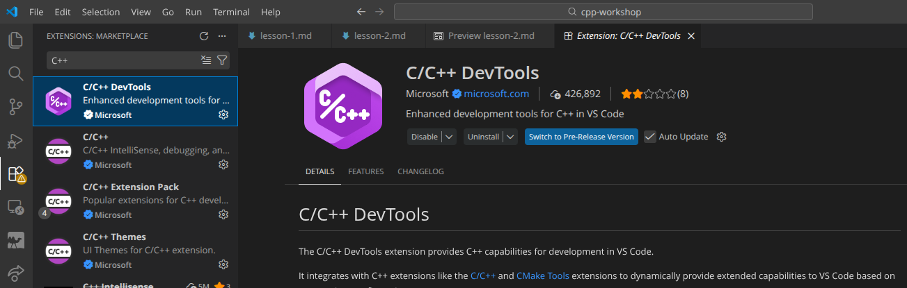
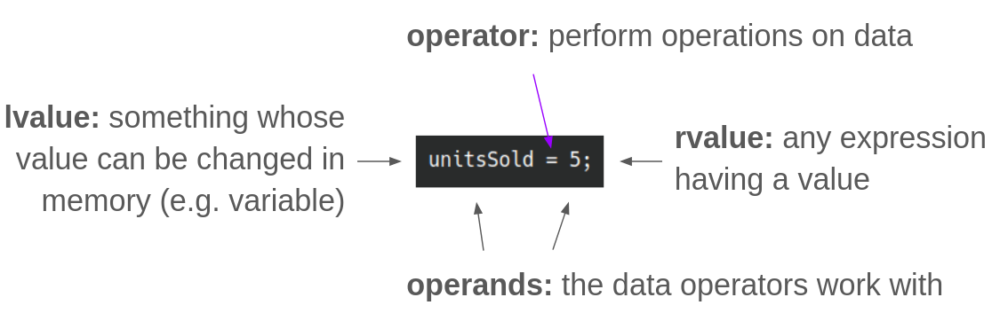
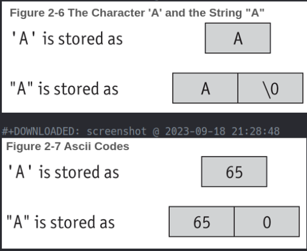

+++
title = "C++ Project Design Workshop: Part 2"
date = "2026-07-06"
tags = [
    "guide"
]
+++

During March and April of this year, I coordinated and taught a C++ Project Design workshop at Bergen Community College. This serves as an introduction to programming in C++, as well as some introduction to Linux and software development ideologies, such as Agile.

This was a four-part workshop, each lesson an hour long.

This post contains the second lesson of the workshop.

---

# Workshop Outline

1. Setup
2. **Programming fundamentals (today!)**
3. Project introduction
4. Software methodologies

---

# Today's Outline

- What is C++?
- Install G++ (or GCC)
- Anatomy of a C++ program
- Variables
- Data types
- Operators
- Conditionals

---

# What is C++?


*^ This is [Keith, the unofficial mascot of C++](https://en.uncyclopedia.co/wiki/C%2B%2B).*

C++ is a procedural programming language, based on C. It's an extension of the C programming language. There has been object-oriented (OOP) and functional features added to the language since the mid-1980s. You've probably heard of it being popular in video game development and embedded systems!

## Side Note: Procedural vs. Functional PLs

- Procedural relies on step-by-step instructions to change the state of the program in which data is mutable (can be changed)
    - C, C++, Python, Java
- Functional takes after mathematical functions (same output for same input) in which data is immutable (cannot be changed)
    - Haskell, OCaml (impure)

---

# Install G++ 🐃

```bash
g++ --version # Check if it's already installed!
sudo apt install build-essential
```

For MacOS users, you will likely need to install GCC.
```bash
brew install gcc
```

## Install the C++ Extensions on VS Code

1. Open VS Code
2. Select the Extensions view and search for `C++`
3. Install the extensions



---

# Anatomy of a C++ Program

1. Preprocessor directives
2. `using namespace std;`
    - The program will access entities whose names are part of the namespace `std` ("standard")
3. `main()`

```cpp
#include <iostream> // Preprocessor directive
using namespace std;

int main() { // Starting point of the program
    cout << "Hello world!";
    return 0;
}
```

---

# Interacting with our C++ Programs: cout, cin, endl

The `iostream` library handles input and output. The common objects are:
- `cout` ("character output") is used with the **insertion operator** (`<<`) to send output to the console
- `cin` ("character input") is used with the **extraction operator** (`>>`) to put input from the console in a variable
- `endl` ("end line") outputs a newline (and flushes the buffer), though `\n` is preferred

```cpp
#include <iostream>
using namespace std;

int main() {
    cout << "Enter a number: "; // Waits for input by the user
    int x = 0;
    cin >> x;
    cout << "You entered " << x << '\n';

    return 0;
}
```

---

# Variables

A variable is a named location in RAM. Think of it as a bucket where you can store a value.

- Variables must be defined before it can be used, where its type and name must be specified.
- Data types include:
    - `char` = 1 byte
    - `short` = 2 bytes
    - `float`, `long` = 4 bytes
    - `double` = 8 bytes

## Declaring and Assigning Variables

- The syntax for declaration is: `<DataType> <variableName>;`
- The syntax for assignment is: `<variable name> = <expression>;`

```cpp
#include <iostream>
using namespace std;

int main() {
    int number; // Variable declaration
    number = 5; // = is an assignment operator; number now holds the value 5

    int width, length = 5; // width is declared, but not initialized. length is initialized.
}
```

## Variable Initialization

Variable initialization is assigning a variable a value at the time it's defined. There are 3 ways to do this:

1. Functional notation
2. Brace notation
3. Copy initialization (most common)

```cpp
int value(5); // (1)
int value{5}; // (2)
int value = 5; // (3)
```

## More Variable Terminology!



Variable names are typically written in [camelCase](https://developer.mozilla.org/en-US/docs/Glossary/Camel_case).

## Constant Variables

Constant variables are read-only and can't be changed later in the program. These must be initialized when defined.

The syntax: `const <DataType> <VARIABLE_NAME> = <exp>;`

The convention is to write constant variable names in all CAPITAL_LETTERS.

```cpp
const double INTEREST_RATE = 0.069;
```

## Try: Initializing and Displaying Variables

**Task:** Initialize an integer variable (give it any name) and give it any value. Then, display the variable back to the user.

To compile and and generate an executable: `g++ main.cpp -o main`

Then, run the executable with `./main`

**Note:** Try using Git! Create another repo for these exercises with `mkdir exercises`. Initialize your local repo with `git init -b main`. If you want to push it to GitHub, create a new empty repo on GH and copy the remote repo URL (SSH). In your terminal, `git remote add origin <URL>` and then push your commits.

## Bad Practice: Multiple Assignment (·•᷄‎ࡇ•᷅ )

```cpp
a = b = c = d = 12;
```

---

# Primary Data Types

## Numeric

- Integer (whole numbers)
    - `int` = 4 bytes
    - `unsigned int` = 4 bytes
    - `char` = 1 byte
        - Stored in memory as integers
        - Must be enclosed in `''`
        - Corresponds to an ASCII value, where `A = 65` and `a = 97`
- Floating-point
    - `float` = 4 bytes
    - `double` = 8 bytes
    - By default, are displayed with 6 significant digits
    - When assigned to an integer variable, the part after the decimal gets truncated (cut off)
- `bool`
    - Allows you to create values that hold true (1) or false (0) values
- `string`
    - Not built-in; must `#include <string>`
    - A null terminator `\0` is automatically placed at the end of string literals
    - When comparing string objects, the ASCII values of the characters making up each string are being compared



*^ From "Starting Out with C++: Early Objects" (10th Ed.) by Tony Gaddis, Judy Walters, and Godfrey Muganda*

---

# Operators

## Arithmetic Operators

|Operator|Definition|Example|
|---|---|---|
|+|Addition|`x = x + 1;`|
|-|Subtraction|`x = 10 - y;`|
|*|Multiplication|`z = x * y;`|
|/|Division|`z = 10 / x;`|
|%|Modulo|`z = 10 % 3;`|
|++|Increment|`z++`|
|--|Decrement|`--y`|

## Try: Using Arithmetic Operators

**Task:** Create 2 variables `x` and `y`. Initialize them to be `12.3` and `67`, respectively. Perform three arithmetic operations with `x` and `y`, assigning each of the results to their own variables. Display the three results in the console.

### Solution

```cpp
#include <iostream>
using namespace std;

int main() {
    float x = 12.3;
    int y = 67;
    float sum, difference, product;

    sum = x + y;
    difference = y - x;
    product = x * y;

    cout << "The sum is: " << sum << "\n";
    cout << "The difference is: " << difference << "\n";
    cout << "The product is: " << product << "\n";

    return 0;
}
```

## Combined Assignment Operators

|Operator|Example|
|---|---|
|+=|`x += 5;` instead of `x = x + 5;`|
|-=|`y -= 2;`|
|*=|`z *= 10;`|
|/=|`a /= b;`|
|%=|`c %= 3;`|

## Relational Operators

|Operator|Definition|
|---|---|
|`==`|Equal to|
|`!=`|Not equal to|
|`>`|Greater than|
|`<`|Less than|
|`>=`|Greater than or equal to|
|`<=`|Less than or equal to|

## Logical Operators

Logical operators connect 2 or more relational expressions into 1.

|Operator|Meaning|Effect|
|---|---|---|
|`&&`|AND|Both must be true for the expression to be true|
|`\|\|`|OR|One or both expressions must be true for the expression to be true|
|`!`|NOT|Makes a true expression false and a false expression true|

### Precedence

1. `!`
2. `&&`
3. `||`

### Examples

```cpp
if ((temperature < 20) && (minutes > 12)) {
    cout << "The temperature is in the danger zone.";
}

if (moreData == true) {
    cout << "Do cool stuff!";
}
```

---

# Conditionals

## `if` Statement

The `if` statement is a control structure. When the condition is true (or false), certain statements are executed.

```cpp
if (expression) {
    // Code here
}
```

Can be written without the `{}` if only 1 line is going to be conditionally executed.

```cpp
#include <iostream>
using namespace std;

int main() {
    int score1, score2, score3;
    double average;

    cout << "Enter 3 test scores and I will average them: ";
    cin >> score1 >> score2 >> score3;
    
    average = (score1 + score2 + score3) / 3.0;
    cout << "Your average is " << average << endl;

    if (average == 100) {
        cout << "Congrats! That's a perfect score!" <<< endl;
    }

    return 0;
}
```

### if-else

The else block is run when the conditional statement is false.

```cpp
if (expression) {
    // These statements run if the expression is true
}
else {
    // These statements run if the expression is false
}
```

### if-else if

```cpp
if (expression) {
    // These statements run if the expression is true
}
else if (expression) {
    // These statements run if the expression is true
}
else {
    // Statements run if all of the above expressions are false
}
```

## Try: Write an if-else

**Task:** Take an integer input from the user and then display if the number is odd or even.

### Solution

```cpp
#include <iostream>
using namespace std;

int main() {
    int num;
    cout << "Enter an integer: ";
    cin >> num;

    if (num % 2 == 0) {
        cout << num << " is even." << endl;
    }
    else {
        cout << num << " is odd." << endl;
    }
}
```
