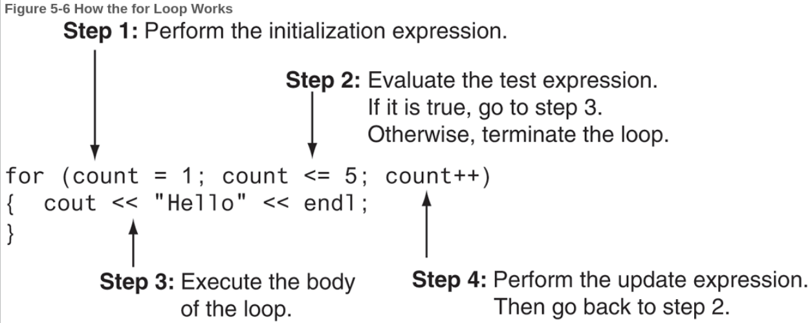
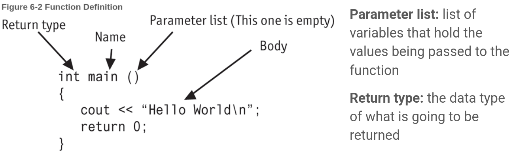
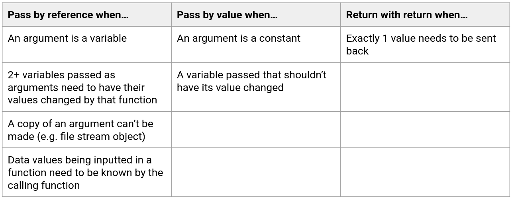
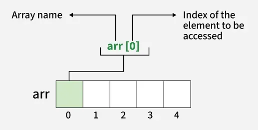

+++
title = "C++ Project Design Workshop: Part 3"
date = "2026-07-07"
tags = [
    "guide"
]
+++

During March and April of this year, I coordinated and taught a C++ Project Design workshop at Bergen Community College. This serves as an introduction to programming in C++, as well as some introduction to Linux and software development ideologies, such as Agile.

This was a four-part workshop, each lesson an hour long.

This post contains the third lesson of the workshop.

---

# Workshop Outline

1. Setup
2. Programming fundamentals
3. **Project introduction (today!)**
4. Software methodologies

---

# Today's Outline

- Loops
- Functions
- Arrays
- Project introduction

---

# Loops

A **loop** is a control structure that repeats a statement or group of statements until the condition it’s testing is false.

The main loop structures are:
- `while`
- `do-while`
- `for`

Each execution of a loop is called an **iteration**.

## Types of Loops

- Conditional loops
    - Executes for as long as a particular condition exists
- Count-controlled loops
    - Repeat for a specified number of times
    - Includes `while` and `for` loops
    - Must have 3 elements:
        1. Must initialize a counter variable to a starting value
        2. Must test the counter variable by comparing it to a final value; terminates upon reaching its final value
        3. Must update the counter variable during each iteration (usually by incrementation)
- Pretest loops
    - Tests the condition before each iteration
    - `while` and `for`
- Posttest loops
    - Tests the condition at the end of the loop
    - `do-while`
- Sentinel-controlled loops
    - Iterate until the user enters the **sentinel** (a special value that marks the end of a list of values)

## Basic Parts of a Loop

The anatomy:
- Header
- Body

Terminology:
- **Loop control variable (LCV):** used to control the number of times a loop iterates
- **Counter:** a variable regularly incremented or decremented at each iteration; can be a LCV
- **Accumulator:** the variable keeping track of the running total

```cpp
int x = 0;
while (x < 5) { // Header
    cout << x << endl;
    x++; // LCV/counter
}
```

## `while` Loop

```cpp
while (condition) {
    // Statements
}
```

## `do-while` Loop

```cpp
do {
    // Statements
} while (condition);
```

## `for` Loop

```cpp
for (initialization; test; update) {
    // Statements
}
```



*^ From "Starting Out with C++: Early Objects" (10th Ed.) by Tony Gaddis, Judy Walters, and Godfrey Muganda*

## How do I know what loop to use?

- Use `while` when...
    - You don't want the loop to iterate if the test condition is false from the start
    - Validating input
- Use `do-while` when...
    - You want the loop to iterate at least once
    - Repeating a menu
- Use `for` when...
    - The exact number of iterations is known

## Breaking Out of a Loop

- The `break;` statement breaks out of a loop entirely when executed; typically used if an error occurs.
- The `continue;` statement ends the current loop iteration and prepares for the next iteration.

## Aside: Nesting Ifs and Loops

If blocks and loops can be **nested**, but limit the number of nesting you do. It may impact performance.

---

# Functions

- These promote modularity and structural programming.
- Functions can only return 1 value, but they can be packaged in a way to return multiple values.
- When functions are called and executed, after the program returns back to main(), everything about the function is forgotten.

## Function Definition

- Contains the statements that make up the function.
- The `return` statement causes a function to end immediately.



*^ From "Starting Out with C++: Early Objects" (10th Ed.) by Tony Gaddis, Judy Walters, and Godfrey Muganda*

## The `void` Function

- Does not return a value; no return statement required.

```cpp
void sayHello(); // Function prototype

int main() {
    sayHello(); // Function call
    return 0;
}

// Function definition
void sayHello() {
    cout << "Hello world!\n";
}
```

## Calling Functions

- A function call causes the named function to execute.
- `main()` is the only function called automatically when a program starts.

## Function Prototypes

- These eliminate the need to place a function definition before all calls to the function.
- Before the compiler encounters a function call, it needs to know the number of parameters the function uses, the data type of each parameter, and the return type of the function.
- Include a function prototype for each function at the beginning of the program. Otherwise, put the function definition before `main()`.

```cpp
int calculateSum(int num1, int num2); // Function prototype with 2 parameters

int main() {
    int sum = calculateSum(4, 8); // Function call, passing 2 arguments
    cout << sum << endl;
    return 0;
}

// Function definition
int calculateSum(int num1, int num2) {
    return num1 + num2;
}
```

## Sending Data to Functions

- **Arguments:** values sent into a function
- **Parameters:** special variables that hold a value being passed as an argument into a function
- Default arguments can be assigned, which are passed to the parameters automatically if no arguments are provided in the function call. They are typically listed in the function prototype.
    - The parameters with default arguments must be declared last in the function prototype.
    ```cpp
    void calcPay(int empNum, double payRate, double hours = 40.0);
    void calcPay(int empNum = 10, double payRate, double hours); // Illegal!
    ```

## Pass by Value vs. Pass by Reference

- Parameter variables are local, so you can’t give a parameter variable and a local variable in the same function the same name.
- By default, arguments are **passed by value**.
- You can have a parameter or local variable with the same name as a global variable or constant. The name of the parameter/local variable shadows the name of the global variable or constant. The global variable from that scope isn’t accessible (or must be explicitly referred to).
- **Static variables** exist for the entire lifetime of the program.

```cpp
void showStatic();

int main() {
    for (int count = 0; count < 5; count++) {
        showStatic();
    }

    return 0;
}

void showStatic() {
    static int numCalls = 0;

    cout << "This function was called " << ++numCalls << " times.\n";
}
```

- We can **pass by reference**, which allows us to modify the original value of the variable instead of creating a copy of it (which is what happens when we pass by value—this is the default behavior).

---

```cpp
#include <iostream>
using namespace std;

// Function prototypes
void getNum(int &);   
int doubleNum(int);

int main() {
    int value;

    // Call getNum to get a number and store it in value
    // The & does not appear in the function call
    getNum(value);   

    // Call doubleNum, passing it the number stored in value
    // Assign value the number returned by the function
    value = doubleNum(value);

    // Display the resulting number
    cout << "That value doubled is " << value << endl;
    return 0;
}

void getNum(int &userNum) {
    cout << "Enter a number: ";
    cin  >> userNum;
}

int doubleNum (int number) {
    return number * 2;
} 
```

## When to Pass Args by Reference or Value



## Scope: Local and Global Variables

- **Local variables** are defined inside a function and isn't accessible outside of it.
- **Global variables** are defined outside all functions and is accessible to all functions in its scope.

## Try: Write a Function

**Task:** Write a function that calculate the area of a triangle. Take the `base` and `height` as parameters and return the `area`.

---

# Arrays

- **Arrays** are a useful data structure that allows you to store and work with multiple values of the same data type. These values are stored in consecutive memory locations.

```cpp
// Syntax
int hours[6]; // Declaration

const int SIZE = 6;
int hours[SIZE];

hours[0] = 20; // Stores 20 in the first element of array hours
```



*^ From [GeeksForGeeks](https://www.geeksforgeeks.org/cpp/cpp-arrays/).*

- Indexing begins from 0.
- C++ does not perform array bounds checking, so you can write a program that allows a subscript to go beyond its boundaries. This may result in a crash.

## Initializing Arrays

```cpp
 string cars[5] = {"Mazda", "Volvo", "Audi", "Mercedes", "Aston Martin" };
```

## Cycling Through an Array

```cpp
for (int i = 0; i < 5; i++) {
    cout << "Car make: " << cars[i] << endl;
}
```

## Try: Creating an Array

**Task:** Create an array of at least 3 integers and sum them. Display the result.

## Arrays as Function Arguments

- Entire arrays and array elements can be passed as arguments. 
- When passing an array itself, we are actually passing the memory address of the array so that the function knows where the first element of the array is. This is the same as passing a variable to a function by reference.

```cpp
#include <iostream>
using namespace std;

void showValues(int intArray[], int size); // Function prototype

int main() {
    const int ARRAY_SIZE = 8;
    int collection[ARRAY_SIZE] = {5, 10, 15, 20, 25, 30, 35, 40};

    cout << "The array contains the values\n";
    showValues(collection, ARRAY_SIZE);
    return 0;
}

void showValues (int nums[], int size) {
    for (int index = 0; index < size; index++) {
        cout << nums[index] << "  ";
    }
    cout << endl;
}
```

---

# Project Introduction

**Objective:** Write a pomodoro timer in C++. We expect the user to input the number of work sessions they want to do, and our program should terminate after all of the work sessions are complete. A work session is 25 minutes and a short break is 5 minutes. After 4 sessions, a longer break of 15 minutes is taken.

For example, if a user writes `./timer 6`, 4 work sessions occur with short breaks in between, and then a long break occurs the 4th work session followed by 2 work sessions with a short break in between and after.

## To take arguments from the terminal...

You use the following parameters in `main()`:

```cpp
int main(int argc, char *argv[]) {
    // argc is the number of arguments passed to the program
    // argv is a C-string of arguments
    return 0;
}
```

- `argv[0]` is the name of the program being executed
- `argv[1]` is the first argument passed by the user
- `argv[2]` is the second argument

## You may need to convert a string to an integer

*Different data types can't be mixed!*

- `stoi()` converts a string to integer

## Special characters

- `\a` produces a bell or beep sound (OS-dependent)
- `\r` is carriage return, which moves the cursor to the beginning of the line

## You will likely need `chrono` and `thread`

- [`chrono`](https://cplusplus.com/reference/chrono/) and [`thread`](https://cplusplus.com/reference/thread/thread/) are libraries that you will likely need to create a second-by-second delay to emulate a timer

## Other notes

- `flush` is part of the `iostream` library, which forces information held in the buffer to be written out
- `cin.ignore()` ignores one inputted character (or more specifically, the next character in the buffer)