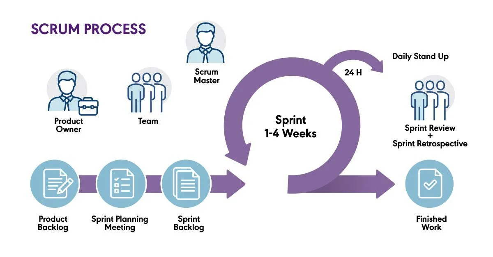
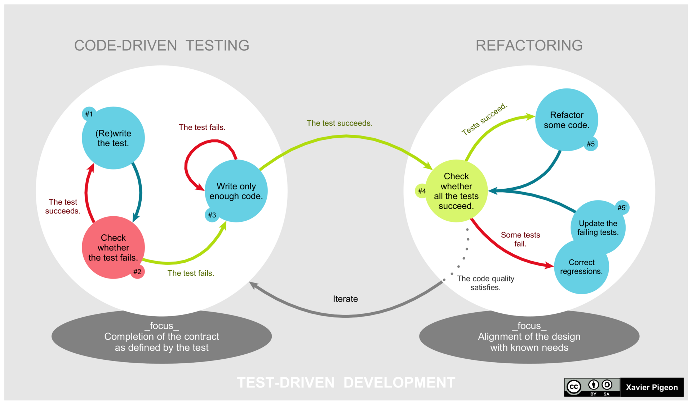

+++
title = "C++ Project Design Workshop: Part 4"
date = "2026-07-08"
tags = [
    "guide"
]
+++

During March and April of this year, I coordinated and taught a C++ Project Design workshop at Bergen Community College. This serves as an introduction to programming in C++, as well as some introduction to Linux and software development ideologies, such as Agile.

This was a four-part workshop, each lesson an hour long.

This post contains the fourth lesson of the workshop.

---

# Workshop Outline

1. Setup
2. Programming fundamentals
3. Project introduction
4. **Software methodologies (today!)**

---

# Today's Outline

- Agile
- Scrum
- The UNIX philosophy
- Test Driven Development

---

# Agile

These are a series of principles that are listed in [their manifesto](https://agilemanifesto.org/principles.html), prioritizing frequent iteration, reflection, and collaboration.

Key points include:
- Individuals and interactions over tools and processes
- Working software over detailed documentation
- Customer collaboration over contract negotiation
- Simplicity is essential

---

# Scrum

Scrum is an application of Agile, which consists of a small team and its cycle occurs over 2-4 weeks. Some hold to the 3:5:3 rule, where there are 3 roles (Product Owner, Scrum Master, and Development Team), 5 events (Sprint, Sprint Planning, Daily Scrum, Sprint Review, Sprint Retrospective), and 3 artifacts (Product Backlog, Sprint Backlog, Increment).

## The 3 Roles

- The product owner engineers the team accordingly, including managing the product backlog, the sprint backlog, guides what features to deliver next, and decides when to ship the product.
- The Scrum master coaches teams, product owners, and are the facilitators, scheduling sprint planning, stand-ups, sprint reviews, and retrospectives.
- The development team are the ones who get things done.

## The 3 Artifacts

- The product backlog is the team's to-do list
- The sprint backlog is the list of items selected by the development team for implementation in the current sprint cycle
- The **increment** (or sprint goal) is the end product from a sprint; this could be a prototype

## The 5 Events (or Ceremonies)

- Sprint planning is lead by the Scrum master, which is when the sprint goal is determined
- The sprint is the actual time where the team collaborates to complete and increment, which last for about 2-4 weeks. The scope can always be renegotiated; flexibility is important.
- Daily Scrum or stand-up is a short daily meetings where progress is shared and blockers are identified. It should be no more than 15 minutes.
    - Every team member answers: What did I do yesterday? What do I plan to do today? Are there any obstacles?
- At the end of a sprint, a sprint review takes place to view a demo or see the increment. The product owner decides whether or not to release the increment.
- The sprint retrospective is when the team documents and discuss what worked and what didn't. The idea is to focus on what went well and what needs to be improved.

*^ From [PM Partners](https://www.pm-partners.com.au/insights/the-agile-journey-a-scrum-overview/).*

---

# The UNIX Philosophy

- Make each program do one thing well.
- Write programs to work together.
- Write programs to handle text streams (universality).
- Use simple algorithms as well as simple data structures because fancy algos are buggier than simple ones.
- Data structures, not algorithms are central to programming because the algorithms will almost always be evident if you've chosen the right data structures and organize things well.
- Clarity is better than cleverness. Maintenance is so important.

*From the [Basics of the Unix Philosophy](https://cscie2x.dce.harvard.edu/hw/ch01s06.html).*

---

# Test-Driven Development (TDD)

This is writing enough code so that it passes a set of test cases and then refactoring the test and production code for a new test case. Automated tests drive the design of the software. Your application needs to be broken into steps until they can be covered by tests.

*From [Wiki](https://en.wikipedia.org/wiki/Test-driven_development).*

---

This concludes the end of the four-part workshop series. Upon reflecting, an hour was too short. I think 90 minutes or 2 hours with a break in the middle would have worked better because I was demoing examples. Including in-class exercises also required more time. Lessons 2 and 3 ran over the time limit the most.

Besides the speedy pace, students suggested that there either be more sessions/lessons or office hours. Office hours were held virtually once a week. Some noted that the documentation linked was difficult to understand. Perhaps explaining how to read documentation would be helpful (as some assume more background knowledge than others). Additionally, it was suggested to teach as if they had no coding exposure at all.

This workshop ran for two separate sections. In the second section, I had two co-teachers who really helped with answering students' questions and assisting when they ran into technical issues. Big shout-out to them!

Perhaps the most rewarding part delivering this workshop was teaching those who really wanted to learn. I recall one of my students who came to office hours because they had no idea how to start the project. Though we sat at a table for a little bit more than an hour, it gave me insight into how I could restructure this series of introductory C++ lessons. Plus, it was awesome seeing things click for them!