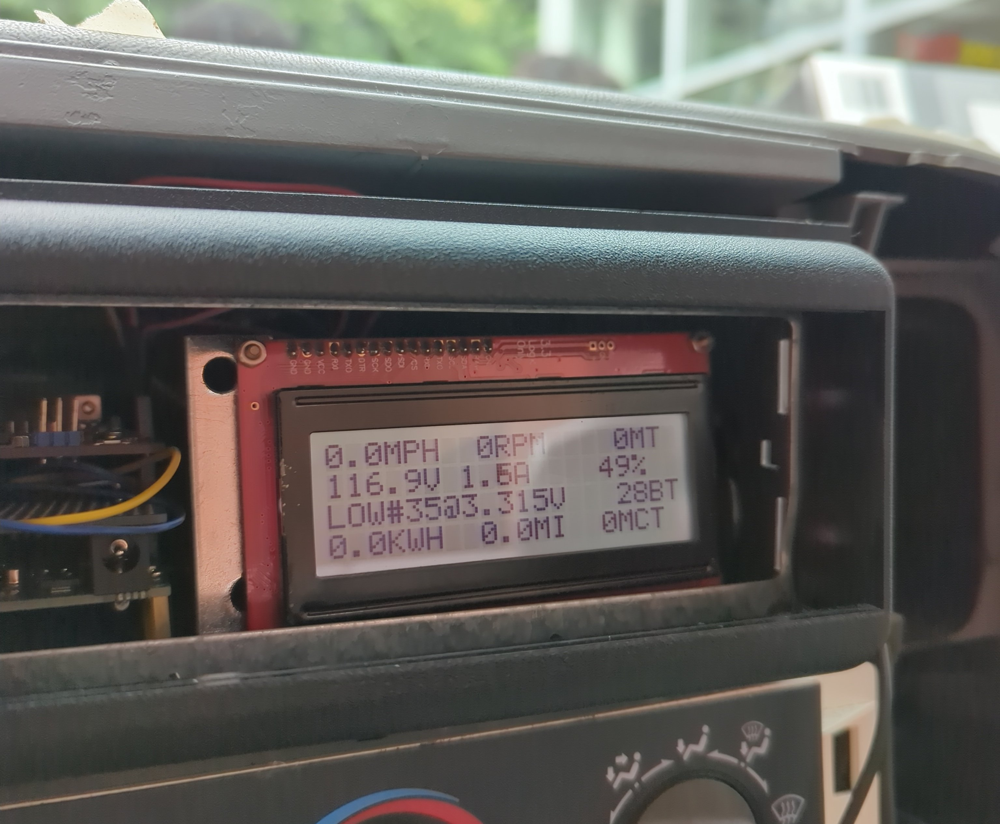

+++
title = "Assistant Mentor for EVC"
date = "2025-08-08"
+++

# Assistant Mentor for EVC

I did not expect to be back as an assistant mentor for EVC during the summer. (Shout out to my mentor!) I had the opportunity to oversee all things Arduino-related (i.e. instrumentation) and paper-like (i.e. the engineering report, the poster, and the presentation). Fortunately, I was able to juggle my IT internship in the city with this position, and I learned so much from both experiences. I almost wish that I worked as an IT intern first to get to apply the Agile methodology for this job. It really would have helped with organization and keeping everyone in sync as many interns had conflicting schedules, which was not as big of a problem last year.

The overarching primary purpose of EVC is to reduce greenhouse gas (GHG) emissions, but this year's iteration of the project was to improve our platform's reliability and performance. The driving experience in previous trial runs was not ideal: shutdowns initiated by the Battery Management System (BMS) forced us to cycle the system as we drove. This was because the motor controller requested well over 400 A from the battery pack, which had a max discharge current of 360 A. One approach to resolve this was to increase our max discharge current by installing more battery cells.

Mechanically and electrically, our biggest upgrade was to double the number of battery cells from 35 cells in series to 70 cells with 35 pairs in series. Our pack voltage would remain the same, but our max discharge current would double to 720 A. Our battery capacity would also double to 41.4 kWh. Despite a ton of trouble with the battery order, we were able to install the additional 35 cells and performed a few test runs. We were able to draw 450 A without a shutdown, but our transmission issue was worsening. To proceed with further testing, we would need to fix our transmission. Over the course of 2 days of testing, we poured in 3.5 gallons of transmission fluid. That's not normal. (Considering how old the truck is, it's probably a broken seal/worn parts.)

On the Arduino, our biggest undertaking was refactoring the code to implement better programming practices... and actually not make it a [headache](https://github.com/bccevc/evc-programs/blob/main/sketches/canbus123-fixed-sd/canbus123-fixed-sd.ino) to read. After noticing some discrepancies with trip, we computed it correctly by setting a threshold value whenever it calculated a tiny amount of distance when the truck idled. The only issue is that pack current now does not collect accurate data. I suspect the value is being scaled incorrectly. Because of this, we were unable to compute the energy consumed and our MPGe. We also started to wire the motor controller with the truck's CAN bus wiring by using a PCAN-Optoadapter. When checking for CAN signals from the motor controller, it seemed to be picking up a ton of noise, so we did not get that fully hooked up yet in time for our final test runs.

*The driver's dashboard.*

I was a lot more aware of what was going on mechanically and electrically in comparison to last year, and I got to do more on-truck work! Yay!