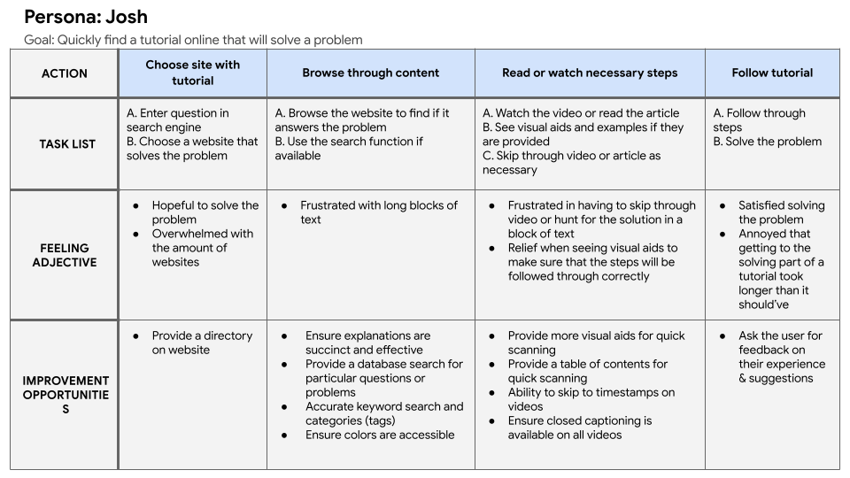

+++
title = "UX Project: Art Skool (2/3)"
date = "2022-03-01"
description = "A website for finding and viewing art tutorials."
+++

# UX Project: Art Skool (2/3)

A website for finding and viewing art tutorials.

---

## Overview

This is the second project I completed as part of completing [Google's UX design course](https://www.coursera.org/professional-certificates/google-ux-design?utm_source=gg&utm_medium=sem&utm_campaign=15-GoogleUXDesign-US&utm_content=B2C&campaignid=12512630840&adgroupid=118346521839&device=c&keyword=coursera%20ux%20design&matchtype=b&network=g&devicemodel=&adpostion=&creativeid=504932118675&hide_mobile_promo&gclid=Cj0KCQjworiXBhDJARIsAMuzAuylL9CAVA5hZfxp1RXWVD_fRDczJ0AW1XD_GYyGWOAqwErCDxk8wV0aAjR4EALw_wcB).

**The Design Prompt:** Design a website for finding and viewing art tutorials.

**The Product:** Art Skool is an online art tutorial website that strives to help artists of all levels by providing lessons free of charge in a more structured, academic format. Art Skool targets both beginning aspiring artists, who may not be able to afford art classes, and seasoned professionals, who may refresh or refine their skills by searching for particular topics or lessons.

**The Problem:** Aspiring artists such as busy students and workers lack the time to search on the internet for intuitive and comprehensive art tutorials, especially ones specific to their needs.

**The Goal:** Design a website for Art Skool that allows users to view comprehensive art tutorials and easily filter for specific types of lessons.

**What I Did:**
- Conducted interviews
- Paper and digital wireframing
- Low and high-fidelity prototyping
- Conducting usability studies
- Iterating on designs

**Duration:** August 2021 - March 2022 (with a gap from October to January)

---

## Step 1: Empathize

### User Research

I conducted interviews and created empathy maps. I interviewed people who viewed online tutorials at least once a week. The primary user group was busy students who don’t have the money to pay for art classes or the time to scour the internet for one topic. Another user group was busy workers who were already familiar with art but had trouble with turning problems into questions to look up.

Research also revealed affordability was not the only factor limiting users from learning about art. Other user problems included a lack of visual aids and difficulty in finding solutions to an exact problem.

**Pain Points:** I've identified three main pain points that the design should solve:
1. **Time:** full-time students and working adults are too busy to take the time to build their own exhaustive art curriculum to follow.
2. **Comprehensiveness:** most art tutorials do not go into depth about the topic they are teaching and do not provide applicable, everyday exercises that build art skills.
3. **Lack of Support & Structure:** students and adults feel annoyed and frustrated when art tutorials do not answer their questions, especially when the information is hard to find within an article or video.

Based on this, I created two personas:

*The profile images for each persona are generated and not a real person.*

---

## Step 2: Define

I've identified what the design should aim to solve by creating problem statements based on the personas.

### Problem Statements

Josh is a busy college student who needs **intuitive and succinct website tutorials with a search option along with visual aids** because they want to quickly solve problems.

Hulda is an office administrator not fluent with technology who needs **tutorials that can be viewed without problems being translated into specific questions** because they want to solve problems on their own.

---

## Step 3: Ideate Solutions

### Crazy 8s

I sketched 8 ideas to brainstorm what pages there should be and how they should look like.

### Competitive Audit

I conducted a competitive audit to compare the user experiences of a few competitor websites, such as YouTube, Udemy, Ctrl+Paint, and Drawabox. The following is a general summary of my findings; one website might have the other's strengths or weaknesses, but I still found it useful to note.

**Competitors' Strengths:**
- Provides a course preview and description section
- Provides a comments or reviews section
- Shows a progress indicator
- Includes search, filter, and category features
- Has a note-taking featureHas a resources page (provides external information on the subject)
- Videos/lessons are placed in a logical order (much like a curriculum)
- Has a "Homework" page to post work where others can comment
- Includes multiple mediums: text (with an audio feature that allows users to have the article read to them), video, and images/diagrams

**Competitor's Weaknesses:**
- Difficult to preview the quality of the lesson
- Paywall
- No indicator of progress
- Lengthy text

### User Journey Maps

Mapping Josh's user journey revealed how helpful it would be for users to access more academic, organized, and comprehensive art tutorials where everything is in one place.

Mapping Hulda’s user journey revealed how helpful it would be for users to have filters in the search function and provide for a support community, where members can describe problems or ask questions.

### Sitemap

Based on the research, competitive audit, crazy 8s, and user journey maps, I drafted a sitemap to visualize what pages and features there would be.

### Paper Wireframes

I drafted 5 iterations of each screen of the app on paper to ensure that the elements would address user pain points. For the home screen, I prioritized a way to determine if the courses offered would answer user questions or problems. *Stars were used to mark the elements that would be used in the initial digital wireframes.*

### Digital Wireframes

---

## Step 4: Initial (Lo-Fi) Prototype

This [low-fidelity prototype](https://xd.adobe.com/view/015e6578-07ae-41a4-9471-d9bbb5951ff4-540d/?fullscreen) connects the primary user flow of finding a lesson and learning from it, which will be used in a usability test with users.

---

## Step 5: Test

I conducted two rounds of usability studies with five participants who are interested in art. Findings from the first study helped guide the designs from wireframes to mockups. The second study used a high-fidelity prototype and revealed what aspects of the mockups needed refining.

### Goals
- Determine if users can complete core tasks within the prototype: finding and completing a lesson.
- Determine if the app is difficult to use.
- Identify and understand the specific challenges that users might face in the learning process.

### Round 1 Findings Summary
- Marking a lesson complete is unclear.
- The "CURRICULUM" tab under the Library page is unclear.
- Users want more ways to view a catalog of courses.

### Round 2 Findings Summary
- Clicking a lesson on the Lesson page is unclear.
- Use more commonly used language for the word "curriculum."
- Finding a lesson under the "LESSONS" tab under Library is difficult and unclear.

---

## Step 6: Iterate on the Prototype

### Before & After First Usability Study

Early designs proved frustrating when marking a lesson complete. After the first usability study, I decided to have the lesson automatically be marked complete after the user submitted their assignment.

### Before & After Second Usability Study

The second usability study revealed difficulties in clicking a lesson from the lesson page. To give the user a more intuitive cue, I redesigned the lesson page to better show where the headings, the lessons, and where the user last left off of were.

### Mockups

### High-Fidelity Prototype

The final [high-fidelity prototype](https://xd.adobe.com/view/7c78c47c-1664-4f82-8965-d8157fd45604-292b/?fullscreen) presented cleaner user flows for finding and learning from an art lesson. It also met user needs for organized and comprehensive art courses and tutorials, as well as the opportunity to connect with a support community.

### Accessibility Considerations

- Used a contrast checker to ensure that colors were accessible
- Scaled the size of the text based on importance
- Included a variety of ways of viewing and learning content (i.e. video/audio, text)

---

## Going Forward

### What I Learned

While designing the Art Skool website, I learned that not all user pain points are found in the first usability study. Conducting another study revealed what I had not known and this feedback influenced each iteration of the site’s designs, while still keeping the target users in mind.

### Next Steps

1. Conduct another round of usability studies to validate whether the pain points users experienced have been effectively addressed.
2. Conduct more user research to determine any new areas of need.

### In Retrospect

Looking back on this project, I want to point out a few things that I could apply to the next one:
- Follow a soft grid for consistent spacing
- Stick to a font scale/system

### Slide Deck

Interested in viewing the slide deck for this project? View it [here on Google Slides](https://docs.google.com/presentation/d/1fg56HuHaCsuD4AuAW2eXY0AhyPeHUXGIiISGqowXYMA/edit#slide=id.p).