+++
title = "UX Project: Billucate (3/3)"
date = "2022-09-01"
description = "An app and responsive website that helps individuals learn about proposed bills that affect them."
+++

# UX Project: Billucate (3/3)

An app and responsive website that helps individuals learn about proposed bills that affect them.

---

## Overview

This is the third and final project I completed as part of completing [Google's UX design course](https://www.coursera.org/professional-certificates/google-ux-design?utm_source=gg&utm_medium=sem&utm_campaign=15-GoogleUXDesign-US&utm_content=B2C&campaignid=12512630840&adgroupid=118346521839&device=c&keyword=coursera%20ux%20design&matchtype=b&network=g&devicemodel=&adpostion=&creativeid=504932118675&hide_mobile_promo&gclid=Cj0KCQjworiXBhDJARIsAMuzAuylL9CAVA5hZfxp1RXWVD_fRDczJ0AW1XD_GYyGWOAqwErCDxk8wV0aAjR4EALw_wcB).

**The Design Prompt:** Design a user experience to help people learn about proposed bills that affect their family.

**The Product:** Billucate is an online service that aims to educate individuals about bills that affect them and their family in the United States.

**The Problems:** There were two problems that I identified: (1) educators and perceptive people need to know about multiple perspectives/opinions on proposed bills, and (2) busy students and workers need short, informative, and easy-to-read summary of proposed bills that affect them. A social need I identified was the lack of succinct and easy-to-read information on bills, especially ones from municipal governments.

**The Goal:** Design an app and responsive website for Billucate that provides users with all of the information they need to make an informed decision about a bill that affects them.

**What I Did:**
- Conducted interviews
- Paper and digital wireframing
- Low and high-fidelity prototyping
- Conducting usability studies
- Iterating on designs

**Duration:** June 2022 - September 2022

---

## Step 1: Empathize

### User Research

I conducted interviews and created empathy maps.

#### My Assumptions (Before Interviewing)

Bills passed on the local/municipal level are the ones that would affect a family the most. Unlike federal or state bills (in the US), information on local bills is difficult to find unless one is living in a populous city such as NYC. Additionally, since many local newspapers are closing down or have closed down, I assumed that most people would (rarely) hear about a local bill in the national news or by word of mouth. Thus when interviewing four participants who learn about proposed bills at least a few times a year, my questions consisted of how they heard about proposed bills, how they get their news, and what common user experiences are associated with finding more information about proposed bills.

#### The Results

The feedback received through research made it clear that users who learn about proposed bills typically do not actively browse to look for it. Rather, they find it from the news, radio, newsletter, or email from an organization or representative from Congress/state legislature. Meaning, participants are generally searching for things of their interest or things that would affect them. (On local bills, they expressed that it was difficult to find.) Then, they would go to a news source, a search engine, or social media to find more information or what others have to say about it. Sometimes, they would then search for the bill text. Thus, I focused on fleshing out features that would provide the kind of information participants searched for after already hearing about a bill. But I did plan on building a simple browsing/subject feature so that people can browse for bills if they would like to. I didn’t focus on developing the search function as I concluded that most users already knew what to search for and that the search function would be relatively simple. This user group also expressed excitement for an action component (i.e. a way to contact their representative) and for an easier way to find out about local bills.

Based on this, I created two personas:

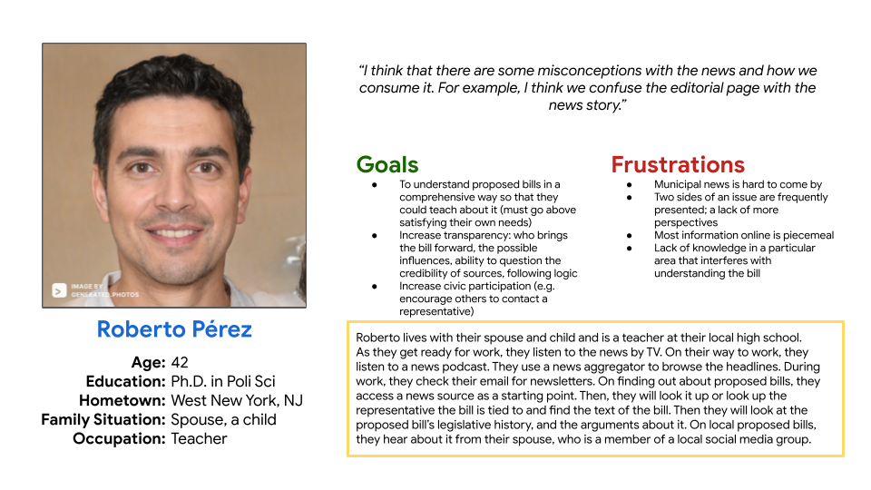
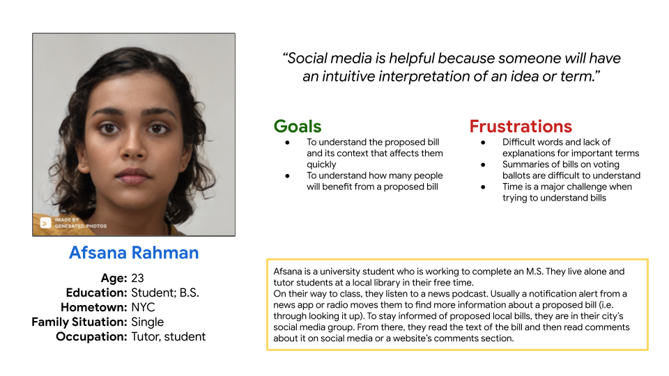
*The profile images for each persona are generated and not a real person.*

---

## Step 2: Define

I've identified what our design should aim to solve by creating problem statements based on the personas.

### Problem Statements

Roberto Pérez is a teacher who needs a **compilation of sources and perspectives on proposed bills** because they want to grasp a complete understanding of a bill to teach their students.

Afsana Rahman is a working student who needs a **short, informative, easy-to-read summary of proposed bills that affect them** because the process of understanding bills is lengthy and frustrating, but they want to take political action with confidence.

---

## Step 3: Ideate Solutions

### Competitive Audit

I conducted a competitive audit to compare the user experiences of a few competitor websites, such as GovTrack and the New York Times. The following is a general summary of my findings; one website might have the other's strengths or weaknesses, but I still found it useful to note.

**Competitors' Strengths:**
- Educational resources
- A feature to find representatives
- Provides bill history
- Ability to track/save bills and receive alerts
- Comments section
- Links to other resources

**Competitor's Weaknesses:**
- No information on municipal bills
- No detailed explanation (breakdown) of a bill
- Information isn't always easy to understand and to the point

From this, I've identified some opportunities that Billucate could address:

- Optimize the app and website for accessibility (e.g. accessibility-friendly color options, translation options)
- A more detailed and simpler breakdown of bills
- Provide information on local bills and representatives

For more details, view the [competitive audit spreadsheet](https://docs.google.com/spreadsheets/d/1xV4eJvghitOLrfWf--qHLZhE4fdcU8myEWO4Vh7L1AQ/edit?usp=sharing&resourcekey=0-0ih6WQPLCfEGIyyWRi-j4w) and [audit report](https://docs.google.com/document/d/1w6wukDFl7gbFzGXRyfMI8OAuRvqDXm3rgR_4ohnU7l4/edit?usp=sharing).

### Crazy 8s

I sketched 8 ideas to come up with ideas for how to address the gaps identified in the competitive audit. I focused on what kind of information should be provided (i.e. features), such as a summary and background information feature.

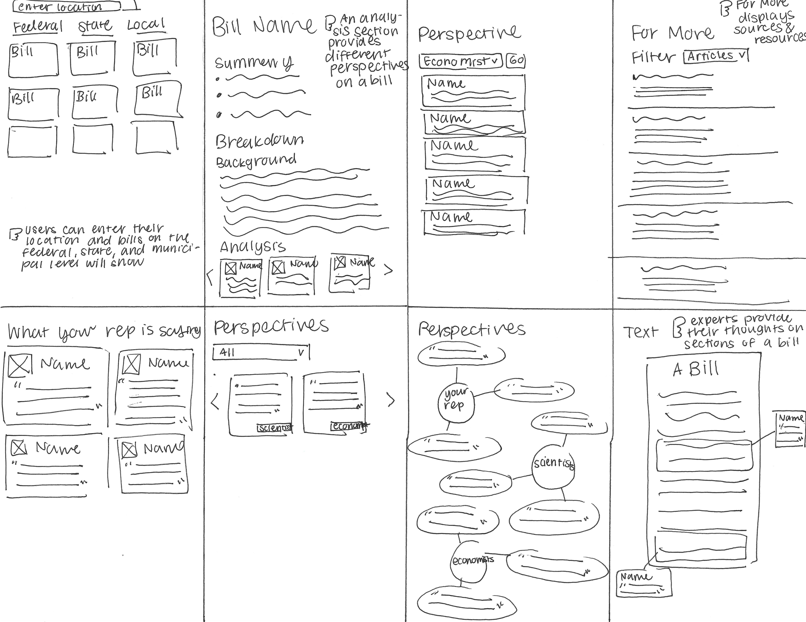

### User Journey Maps

Mapping Roberto's user journey revealed how helpful it would be to provide different expert perspectives on a bill to reduce the amount of time spent searching for some.

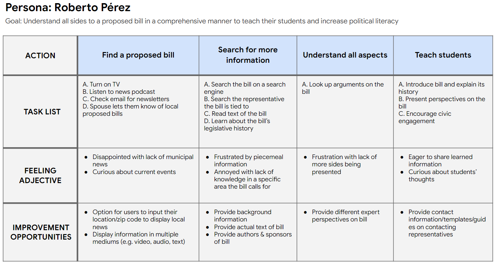

Mapping Afsana's user journey revealed how providing a short, informative summary of the bill would be helpful in time constraints.

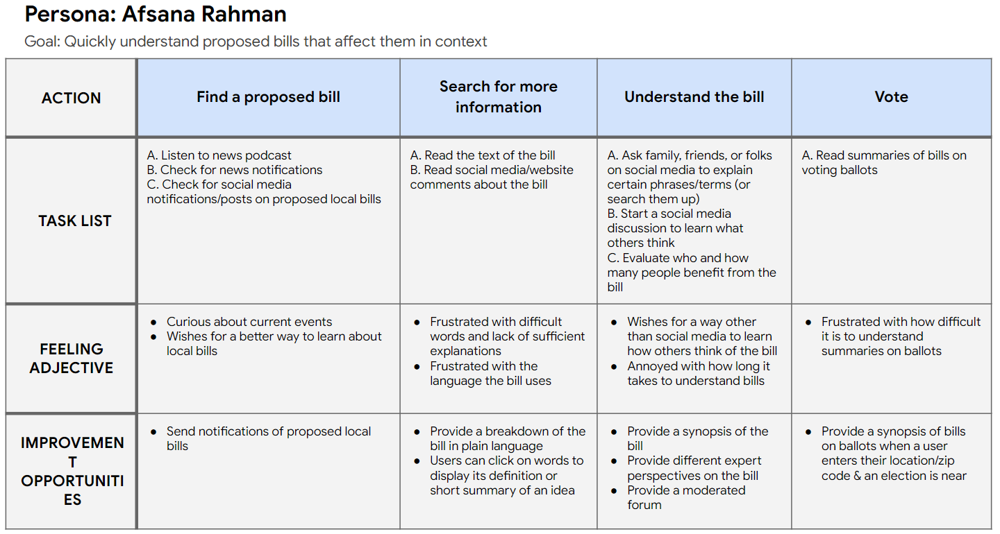

### Digital Wireframes

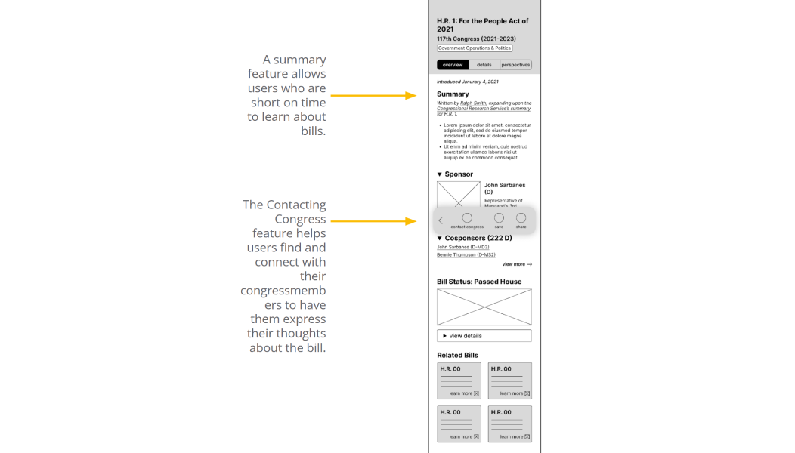
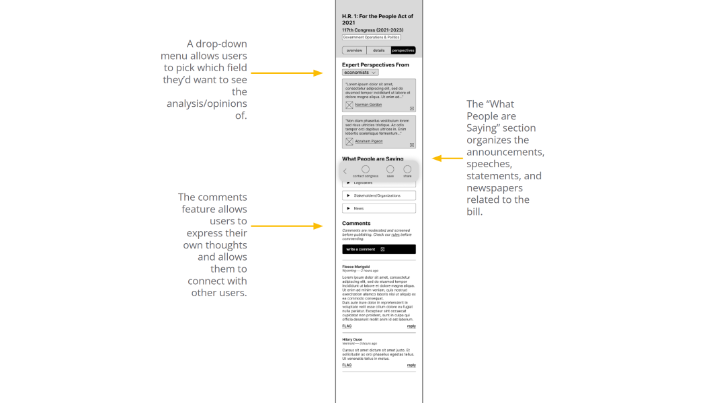
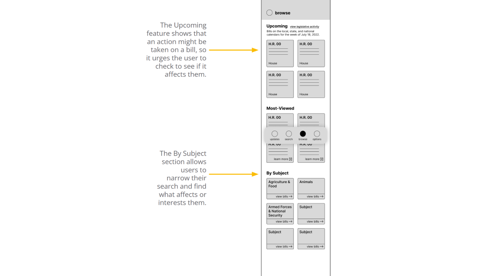

---

## Step 4: Initial (Lo-Fi) Prototype

Billucate's [low-fidelity prototype](https://www.figma.com/proto/sBfO1zEyk761nWySTGh6GR/Billucate?page-id=0%3A1&node-id=4%3A2&viewport=757%2C530%2C0.25&scaling=scale-down&starting-point-node-id=4%3A2) connects the primary user flow of selecting a bill, learning about it, and contacting their legislator, which will be used in a usability test with users.

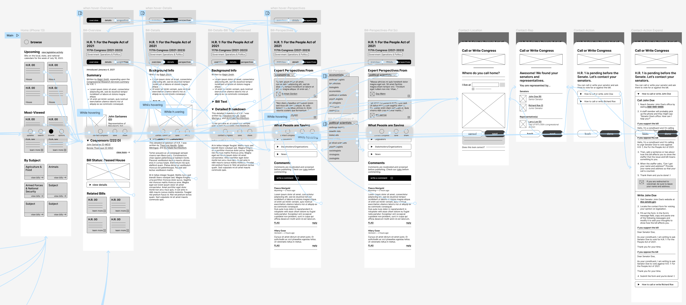

---

## Step 5: Test

I conducted a usability study with five participants who are interested in politics and read the news at least once a week. Findings from the first study helped guide the designs from wireframes to mockups.

### Goals
- Determine if users can complete core tasks within the prototype: selecting a bill, learning about it, and contacting their legislator.
- Determine if the app is difficult to use.

### Findings
1. **Clear User Flow.** All participants found the primary user flow of picking a bill, learning about it, and contacting their representative to be clear. All participants completed all of the tasks successfully.
2. **Collapse Drop-Down Sections.** Some participants found the information presented to be overwhelming due to lack of spacing and already opened drop-down sections.
3. **Visual Hierarchy.** Some participants found it difficult to pick out information from sections with similar-sized texts.

---

## Step 6: Iterate on the Prototype

Based on the insights from the usability study, I collapsed the drop-down sections when a user would first view the page, and I made the drop-down sections more obvious.

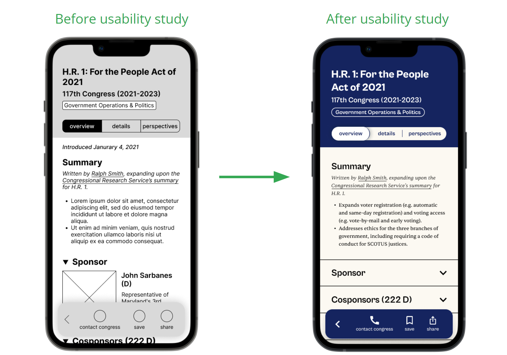

Another design change included increasing contrast by using two different font types and by maintaining a consistent visual hierarchy.

### Mockups

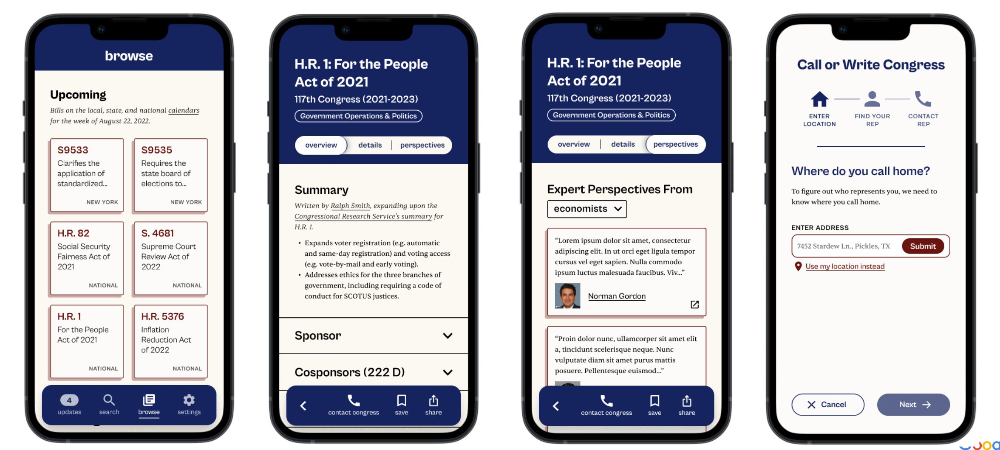

### High-Fidelity Prototype

The final [high-fidelity prototype](https://www.figma.com/proto/sBfO1zEyk761nWySTGh6GR/Billucate?page-id=300%3A114&node-id=305%3A120&viewport=1174%2C183%2C0.19&scaling=scale-down&starting-point-node-id=305%3A120) followed the same user flow as the low-fidelity prototype and design changes made after the usability study. It met users' concerns with contrast and visual hierarchy.

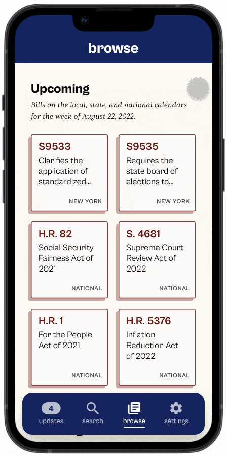

### Accessibility Considerations

- Used a contrast checker to ensure that primary colors were accessible
- Consistent components and navigation makes it easier for users to predict where they can find things
- For the website designs, I included an option to change the website's language

---

## Responsive Website

When finishing the app designs, I worked on designing a responsive website. I created a sitemap to ideate and guide the organizational structure of each screen’s design to ensure a consistent experience across devices.

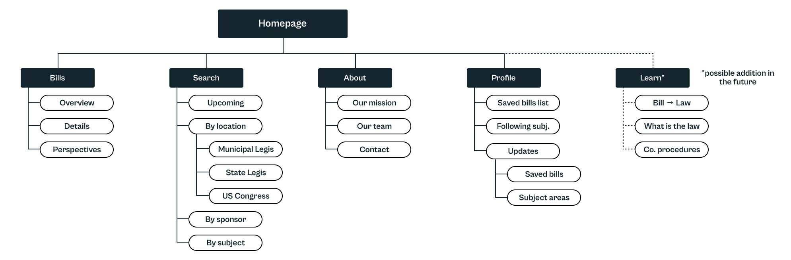

The designs for screen size variation included mobile, tablet, and desktop. I optimized the designs to fit specific user needs to each device and screen size. For example, the tablet and desktop screens addressed user needs for comprehensive (i.e. a longer read) and easy-to-understand information. Since the screen size is bigger, I took out the drop-down features since most users visiting the site are looking for a longer read.

Feel free to check out [Billucate's high-fidelity website prototype](https://www.figma.com/proto/sBfO1zEyk761nWySTGh6GR/Billucate?page-id=950%3A321&node-id=952%3A1003&viewport=7821%2C2381%2C1&scaling=scale-down&starting-point-node-id=952%3A1003) on desktop.

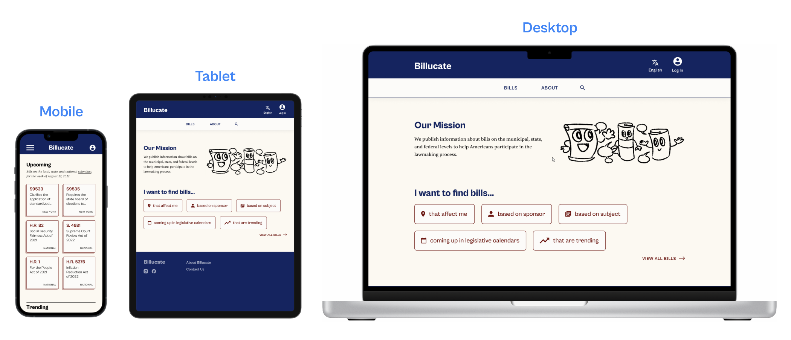

---

## Going Forward

### What I Learned

I learned the what roles visual hierarchy, contrast, and layout play into creating a clean design that addressed user needs. I also learned how to address seemingly contradictory problems at once, such as providing a detailed breakdown of a bill on one page while providing a summary on another page—all the while making sure that the information being presented wouldn’t be confusing or overwhelming.

### Next Steps

1. Conduct another usability study to ensure that the problems of visual hierarchy were solved.
2. Design the About page and include information about the main team of writers (and other contributors), provide their contact information, what bills they've worked on, and their other work as a form of accountability/transparency.
3. Design another page to educate users about how a bill becomes a law, what to look for in a bill, and what congressional procedures there are.
4. Design a feature that would notify users of bills that may affect them because users typically do not browse for bills to read, rather, they find out about them when alerted (i.e. from the news or radio).

### From Art Skool to Billucate: Applying Changes

- When designing the app and website, I followed a soft grid to, for example, establish the content's boundaries and ensure predictability.
- I stuck to a type scale for the most part, reducing the number of unique font sizes and variations I had. Addressing peer feedback, I fixed contrast between texts, made the paragraph text bigger, and increased its leading (line height), which made it easier to read long texts for longer periods of time.

### Slide Deck

Interested in viewing the slide deck for this project? View it [here on Google Slides](https://docs.google.com/presentation/d/1kKt4edgOTqTkppSf0L0yMbCp60WatsAClrZSxX_LCOk/edit?usp=sharing).