+++
title = "UX Project: Shoobwiches (1/3)"
date = "2021-08-12"
description = "A mobile-ordering app for a sandwich shop."
+++

# UX Project: Shoobwiches (1/3)

A mobile-ordering app for a sandwich shop.

---

## Overview

This is the first project I completed as part of completing [Google's UX design course](https://www.coursera.org/professional-certificates/google-ux-design?utm_source=gg&utm_medium=sem&utm_campaign=15-GoogleUXDesign-US&utm_content=B2C&campaignid=12512630840&adgroupid=118346521839&device=c&keyword=coursera%20ux%20design&matchtype=b&network=g&devicemodel=&adpostion=&creativeid=504932118675&hide_mobile_promo&gclid=Cj0KCQjworiXBhDJARIsAMuzAuylL9CAVA5hZfxp1RXWVD_fRDczJ0AW1XD_GYyGWOAqwErCDxk8wV0aAjR4EALw_wcB).

**The Design Prompt:** Design a mobile-ordering app for a sandwich shop.

**The Product:** Shoobwiches is a local sandwich shop located in the NYC metropolitan area that aims to prepare and deliver healthy sandwiches. It targets busy customers like commuters and workers who lack the time to prepare a meal.

**The Problem:** Busy workers and commuters lack the time to prepare a meal.

**The Goal:** Design an app for Shoobwiches that allows users to quickly and easily order and pick up fresh dishes.

**What I Did:**
- Conducted interviews
- Paper and digital wireframing
- Low and high-fidelity prototyping
- Conducting usability studies
- Iterating on designs

**Duration:** Summer 2021

---

## Step 1: Empathize

**User Research:** I conducted interviews and created empathy maps. The primary user group was working adults who don't have time to prepare meals.

**Pain Points:** I've identified four main pain points that the design should solve:
1. **Time:** working adults are too busy to prepare meals.
2. **Accessibility:** mobile platforms for ordering food aren't compatible with assistive technologies.
3. **Text:** text-heavy menus are often difficult to read and order quickly from. A lack of food descriptions or head-to-read nutrition information cause misunderstandings and a lack of confidence.
4. **Customizability:** a lack of menu item customizability causes frustration.

Based on this, I created two personas:

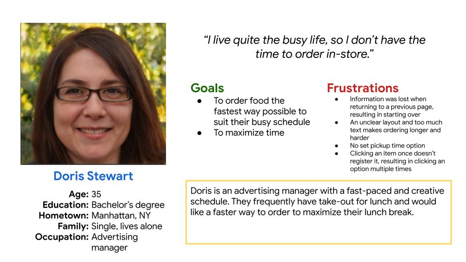
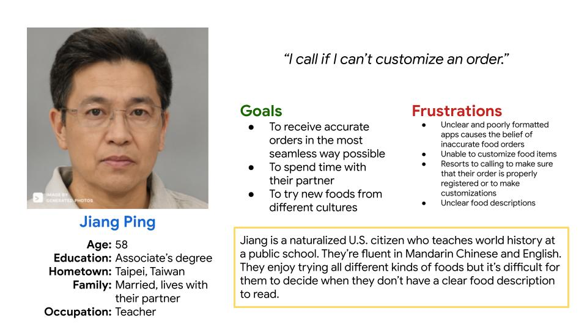
*The profile images for each persona are generated and not a real person.*

---

## Step 2: Define

I've identified what the design should aim to solve by creating problem statements based on the personas.

### Problem Statements

Doris Stewart is a busy adult who needs **to order food in the quickest way possible** because they don’t have time to make lunch for themself. 

Jiang Ping is a particular person who needs **customizable food options** because they want the food to suit their tastes.

---

## Step 3: Ideate Solutions

### Competitive Audit

I conducted a competitive audit to compare the user experiences of a few competitor apps.

**Competitors' Strengths:**
- Straightforward and sleek design
- Offers rewards/point system
- Offers multiple ways to pick up an order (dine-in, curbside, in-store pickup, delivery)
- Offers an option to automatically start preparing orders by sharing location
- Remembers users' orders and allows favoriting food items
- Ability to order time-sensitive menu items ahead of time

**Competitor's Weaknesses:**
- Must sign-in to order (no guest feature)
- Ingredients list is difficult to find
- Not compatible with screen reader technologies
- No search/filter option
- Nutritional and allergen information is too cramped

### Flowchart

Based on the research done, I made a flowchart to trace what steps a user might take when ordering from a sandwich app, which I would model the app after.

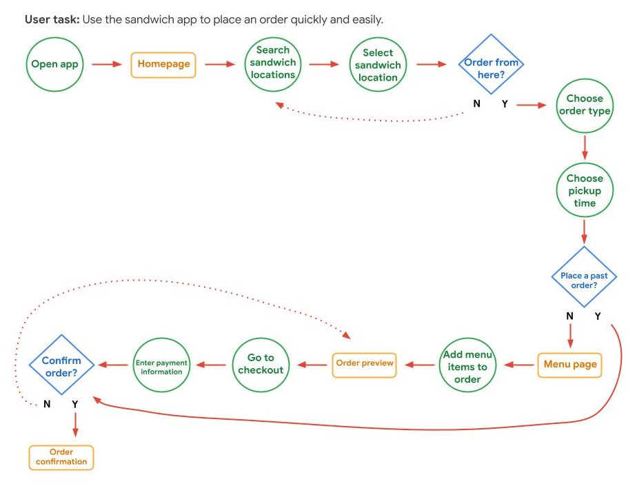

### Paper Wireframes

I drafted 5 iterations of each screen of the app on paper to ensure that the elements would address user pain points. For the home screen, I prioritized a quick and easy ordering process to help users save time. *Stars were used to mark the elements that would be used in the initial digital wireframes.*

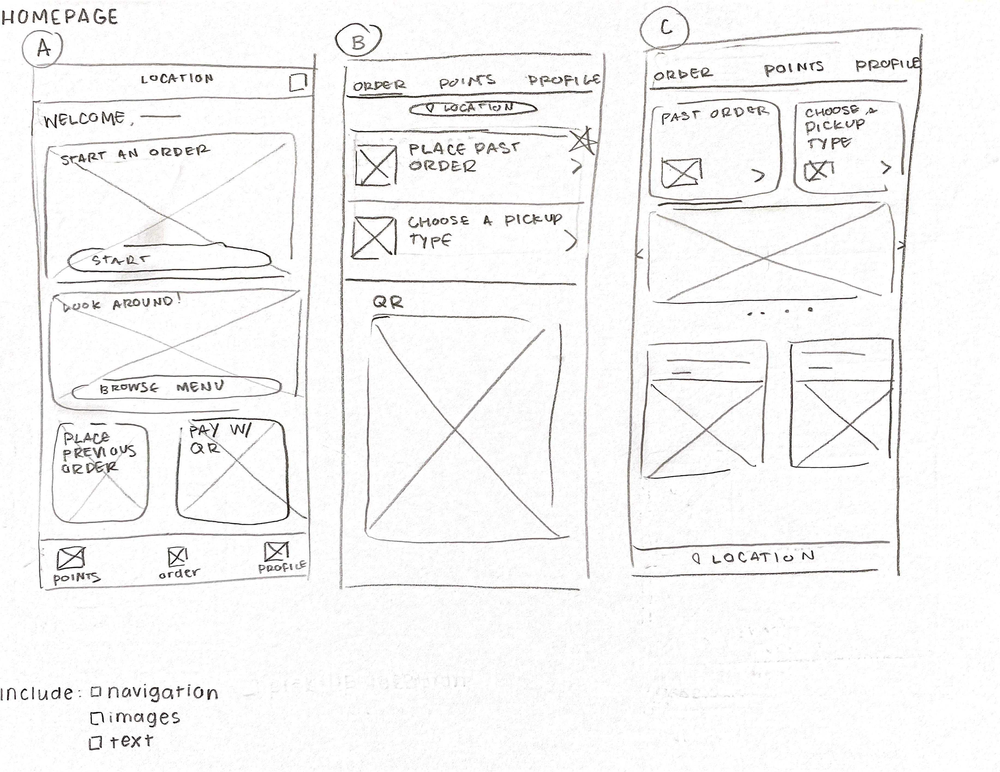
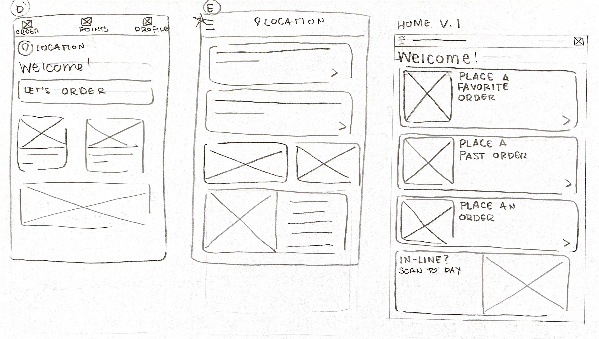

### Digital Wireframes

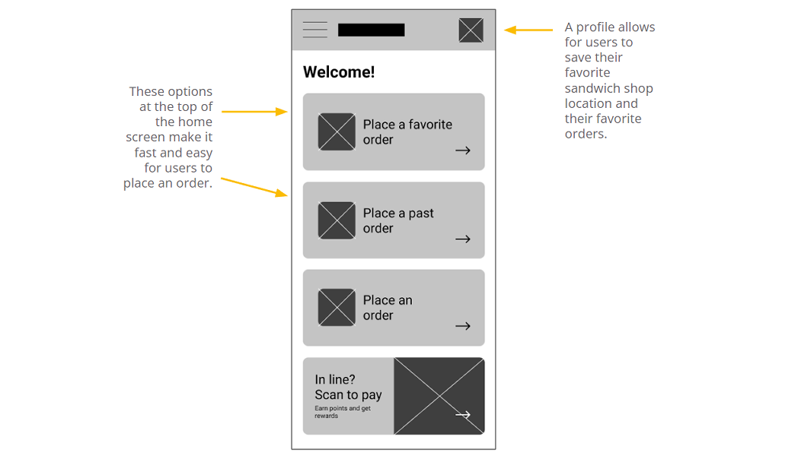
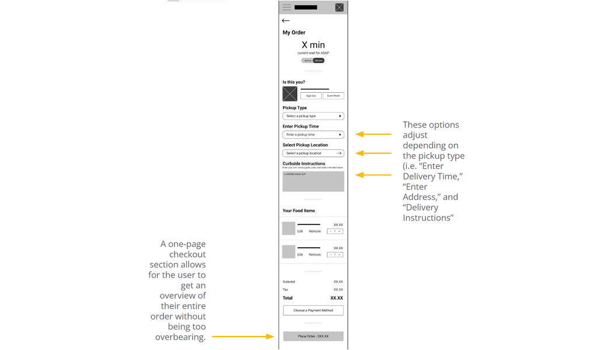
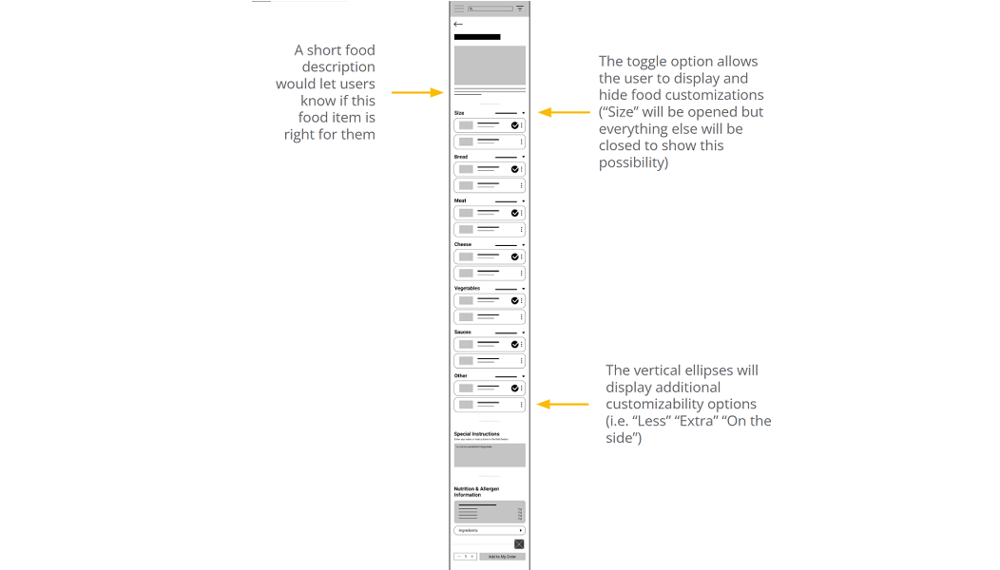

---

## Step 4: Initial (Lo-Fi) Prototype

This [low-fidelity prototype](https://www.figma.com/proto/FodXcG9TFvFXoz7UAcRUFA/Lo-Fi-Prototype-V1?node-id=2%3A2&scaling=scale-down&page-id=0%3A1&starting-point-node-id=2%3A2) connects the primary user flow of ordering a sandwich, which will be used in a usability test with users.

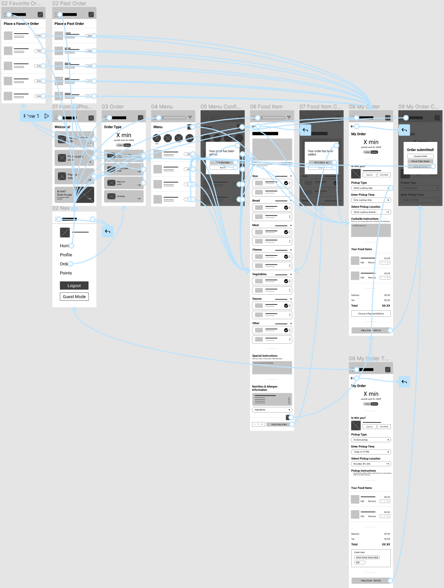

---

## Step 5: Test

I conducted a usability study with five participants who order food at least twice a week.

### Goals
- Determine if users can complete core tasks within the prototype: choosing, customizing, and paying for a sandwich order.
- Determine if the app is difficult to use.
- Identify and understand the specific challenges that users might face in the scheduling, customizing, and ordering process.

### Findings Summary
- Users can complete core tasks.
- The sandwich ordering app isn't difficult to use.
- Detailed customizations are useful for some people and not a majority.

---

## Step 6: Iterate on the Prototype

### Mockups

The usability study revealed that there were no functionality difficulties. When proceeding with the mockups, I based them on the digital wireframes.

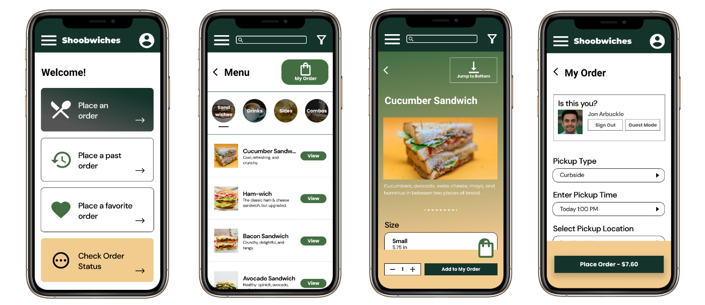

### High-Fidelity Prototype

This [high-fidelity prototype](https://www.figma.com/proto/EprLoETSDb9DvljL6ZVwVv/Lo-Fi-Prototype-V2?node-id=357%3A745&scaling=scale-down&page-id=357%3A96&starting-point-node-id=357%3A745) connects the primary user flow of ordering a sandwich, which will be used in another usability test with users.

### Accessibility Considerations

- Used a contrast checker to ensure that colors were accessible
- Used icons to help make navigation easier
- Used detailed imagery for sandwiches and customizations to help all users better understand the designs

---

## Step 7: Test the Hi-Fi Prototype

I conducted a usability study on the mockups with five participants who order food at least once a week.

### Goals

- Determine if the Shoobwiches app is easy to use.
- Identify any pain points the user may experience.

### Findings Summary

- An overwhelming majority of users found the app easy to use overall.
- The customizability option is unclear and difficult to use.
- The "Order Status" page (which allows users to check their order's status) is hard to find and access.

---

## Step 8: Prototype (Again)

From my findings, I restructured a part of the user flow by making the customization feature a step-by-step process.

I made the "Order Status" page more visible by placing it on the home page and adding the feature to the app's navigation menu.

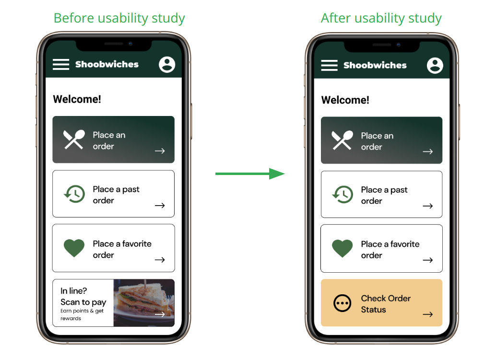

### The Final High-Fidelity Prototype

The final [high-fidelity prototype](https://www.figma.com/proto/EprLoETSDb9DvljL6ZVwVv/Lo-Fi-Prototype-V2?node-id=464%3A1059&scaling=scale-down&page-id=464%3A2&starting-point-node-id=464%3A1059) presented cleaner user flows for customizing and purchasing a sandwich. It also met user needs for a pickup or delivery option as well as an opportunity to place past and favorite orders to make the ordering process quicker.

---

## Going Forward

### What I Learned

While designing the Shoobwiches app, I learned that the first ideas are only the beginning of the process. Usability studies heavily influenced each iteration of the app's designs to best serve the user.

### Next Steps

1. Conduct another round of usability studies to validate whether the pain points users experienced have been effectively addressed.
2. Conduct more user research to determine any new areas of need.

### Slide Deck

Interested in viewing the slide deck for this project? View it [here on Google Slides](https://docs.google.com/presentation/d/1XX6bp6m3MOZ75WGSVhPewfniID61SO3lk_sFix5Is7Y/edit?usp=sharing).